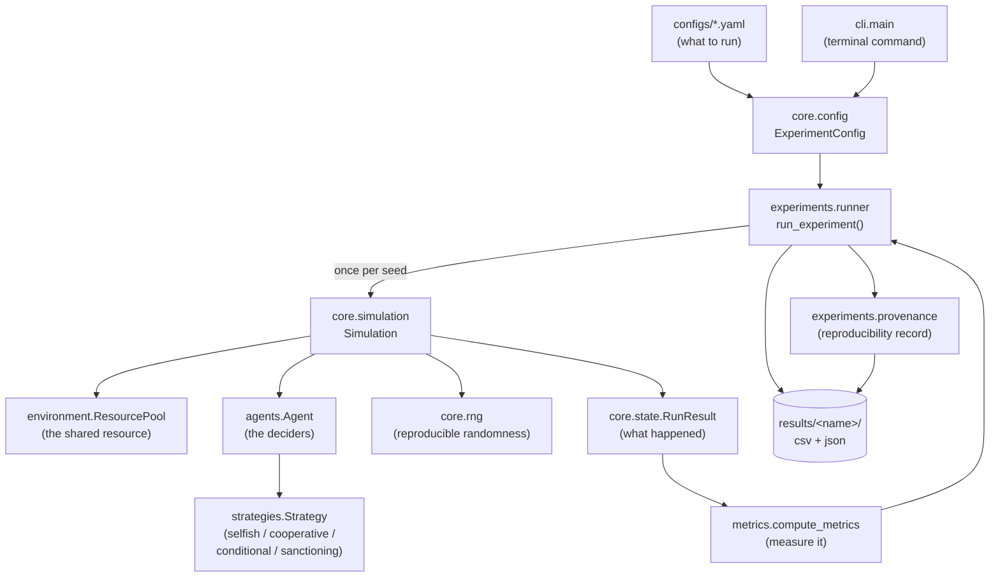
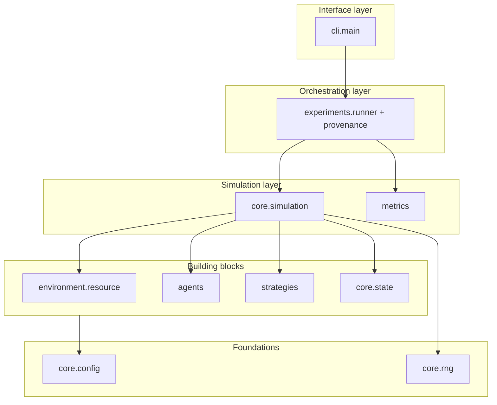
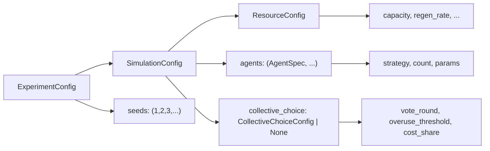
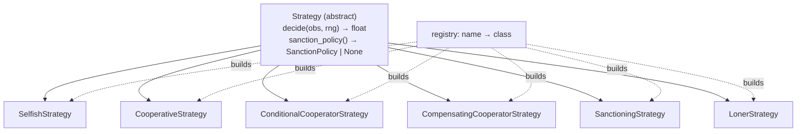
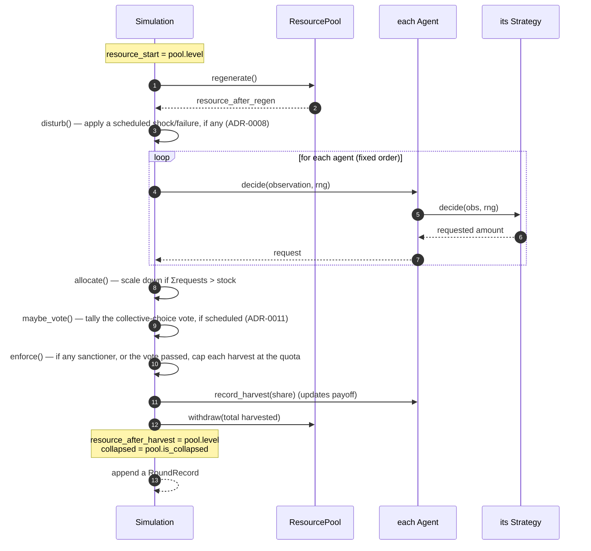
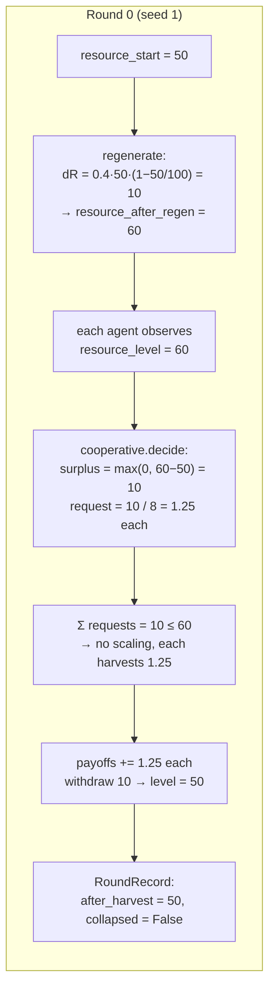

# Code Walkthrough

A guided tour of the whole Python codebase: what each part does, how the parts fit
together, and a worked example that follows one simulation from a config file to the
output files. Diagrams use [Mermaid](https://mermaid.js.org/) (they render on GitHub
and in most Markdown viewers).

This is the *learning* companion to [architecture.md](architecture.md) (which is the
terser reference). If you're new to the code, read this one.

A short Python-concepts glossary is at the [end](#appendix-python-concepts-used).

---

## 1. The big picture

The whole system is a pipeline: a **config** describes an experiment, the **engine**
runs it once per random **seed**, each run produces a **result**, results are turned
into **metrics**, and everything is written to **files**. Agents make the decisions;
the environment holds the shared resource.



Everything is deliberately split so you can change **one thing at a time** — the
resource rule, an agent's strategy, or what agents can see — without touching the
rest.

---

## 2. The directory map

```
src/emergent_cooperation/
├── core/            The machinery: config, randomness, run-state, the engine
│   ├── config.py        Turns YAML into validated settings objects
│   │                     (incl. CollectiveChoiceConfig — the voted, jointly-funded
│   │                     enforcement mechanism, ADR-0011)
│   ├── rng.py           Reproducible random-number generators
│   ├── state.py         Plain data records of what happened (results)
│   └── simulation.py    THE ENGINE — the per-round loop
├── environment/
│   └── resource.py      The shared renewable resource (stock + regrowth)
├── agents/
│   ├── observation.py   What an agent is allowed to see (the info boundary)
│   └── agent.py         An agent: identity + payoff, delegates decisions
├── strategies/
│   ├── base.py          The Strategy interface (+ SanctionPolicy for enforcement)
│   ├── selfish.py       Grab a big share now
│   ├── cooperative.py   Take only the sustainable surplus (+ knowledge_bias)
│   ├── conditional.py   Reciprocity: cooperate until others over-extract, then retaliate
│   ├── compensating.py  Restraint: on over-extraction, withhold to let the pool recover
│   ├── sanctioning.py   Cooperate AND enforce a sustainable harvest quota
│   └── registry.py      Name → strategy class lookup (the extension point)
├── metrics/
│   └── metrics.py       Turn a result into numbers (harvest, collapse, fairness)
├── experiments/
│   ├── runner.py        Run one Simulation per seed; export the outputs
│   └── provenance.py    Record code version, git commit, timestamp, seeds
├── cli/
│   └── main.py          The `emergent-coop` terminal command
├── communication/       CommunicationModel protocol (stub); a first broadcast model
│                         is live via SimulationConfig.broadcast_reliability + Observation.signal
└── disturbances/        Disturbance protocol + ResourceShock / AgentFailure (config-scheduled)
```

A useful way to think about it in **layers**, from foundations up:



We'll go bottom-up: foundations first, then the engine, then orchestration.

---

## 3. Foundations

### 3a. Configuration — `core/config.py`

Everything an experiment does is described by data, not hard-coded. These settings
live in **dataclasses** — small classes that just hold named fields. They are
`frozen=True`, meaning **immutable**: once created they can't be changed (this
prevents accidental state changes mid-run and keeps experiments reproducible).

There are four, nested inside each other:



- **`ResourceConfig`** — the resource: `initial_level`, `capacity` (K),
  `regeneration_rate` (g), `regeneration_rule`, `collapse_threshold`.
- **`AgentSpec`** — *a group of identical agents*: which `strategy`, how many
  (`count`), and its `params`.
- **`SimulationConfig`** — one run: `rounds`, `information_model`, the resource, and
  the list of agent groups.
- **`ExperimentConfig`** — a simulation config **plus the list of seeds** to run it
  with.
- **`CollectiveChoiceConfig`** *(optional, `None` by default)* — a group vote on
  jointly-funded enforcement: `vote_round`, `overuse_threshold`, `cost_share`.
  See §5's enforcement step and ADR-0011.

Each has a `__post_init__` method that **validates** on creation — e.g. it rejects a
negative capacity or an unknown information model immediately, so bad configs fail
fast with a clear message instead of producing garbage later.

The bridge from a YAML file to these objects is `from_dict` + `load_experiment`:

```python
# this YAML ...
# name: demo
# rounds: 100
# seeds: [1, 2, 3]
# resource: { capacity: 100.0, regeneration_rate: 0.4 }
# agents:
#   - strategy: cooperative
#     count: 8
#     params: { capacity: 100.0 }

cfg = load_experiment("configs/demo.yaml")
cfg.seeds                      # (1, 2, 3)
cfg.simulation.rounds          # 100
cfg.simulation.num_agents      # 8   (a computed @property: sums the counts)
cfg.simulation.resource.capacity   # 100.0
```

`from_dict` peels off the nested pieces (`resource`, `agents`) and builds the small
objects first, then the big one — so the messy dict-parsing lives in one place and
the rest of the code always works with clean, typed objects.

### 3b. Randomness — `core/rng.py`

This tiny module is the backbone of **reproducibility**. The rule in this project:
*all* randomness comes from here, seeded by a single integer, and we never touch
NumPy's hidden global random state.

```python
make_rng(42)          # one generator, seeded → same numbers every time for seed 42
spawn_streams(42, 8)  # eight INDEPENDENT generators from one seed (one per agent)
```

Why `spawn_streams`? If all agents drew from one shared generator, the *order* in
which they happened to draw would couple their behaviour — add an agent and everyone
else's "randomness" shifts. Independent streams (via NumPy's `SeedSequence.spawn`)
give each agent its own stable sequence, so results stay reproducible even if you
change the number or order of agents.

> Our current strategies happen to be deterministic (they don't draw random
> numbers), but two things already use the per-agent RNG — `decision_noise` (a
> configurable perturbation of each request) and broadcast message loss — so the
> seed genuinely matters, *without* breaking reproducibility. See experiment E4.

---

## 4. Building blocks

### 4a. The world — `environment/resource.py`

`ResourcePool` is the shared resource. It holds one number, `level` (the current
stock), and knows two things:

```python
pool = ResourcePool(ResourceConfig(initial_level=50, capacity=100, regeneration_rate=0.4))
pool.regenerate()     # stock grows by the logistic rule
pool.withdraw(30)     # remove up to 30 (never below 0); returns what was removed
pool.is_collapsed     # True if stock <= collapse_threshold
```

The **logistic** regeneration rule is `dR = g·R·(1 − R/K)`:
- growth is fastest at half capacity (`R = K/2`),
- growth is zero at `R = 0` and `R = K`,
- so **a pool driven to 0 never recovers** — that's why over-harvesting is
  permanent.

Notice what the pool does **not** do: it doesn't decide who gets how much. That
split (rationing lives in the engine) keeps the resource simple and reusable.

### 4b. What an agent sees — `agents/observation.py`

An `Observation` is a frozen dataclass — the **only** information an agent gets when
deciding. This is the "information boundary," and it's what makes information models
meaningful:

```python
Observation(
    round_index=0,
    num_agents=8,
    capacity=100.0,
    resource_level=60.0,   # ← the shared stock ... or None under "private" info
    own_last_harvest=0.0,
    own_total_payoff=0.0,
)
```

Under the `private` information model, `resource_level` is set to **`None`** — the
agent literally cannot see the stock and must fall back on assumptions. Flip that one
field and you've changed the experiment's information condition.

### 4c. An agent — `agents/agent.py`

An `Agent` is thin on purpose. It owns *identity and bookkeeping* and hands the
actual decision to its strategy:

```python
class Agent:
    def __init__(self, agent_id, strategy):
        self.agent_id = agent_id
        self.strategy = strategy
        self.total_payoff = 0.0
        self.last_harvest = 0.0

    def decide(self, observation, rng):
        request = self.strategy.decide(observation, rng)   # delegate!
        return max(0.0, float(request))                    # never negative

    def record_harvest(self, amount):
        self.last_harvest = amount
        self.total_payoff += amount
```

Separating *what an agent is* (identity, payoff) from *how it decides* (the strategy)
is what lets us mix and swap strategies freely.

### 4d. Strategies — `strategies/`

A **strategy** is a decision rule. `base.py` defines the interface every rule must
follow (an *abstract base class*): implement `decide(observation, rng) -> float`.



**Selfish** (`selfish.py`) — grab an equal share of the *visible* stock, scaled by
`greed`:

```python
def decide(self, observation, rng):
    n = max(1, observation.num_agents)
    visible = observation.resource_level
    if visible is None:                 # blind (private info)
        visible = observation.capacity  # assume the pool is full
    return self.greed * visible / n
```

With `greed = 1.0` and 8 agents, each asks for `1/8` of the stock — so together they
demand the **whole** stock, and it collapses. That's the tragedy of the commons in
three lines.

**Cooperative** (`cooperative.py`) — take only the *surplus above a healthy level*
(the maximum-sustainable-yield stock `K/2`):

```python
def decide(self, observation, rng):
    n = max(1, observation.num_agents)
    if observation.resource_level is not None:          # can see the stock
        target = self.target_fraction * self.capacity   # e.g. 0.5 * 100 = 50
        surplus = max(0.0, observation.resource_level - target)
        return self.restraint * surplus / n
    return self.restraint * (self.regeneration_rate * self.capacity / 4.0) / n  # blind: MSY share
```

This rule is **self-correcting**: if the stock is at or below the target, `surplus`
is 0 and the agent takes nothing, letting the pool recover. (The blind `private`
branch can't do this — it takes a fixed amount regardless — which is exactly why
blind cooperation is fragile; you saw this in the walkthrough.) A `knowledge_bias`
parameter scales that blind estimate: `> 1` makes the agent overconfident (it
over-extracts and collapses the pool), separating cooperative *intent* from
sustainable *outcome* (see experiment E1 and ADR-0004).

**Conditional cooperator** (`conditional.py`) — *reciprocity*. It cooperates like the
cooperative rule, but watches the stock: if the observed stock *fell* since last
round (someone over-extracted), it retaliates by grabbing a selfish share. It is
**stateful** (remembers the previous stock). All-conditional populations cooperate
happily; a single free-rider triggers retaliation that protects the agents' payoffs
but collapses the resource (experiment E2).

**Sanctioning** (`sanctioning.py`) — cooperate *and* enforce. It harvests sustainably
like a cooperator, but also exposes a `SanctionPolicy` (`sanction_policy()`), which
makes the engine cap *every* agent's harvest at a sustainable quota and charge the
sanctioner a monitoring cost. Because it limits defectors' *extraction* (not just
their payoff), it protects the resource even against fixed selfish agents — the only
mechanism that protects both resource and fairness (experiment E3).

**Loner** (`loner.py`) — opts out entirely: `decide` always returns `0.0`. It never
touches the pool, so it's deliberately excluded from evolution-mode simulations
rather than run through them; its fixed side payoff is applied by the experiment
script (E11), not the engine. It exists to test whether an opt-out option rescues
voluntary monitoring from collapse (Hauert et al. 2007) — it delays the collapse but
doesn't prevent it (E11, ADR-0009).

**The registry** (`registry.py`) maps a name string to a strategy class, so a config
can say `strategy: cooperative` and the code can build it:

```python
make_strategy("cooperative", {"capacity": 100.0})   # → CooperativeStrategy(capacity=100.0)
available_strategies()  # → ["compensating_cooperator", "conditional_cooperator",
                        #    "cooperative", "loner", "sanctioning", "selfish"]
```

The full set of six strategies (and what each does) is defined in
[terminology.md](terminology.md#cooperation-mechanisms-the-strategies); this section
walks through `selfish` and `cooperative` as the core contrast.

**To add a new strategy** you subclass `Strategy`, set its `name`, and call
`register_strategy(...)`. Nothing else in the codebase needs to change — that's the
whole point of the registry.

---

## 5. The engine — `core/simulation.py`

This is the heart. A `Simulation` owns one run: it builds the pool and the agents
from the config, gives each agent its own RNG stream, and advances the rounds.

**Construction** expands the agent *specs* into actual agents (a group with
`count: 8` becomes eight `Agent` objects) and spawns the per-agent RNG streams.

**The round** (`step`) follows a fixed order — **regenerate → disturb → observe →
decide → allocate → vote → enforce → harvest**:



The `disturb` and `vote` steps are both no-ops unless configured — a plain config
with no `disturbances` and no `collective_choice` behaves exactly as before either
was added.

The **allocation** step is the rationing rule. If agents collectively ask for more
than exists, everyone is scaled by the same factor so the total exactly equals the
stock — a neutral rule that doesn't favour any strategy:

```python
total_request = sum(requests)
available = self.pool.level
if total_request <= available or total_request == 0.0:
    harvests = list(requests)                 # everyone gets what they asked
else:
    scale = available / total_request         # over-demanded → scale everyone down
    harvests = [r * scale for r in requests]
```

Between allocation and enforcement, `_maybe_vote` tallies the **collective-choice
vote** (ADR-0011) if one is scheduled for this round: it looks back at every round
simulated so far and checks whether total harvest exceeded the sustainable yield
(`g·K/4`) in more than `overuse_threshold` of them; if so, collective enforcement
switches on starting *this* round. This is what lets a population with **no**
individually-sanctioning agent still end up enforced — see [E13](experiments/E13-binding-agreement.md).

The **enforcement** step (`_enforce`) runs next, now scoped per `AgentSpec.group`
rather than population-wide (ADR-0012) — see
[architecture.md](architecture.md#the-round-in-detail)'s round-in-detail for the
exact quota/charging rules (including how boundaries/`governed=False` fit in,
ADR-0013). With neither an active sanctioner nor a passed vote it is a no-op, so
ordinary runs are unchanged (ADR-0005; ADR-0011; ADR-0012).

`run()` just calls `step()` for every round and collects the records into a
`RunResult`. Because the pool, the agents, and the RNG are all determined by
`(config, seed)`, **the same inputs always produce the exact same run** — verified by
a test.

---

## 6. Recording results — `core/state.py`

The engine emits **plain data** (no behaviour), so metrics and analysis don't depend
on engine internals:

- **`RoundRecord`** — one per round: `resource_start`, `resource_after_regen`, the
  per-agent `requested` and `harvested` amounts, `resource_after_harvest`,
  `collapsed`, and `penalties` (per-agent monitoring cost paid to sanctioning, 0 for
  everyone else). Computed helpers: `total_harvested`, `total_penalty`.
- **`RunResult`** — the whole run: the seed, each agent's strategy name, and the list
  of `RoundRecord`s. Helpers: `final_resource_level`, and `total_payoffs()` (each
  agent's harvest across all rounds, **net of sanction penalties**).

Think of a `RunResult` as the raw trajectory; the CSV `round_history.csv` you opened
in the walkthrough is basically this flattened into a table.

---

## 7. Measuring — `metrics/metrics.py`

Pure functions that take a `RunResult` and return numbers. `compute_metrics` returns
one flat dictionary (one row of `metrics.csv`):

| metric | meaning |
| ------ | ------- |
| `total_harvest` (gross), `mean_agent_payoff` (net), `efficiency` | system performance |
| `total_sanction_penalty` | total monitoring cost paid (0 without sanctioners) |
| `final_resource_level`, `sustainability_ratio`, `mean_resource_level` | sustainability |
| `collapsed`, `collapse_round`, `survival_time`, `over_usage_rate` | failure / over-use |
| `payoff_gini` | fairness / inequality of (net) earnings |

Note the gross-vs-net distinction: `total_harvest` is the resource actually
extracted, while payoff and `payoff_gini` are *net* of monitoring costs — the two
differ only when sanctioners are present.

The `gini` helper deserves a note — it measures inequality from 0 (everyone equal) up
toward 1 (one agent takes everything):

```python
gini([1, 1, 1])        # 0.0    perfectly equal
gini([0, 0, 0, 4])     # ~0.75  one agent hogs everything
```

That's how the mixed-population run flagged free-riding (`payoff_gini ≈ 0.44`).

---

## 8. Orchestration — `experiments/`

### `runner.py`
`run_experiment(config)` is the loop over seeds:

```python
for seed in config.seeds:
    result = run_simulation(config.simulation, seed=seed)   # one full run
    rows.append(compute_metrics(result, capacity=...))      # measure it
# → ExperimentOutcome(config, results, metrics=DataFrame(rows), provenance)
```

`export_outcome(outcome, dir)` writes the four files you've seen:
`resolved_config.yaml` (exactly what ran), `metrics.csv` (one row per seed),
`round_history.csv` (every round, via `history_frame`), and `provenance.json`.

### `provenance.py`
`Provenance` is a dataclass that auto-captures the reproducibility context when
created — package version, **git commit**, Python version, platform, timestamp — plus
the seeds and a status. This is what turns "I ran something" into "here is a run
anyone can re-execute." Each field uses a `default_factory` (a function that computes
the value at creation time, e.g. shelling out to `git rev-parse HEAD`).

### `cli/main.py`
The terminal command — parses your arguments and calls `run_experiment` /
`export_outcome`. It's covered line-by-line in its own explanation; the key idea is
that it's a *thin wrapper* so all real logic stays in the importable, testable
library.

---

## 9. End-to-end worked example

Let's trace `emergent-coop run --config configs/all_cooperative_global.yaml`
(8 cooperative agents, K=100, g=0.4, global info, seed 1) through **round 0**.



1. **CLI** parses the command, `load_experiment` builds the `ExperimentConfig`.
2. **Runner** starts the seed loop; for seed 1 it builds a `Simulation`.
3. **Simulation** creates a `ResourcePool` at level 50 and eight `CooperativeStrategy`
   agents, and spawns 8 RNG streams from seed 1.
4. **Round 0** runs exactly as the diagram shows: regenerate to 60, everyone sees 60,
   each requests `(60−50)/8 = 1.25`, all requests are feasible, 10 is harvested, the
   stock returns to 50.
5. Rounds 1–99 repeat identically (the system is at equilibrium): stock oscillates
   60→50, 10 harvested each round.
6. **Result** → `total_payoffs` sum to 1000; **metrics** →
   `total_harvest = 1000, sustainability_ratio = 0.5, collapsed = False, gini = 0`.
7. **Runner** collects one such row per seed; **export** writes the four files under
   `results/all_cooperative_global/`.

Swap the config to `all_selfish_global.yaml` and only step 4 changes: each agent
requests `60/8 = 7.5`, the total (60) equals the whole stock, it's all harvested, the
level hits 0, and `collapsed` is `True` forever after — total harvest just 60.

**One line of the decision rule is the entire difference between sustainability and
collapse.** That's the phenomenon this whole codebase exists to study.

---

## 10. Communication and the remaining stub

- **`communication/`** — the full `CommunicationModel` protocol (per-agent messages,
  topology, budget, delay) is still a stub, but a **first broadcast model is
  implemented** (ADR-0007): `SimulationConfig.broadcast_reliability` makes the engine
  deliver an aggregate `signal` (the *whole population's* total harvest last round —
  not scoped to any `AgentSpec.group`; the broadcast predates ADR-0012's groups and
  was never rescoped to them) into each agent's `Observation` with a per-round
  probability. Studied in experiments E6–E7.
- **`disturbances/`** — the `Disturbance` protocol plus two config-scheduled kinds
  (ADR-0008): `ResourceShock` (cuts the stock at a set round) and `AgentFailure`
  (deactivates a fraction of the agents). The engine applies them in the `disturb`
  step and marks the round; `compute_metrics` reports `recovery_time`/`recovered`.
  Studied in [E8](experiments/E8-resilience.md) and
  [E9](experiments/E9-resilience-with-free-riders.md) (the shock) and
  [E10](experiments/E10-agent-failure.md) (agent failure — enforcement is a single
  point of failure). Communication failure is the next kind.
- **`collective_choice`** *(not a stub — fully implemented, ADR-0011)* — the one
  mechanism that lives directly in `core.config`/`core.simulation` rather than a
  separate package, because it has to change behaviour *within* a single run (a
  vote at round `k` must affect every round after it), unlike E11/E12's
  replicator-dynamics tricks which stay entirely at the experiment-script level
  (ADR-0006). See §5 above and [E13](experiments/E13-binding-agreement.md).
- **`AgentSpec.group` / `AgentSpec.governed`** *(not a stub — fully implemented,
  ADR-0012/0013)* — also no separate package, for the same reason as
  `collective_choice`: `_enforce()` needs to know group membership every round.
  Exactly what `group` scopes and what `governed=False` does (and doesn't) exclude
  is in [architecture.md](architecture.md#known-simplifications-current)'s known
  simplifications; boundaries (open vs. closed access) are expressed entirely
  through this one flag, no separate engine mechanism. Studied in
  [E14](experiments/E14-population-diversity.md) (population composition, flat),
  [E15](experiments/E15-groups.md) (groups), and
  [E16](experiments/E16-boundaries.md) (boundaries).

---

## Appendix: Python concepts used

Quick reference for the language features you'll meet in the code.

- **dataclass** — a class that mainly holds named fields; Python writes the
  boilerplate. `@dataclass(frozen=True)` makes instances **immutable**.
  Used for configs, `Observation`, `RoundRecord`, `Provenance`.
- **`__post_init__`** — a hook dataclasses call right after creation; we use it to
  **validate** fields.
- **`@property`** — a method you access like a field (`config.num_agents`), used for
  computed values.
- **abstract base class (ABC) / `@abstractmethod`** — defines an interface that
  subclasses must implement. `Strategy` is one.
- **`Protocol`** — a "structural" interface (used by the stubs): any class with the
  right methods counts, no inheritance needed.
- **type hints** — annotations like `def decide(...) -> float`. Documentation for
  humans and tools; not enforced at runtime.
- **`from __future__ import annotations`** — makes hints lazy (text); harmless
  boilerplate at the top of files.
- **f-string** — `f"harvest = {total}"` embeds values into text.
- **`Path` (pathlib)** — portable file paths; `/` joins parts across OSes.
- **NumPy `Generator` / `SeedSequence`** — modern reproducible randomness (see
  `core/rng.py`).
- **pandas `DataFrame`** — an in-memory table; our metrics are rows in one.
- **`dataclasses.replace(obj, field=new)`** — copy an immutable object with one field
  changed (the CLI uses it to override seeds).

---

### See also
- [architecture.md](architecture.md) — the concise reference version of this.
- [getting-started.md](getting-started.md) — run it yourself, hands-on.
- [decisions/](decisions/) — *why* the design is the way it is (ADRs).
