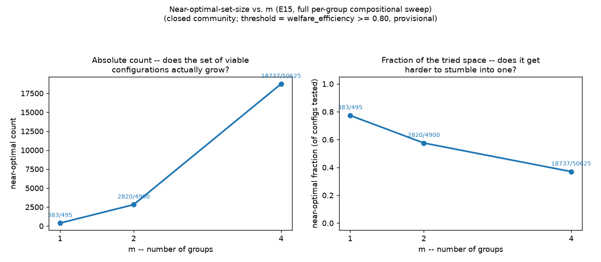
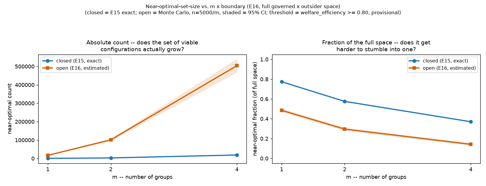

# Complexity Synthesis — Does the Near-Optimal Set Grow as the World Gets Richer?

**Status:** living document, not an experiment. No new simulations run here —
this only synthesises results already produced by E15, E16, and whichever
experiment adds the next axis. Updated every time a new axis joins the
comparison, so the growing complexity story has one home instead of being
patched into whichever experiment happened to add the latest axis (which is
what was starting to happen inside E16 before this doc existed).

**2026-08-08 data revision:** all numbers below reflect ADR-0012's allocation
correction (the governed population's quota, and its own fair-share
reasoning, were being silently diluted by however many outsiders existed —
see [ADR-0012](decisions/0012-nested-enterprise-groups.md#correction-2026-08-08-the-quota-denominator-must-exclude-ungoverned-outsiders)).
E15 (closed-only) is unaffected. E16 (open) numbers shifted, and one finding
changed qualitatively, not just numerically — see the outsider-type table
below.

**2026-08-09 renumbering:** these experiments were originally numbered E14
(groups) and E15 (boundaries). Population-type diversity was identified as a
more foundational axis — it's already implicit in both experiments below (the
governed `k`-sweep, the outsider-type sweep) without ever being isolated and
tested alone first, the way `m` was before boundaries got layered on. So it
took the E14 slot instead, and groups/boundaries shifted down to E15/E16.

**2026-08-09 full-sweep rework:** E15 and E16 were then reworked to actually
sweep the full population-composition matrix per group (not just
sanctioning-vs-selfish), the follow-up flagged above. E15 now tests every
joint combination of per-group compositions exhaustively (56,020
configurations across `m ∈ {1,2,4}`); E16 crosses that against the outsider
side, which is Monte Carlo *sampled* rather than enumerated (the full
governed × outsider space is ~3.9M configurations) — see both experiments'
own Method sections and the third and fourth lessons below.

**Numbering caveat, resolved 2026-08-09:** `docs/literature-review.md` and
two paper notes (Beven & Binley 1992/2014) independently referenced a
*different*, still-unbuilt "E14" — a GLUE-methodology experiment about
varying the starting resource level (`R₀`), planned before this
renumbering. Renumbered to **E17** (next free slot after E16) so both plans
have a real, unambiguous number.

## What this is answering

The equifinality conjecture (see
[thesis-direction-equifinality.md](thesis-direction-equifinality.md)): as the
*setting* gets structurally richer — more axes combined, not just a bigger
number on one existing axis — does the **count** of distinct approaches that
reach a near-optimal outcome grow? "Count how many different approaches land
in the near-optimal region" is the project's own definition; a rising count
supports the conjecture, a flat or falling one is a real, reportable negative
result either way.

**2026-08-10 general sampling procedure extracted:** the Monte Carlo recipe
first used in E16 (sample instead of enumerate once a space gets too large,
report fraction + CI, validate against a known-exact case first) is now
written up once, generally, in
[experiment-design.md#sampling-a-large-configuration-space-monte-carlo--glue](experiment-design.md#sampling-a-large-configuration-space-monte-carlo--glue)
instead of being re-explained per experiment — every future axis should reuse
it rather than re-deriving it. The live demo also now applies it one axis
further than any Python script does: E15's own closed-side sweep is still
exhaustive and exact in `scripts/experiment_groups_full_sweep.py`, but the
browser panel samples it too (56,020 configurations synchronously froze the
tab). That's a demo-only rendering tradeoff, not a change to E15's reported
result — see the same doc section's "Demo-only sampling" note.

## Four methodological lessons, learned the hard way — apply all four to every axis added below

1. **Report count and fraction separately, never just one.** Adding a new
   axis whose new branch contributes zero passing configurations mechanically
   drags the *fraction* down (bigger denominator, same numerator) without the
   achievable *count* actually shrinking. Plotting only the fraction reads as
   "complexity made things worse"; the count is the more precise claim
   ("complexity never made things better"). First caught in E15 (`m` alone:
   count flat at 1, fraction drops `1/2 → 1/3 → 1/5`), and nearly re-broken
   immediately afterward when boundary was added in E16.
2. **Watch for silently fixing a robustness dimension at its worst-case value
   and reporting that as the general answer.** A variable the governed
   population doesn't control (like what strategy an ungoverned outsider
   runs) isn't a governance choice, but that doesn't make it safe to fix at
   its most adversarial value by default — doing so and reporting "0" as *the*
   answer overstates how bad the richer setting is. Caught in E16: "open"
   tested against a `selfish` outsider gives a near-optimal count of 0; the
   same "open" tested across all outsider types gives a count of 3 at full
   coverage. Both numbers are honest; neither is "the" answer alone.
3. **A single scalar "diversity" (or any axis) can be a weak, confounded
   proxy for what's actually driving the result — decompose before
   reporting the headline number.** E14's raw type-count axis rises then
   falls with diversity, but that shape is mostly an artifact of how many
   compositions even exist at each diversity level. Splitting by *which*
   strategies are present (enforcer present or not; reciprocal or
   compensating response to a free-rider) explained the result almost
   completely — E1–E3's already-known findings, rediscovered, not a new
   diversity effect.
4. **A raw count is only comparable across conditions that share the same
   total space size — once an axis changes what the space even is, only
   the fraction is safe to compare directly.** E16's "open" condition draws
   from a space 70× bigger than "closed" (governed choices combined with
   outsider choices, not governed choices alone), so open's near-optimal
   *count* looking bigger than closed's is mostly that bigger denominator,
   not evidence that opening the boundary creates more good options. The
   fraction — which normalises for each condition's own space size — is
   the fair comparison, and by fraction, closed consistently beats open by
   roughly 2× at every `m` tested.

## Axes tested so far

| # | Axis | Built in | Levels tested |
| - | --- | --- | --- |
| 1 | Population-type diversity | [E14](experiments/E14-population-diversity.md) | 495 compositions across 5 strategies, `N=8` |
| 2 | Groups (nested enforcement) | [ADR-0012](decisions/0012-nested-enterprise-groups.md), [E15](experiments/E15-groups.md) | `m ∈ {1, 2, 4}` |
| 3 | Boundary (closed/open access) | [ADR-0013](decisions/0013-boundaries-via-groups-reuse.md), [E16](experiments/E16-boundaries.md) | `closed`, `open` |

Not yet built (see the ranking in
[thesis-direction-equifinality.md](thesis-direction-equifinality.md#ranking-the-axes-by-fit-not-by-build-cost)):
network reciprocity, multiple resources, reputation/indirect reciprocity,
specialization, communication as its own named axis (built, E6/E7, never
formally ranked). A **revised** population-diversity axis (two booleans —
enforcer present, reciprocal-vs-compensating response — instead of a raw
type count) is E14's own recommended follow-up, ahead of any of these.

## The chart: population-type diversity (E14)

| diversity | count | fraction |
| -: | -: | -: |
| 1 | 4/5 | 0.80 |
| 2 | 51/70 | 0.73 |
| 3 | 153/210 | 0.73 |
| 4 | 140/175 | 0.80 |
| 5 | 35/35 | 1.00 |

**Don't read this chart at face value — see lesson 3 above.** The apparent
rise-then-fall shape mostly reflects how many compositions exist at each
diversity level (5, 70, 210, 175, 35), not how hard success gets. The real
driver, decomposed in E14: **every composition with at least one
`sanctioning` agent passes (330/330)**; without one, only 53/165 pass, and
those almost all have zero or one `selfish` agent *and* no
`conditional_cooperator` (whose retaliation spiral turns one free-rider into
a collapse, E2's finding). Raw diversity count explains very little once
these two known effects (E2, E3) are accounted for.

## The chart: `m` (groups) × boundary, full compositional sweep

E15 (top chart, closed only) now sweeps every joint per-group composition
exhaustively; E16 (bottom chart) crosses that against the outsider side,
Monte Carlo sampled — see lesson 2 (adversarial-vs-typical) and lesson 4
(count vs. fraction across different space sizes) above before reading the
numbers below.

| m | closed count (exact) | closed fraction | open count (estimated) | open fraction |
| -: | -: | -: | -: | -: |
| 1 | 383/495 | 0.774 | 16,812/34,650 | 0.485 |
| 2 | 2,820/4,900 | 0.576 | 101,391/343,000 | 0.296 |
| 4 | 18,737/50,625 | 0.370 | 503,921/3,543,750 | 0.142 |

**By count: both closed and open genuinely grow with `m`** — the first
time in this project an axis has shown real, unconfounded count growth
(unlike E14's diversity axis, where the space itself changed shape for
reasons unrelated to difficulty; see lesson 3). More groups means more
independent slots that can each avoid being an "unprotected" liability
(E15's own finding), and the number of ways to combine safe slots grows
combinatorially. **But closed's and open's counts aren't comparable to each
other** — open's space is 70× bigger at every `m` (lesson 4), so its larger
raw count doesn't mean opening the boundary helps.

**By fraction — the fair comparison — closed beats open by a consistent
~2× at every `m`:** 0.774 vs. 0.485 (m=1), 0.576 vs. 0.296 (m=2), 0.370 vs.
0.142 (m=4). Opening the boundary is a real, substantial, and remarkably
stable cost across group counts — not the near-total wipeout the old
adversarial-only reading suggested (E16's outsider-type sub-study explains
why: most outsiders, drawn from the full composition space, aren't actually
threatening).

**So does the near-optimal set grow with complexity, now that both axes are
tested at full compositional richness?** Yes, by count, unconfoundedly, for
the first time — but the *density* of good outcomes in the full space still
falls as more axes and more group-structure get added, exactly as it has
every other time this project has looked. Growth in the achievable set and
growth in how hard that set is to find by chance are not the same claim,
and both are true here simultaneously.

## What's next

Add a row/column here each time a new axis is built and tested against the
existing ones — not a rewrite each time, an extension. Immediate follow-ups,
per E15/E16's own: a matched same-space paired comparison (does a specific
governed composition that passes closed *also* tend to pass open, rather
than comparing aggregate fractions), then network reciprocity or multiple
resources as the next wholly new axis.
