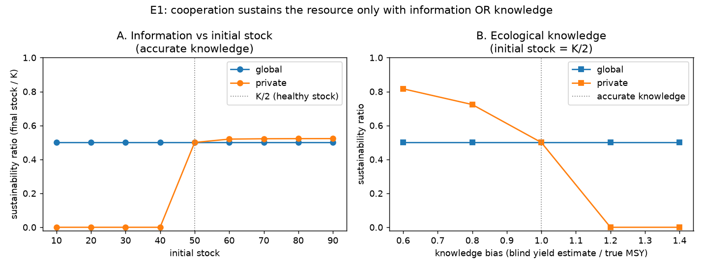

# E1 — Information, Ecological Knowledge, and Sustainable Cooperation

**Date:** 2026-07-25 · **Script:**
[`scripts/experiment_information_knowledge.py`](../../scripts/experiment_information_knowledge.py)
· **Outputs:** `results/E1_information_knowledge/` · **Tests:** H1, H6

## Question

Does an all-cooperative population sustain the shared resource — and how does that
depend on (a) whether agents can *observe* the stock (information) versus (b) whether
their *ecological knowledge* of the sustainable yield is accurate?

This tests hypotheses **H1** (blind cooperation is fragile to initial stock) and
**H6** (cooperation without accurate knowledge fails), and probes the sharpened
research question: *can information substitute for ecological knowledge?* (ADR-0004,
motivated by Schill et al. 2016, "Cooperation Is Not Enough".)

## Method

- Population: 8 `cooperative` agents (homogeneous).
- Resource: logistic, `K = 100`, `g = 0.4` (so `MSY = g·K/4 = 10`),
  collapse threshold 1.0, 100 rounds.
- Metric shown: **sustainability ratio** = final stock / K (0 = collapsed,
  0.5 = held at the healthy K/2 level).
- **Sweep A — information × initial stock:** `information_model ∈ {global, private}`
  × `initial_level ∈ {10,…,90}`, with accurate knowledge (`knowledge_bias = 1.0`).
- **Sweep B — ecological knowledge:** `information_model ∈ {global, private}` ×
  `knowledge_bias ∈ {0.6, 0.8, 1.0, 1.2, 1.4}`, at `initial_level = 50` (= K/2).
  `knowledge_bias` scales the blind agent's estimate of the sustainable yield
  (1.0 = accurate, >1 = overconfident, <1 = under-confident).
- Seeds: 5. **Note:** the baseline strategies are *deterministic* (they draw no
  random numbers), so between-seed variance is exactly 0 here; the seed machinery
  matters once strategies become stochastic. Results below are therefore exact, not
  noisy means.

## Results

**Sweep A — sustainability ratio (final stock / K):**

| initial stock | global | private |
| ------------: | -----: | ------: |
| 10 | 0.50 | **0.00** |
| 20 | 0.50 | **0.00** |
| 30 | 0.50 | **0.00** |
| 40 | 0.50 | **0.00** |
| 50 (= K/2) | 0.50 | 0.50 |
| 60 | 0.50 | 0.52 |
| 70–90 | 0.50 | ~0.52 |

**Sweep B — sustainability ratio (private info relies on knowledge; initial = K/2):**

| knowledge_bias | global | private |
| -------------: | -----: | ------: |
| 0.6 (under) | 0.50 | 0.82 |
| 0.8 | 0.50 | 0.72 |
| 1.0 (accurate) | 0.50 | 0.50 |
| 1.2 (over) | 0.50 | **0.00** |
| 1.4 (over) | 0.50 | **0.00** |

Supporting detail at `knowledge_bias = 1.5`, private: survival ≈ 7 rounds,
over-usage rate ≈ 0.88, efficiency ≈ 0.11 (collapses fast, over-harvesting most
active rounds).

## Interpretation

1. **With global information, cooperation is robust.** The sustainability ratio is a
   flat 0.5 across *every* initial stock (Sweep A) and *every* knowledge bias
   (Sweep B). Observing the stock lets the self-correcting rule hold it at K/2
   regardless — the agent doesn't need an accurate internal model.
2. **With private information, cooperation is fragile in two distinct ways:**
   - **H1 (initial stock):** starting below K/2, blind cooperators harvest their
     nominal sustainable amount even though the depleted stock can't support it, and
     drive it to collapse (ratio 0.0 for initial ≤ 40).
   - **H6 (knowledge):** even starting at K/2, *overconfident* cooperators
     (bias ≥ 1.2) collapse the resource; *under-confident* ones (bias < 1.0)
     survive but leave the stock inefficiently high (ratio 0.72–0.82).
3. **Information substitutes for ecological knowledge.** The two panels are the same
   phenomenon: sustainable cooperation requires *either* observation of the stock
   *or* an accurate model of it. Remove both and cooperative intent is not enough —
   exactly the Schill et al. (2016) result, reproduced in our minimal model.

## Threats to validity / limitations

- **Deterministic strategies:** zero between-seed variance; robustness claims across
  seeds are trivial until stochastic strategies are added.
- **Homogeneous population:** all-cooperative only. Mixed populations (free-riders)
  are studied separately; interactions with information are future work.
- **Idealised knowledge model:** `knowledge_bias` is a single multiplicative error on
  the yield estimate; real ecological uncertainty is richer (noisy, updating,
  heterogeneous across agents — cf. Schill et al.).
- **Global self-correction is by design:** the cooperative rule self-corrects when it
  observes the stock, so global robustness partly reflects that rule choice
  (ADR-0002). The result is "observation enables self-correction", not "observation
  helps any rule".
- **Single parameterisation:** one `(K, g, N)`; sensitivity to these is not yet swept.

## Follow-ups

- Add a **conditional cooperator** and repeat under mixed populations.
- Sweep group size `N` and regeneration rate `g` (sensitivity).
- **Phase 2:** can *communication* supply the missing ecological knowledge under
  private information (i.e. move the private curves toward the global line)?
