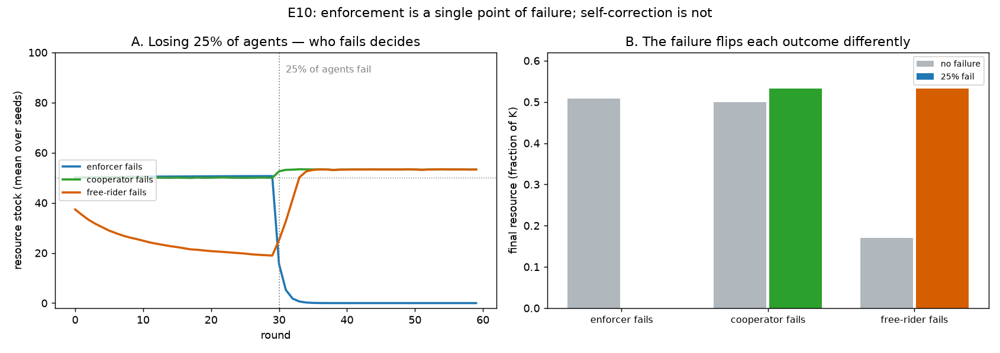

# E10 — Agent Failure: Is Enforcement a Single Point of Failure?

**Date:** 2026-07-27 · **Script:**
[`scripts/experiment_agent_failure.py`](../../scripts/experiment_agent_failure.py)
· **Outputs:** `results/E10_agent_failure/` · **Extends:** E8–E9 (Phase 3)

## Question

E8–E9 disturbed the *resource* (a shock). This one disturbs the *population*: at a
mid-run round a quarter of the agents **fail** — they drop out and stop requesting,
harvesting, and (if a sanctioner) enforcing. Does a commons tolerate losing members,
and does it matter *who* is lost? This is the "tolerance to agent failure" thread from
the resilience literature, and it stress-tests the enforcement result (E3/E9): does
concentrating protection in a monitor create a fragility?

## Method

Global information, 8 agents, `decision_noise = 0.1`, 20 seeds. At round 30, a
25%-agent-failure (2 of 8) fires (agents fail in spec order, so the group meant to
fail is listed first). Three scenarios, each run with and without the failure:

- **enforcer fails** — 2 sanctioners + 6 selfish (enforcement holds the commons, E3);
  the 2 sanctioners are failed.
- **cooperator fails** — 8 self-correcting cooperators; 2 are failed.
- **free-rider fails** — 2 selfish + 6 cooperators (the free-riders are eroding it);
  the 2 selfish are failed.

## Results

**Final resource (fraction of K)**, no failure vs. 25% of agents failing:

| scenario | no failure | 25% fail |
| -------- | ---------: | -------: |
| enforcer fails | 0.51 | **0.00** |
| cooperator fails | 0.50 | 0.53 |
| free-rider fails | 0.17 | **0.53** |

- **Losing the enforcer collapses the commons** (0.51 → 0.00): with the 2 sanctioners
  gone, enforcement vanishes and the 6 remaining selfish empty the pool.
- **Losing a cooperator is harmless** (0.50 → 0.53): the remaining cooperators still
  observe and self-correct — slightly *healthier*, with fewer harvesters.
- **Losing a free-rider helps** (0.17 → 0.53): removing the 2 selfish lets the eroded
  commons recover to health.

## Interpretation

1. **Who fails decides the outcome.** The same 25% loss is catastrophic, neutral, or
   beneficial depending on *which* agents drop out. Agent failure is not inherently
   good or bad for a commons — it removes whatever service or burden those agents
   provided.

2. **Enforcement is a single point of failure.** The mechanism that makes the commons
   robust to free-riders (E3/E9) concentrates the group's protection in the monitors,
   so losing them removes the protection all at once. A self-correcting cooperative
   commons has no such load-bearing agent: protection is *distributed* across every
   observer, so any subset can be lost without collapse.

3. **This complements E5, from the other direction.** E5 showed monitoring erodes
   *endogenously* (the second-order free-rider problem — nobody wants to pay to
   monitor). E10 shows the same dependency bites *exogenously*: even committed
   monitors can simply fail. Either way, a commons that leans on a few enforcers
   inherits their fragility — an argument for distributed or redundant monitoring
   (echoing Ostrom's design principles: monitoring by the appropriators themselves,
   not a single external enforcer).

**Conclusion:** *robustness to agent failure is a property of how protection is
organized, not of how much cooperation there is. Distributed self-correction degrades
gracefully under agent loss; concentrated enforcement fails catastrophically when the
enforcer does. The resilience of a commons therefore depends not only on information
(E8) and the presence of enforcement (E9) but on whether that enforcement has a single
point of failure.*

## Threats to validity / limitations

- **Failure of *all* enforcers at once.** With only 2 sanctioners, a 25% failure that
  happens to remove both is a worst case. A larger, redundant monitor pool would fail
  gracefully — which is precisely the design lesson; a sweep of "how many enforcers,
  how many fail" would map the redundancy threshold.
- **Failure targets by index order.** The engine fails the first `fraction` of agents;
  the experiment orders the victim group first. This is deterministic and controllable
  but not random — *which* agents fail is a design choice here, not a draw.
- **Permanent failure, single event.** Agents do not recover or get replaced, and only
  one failure fires. Intermittent failure, or joins/leaves over time, are future work.
- **Global information, `greed = 1.0`, one failure fraction/timing.** The qualitative
  ordering (enforcer-loss catastrophic, cooperator-loss benign, free-rider-loss
  beneficial) is the robust claim; the exact numbers are specific to `(K, g, N)`.

## Follow-ups

- Sweep enforcer count and failure fraction: how much monitor **redundancy** buys back
  resilience to enforcer loss.
- Combine with E8: agent failure *and* a resource shock together.
- Communication failure (the broadcast channel drops) against the same interface.
- Agents that **rejoin** or are **replaced**, and intermittent rather than permanent
  failure.
