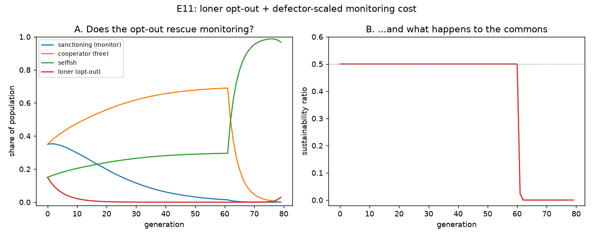

# E11 — Does an Opt-Out ("Loner") Rescue Voluntary Monitoring?

**Date:** 2026-08-06 · **Script:**
[`scripts/experiment_voluntary_monitoring_loner.py`](../../scripts/experiment_voluntary_monitoring_loner.py)
· **Outputs:** `results/E11_voluntary_monitoring_loner/` · **Extends:** E5 ·
**Motivated by:** Hauert, Traulsen, Brandt, Nowak & Sigmund (2007) ·
**Design decision:** [ADR-0009](../decisions/0009-loner-and-defector-scaled-monitoring-cost.md)

## Question

[E5](E5-voluntary-monitoring.md) found voluntary monitoring is **not evolutionarily
stable**: sanctioners pay a flat monitoring cost every round, free-riding
cooperators out-earn them, monitors erode to zero by generation ~13, and the
commons then collapses. Hauert et al. (2007) show that letting agents opt out of
the joint enterprise entirely — becoming a **loner** for a fixed, safe payoff — can
rescue exactly this kind of costly-punishment collapse, because it makes punishing
cheap when defectors are rare. Does the same mechanism rescue *our* monitors?

## Method

Same replicator-dynamics harness as E5 (no core-engine change; see
[ADR-0006](../decisions/0006-evolutionary-dynamics-at-experiment-level.md)) —
`N = 40` agents, `60` rounds/generation, `80` generations, resource `K=100,
g=0.4` (so `MSY = g·K/4 = 10`), `initial_level=50` — extended
with a fourth strategy and one behavioural change:

- **`loner`** — excluded from the simulated round itself (never appears in
  `run_simulation`'s agent list) and instead earns a fixed payoff **σ = 6.0**
  every generation, applied directly in the replicator bookkeeping, not
  computed by the engine. Calibrated between two numbers measured at this
  exact population scale: an all-selfish/collapsed population nets **≈1.5**
  per agent; an all-cooperative/healthy population nets **≈15.0** per agent —
  σ=6.0 sits inside that range (worse than success, better than collapse).
- **Defector-scaled monitoring cost.** The sanctioner's `monitoring_cost`,
  flat at `0.2` in E5, is recomputed *every generation* as
  `0.2 × (selfish_count / n_active)`, where `n_active` = the sanctioning +
  cooperative + selfish agents actually in that generation's simulation
  (loners excluded). E.g. at the starting composition below,
  `n_active = 40 × (0.35+0.35+0.15) = 34` and `selfish_count ≈ 6`, giving
  `monitoring_cost ≈ 0.2 × 6/34 ≈ 0.035` — about a sixth of E5's flat cost.

**Starting composition:** `sanctioning=0.35, cooperative=0.35, selfish=0.15,
loner=0.15` (14/14/6/6 of 40 agents). The loner *must* start
present at a nonzero share, not 0% — replicator dynamics cannot grow a strategy
from an exact 0% share (`0 × any fitness ratio = 0`); see ADR-0009. Seed: 1
(deterministic — no decision noise, no broadcast — so a single seed is exact,
as in E5).

## Results

| generation | sanctioning | cooperative | selfish | loner | sustainability | monitoring_cost |
| ---------: | ----------: | ----------: | ------: | ----: | --------------: | ---------------: |
| 0  | 0.350 | 0.350 | 0.150 | 0.150 | 0.50 | 0.035 |
| 3  | 0.350 | 0.397 | 0.170 | 0.083 | 0.50 | 0.038 |
| 60 | 0.015 | 0.689 | 0.295 | ~0.000 | 0.50 | 0.060 |
| 61 | 0.014 | 0.690 | 0.296 | ~0.000 | 0.02 | 0.060 |
| 65 | 0.003 | 0.199 | 0.797 | ~0.000 | ~0.00 | 0.160 |
| 79 | ~0.000 | ~0.000 | ~1.000 | ~0.000 | 0.00 | 0.200 |

*(Compare to E5, unmodified: sanctioning hits ~0 and sustainability cliff-drops by
generation ~13–14.)*

- **The loner never takes hold.** Its fixed payoff (6.0) is far below a healthy
  commons (~15.0 per agent), so as soon as the resource is fine, opting out is the
  *worst* available option and the loner share shrinks back toward zero within the
  first ~10 generations.
- **Monitoring cost does drop a lot, as designed** — from the flat 0.2 in E5 down to
  0.035–0.06 for most of the run, because the selfish share of the active population
  stays modest while sanctioning is still numerous.
- **Sanctioning still declines every single generation — just much more slowly.**
  It never stabilises or grows; it just erodes on a much longer timescale (from
  generation 0 all the way to ~generation 60, instead of collapsing by generation
  13–14 in E5).
- **The same cliff-drop shape as E5, just delayed ~4–5×.** Sustainability holds
  exactly at 0.50 for as long as *any* sanctioning share remains (consistent with
  the existing "any one monitor enforces fully" rule, ADR-0005), then crashes to
  ~0 within about 4 generations once sanctioning is exhausted (generation ~61→65).
  The end state is the same as E5: selfish fixate near 100%, the commons is dead —
  and the loner is extinct too, since a collapsed commons pays selfish agents more
  (once nothing regulates them) than the fixed σ.

## Interpretation

**The opt-out mechanism substantially delays voluntary monitoring's collapse — by
roughly 4–5× — but does not prevent it in this model.** That is a real,
quantified effect (making monitoring cheap when free-riders are rare genuinely buys
a lot of time), but it is not the qualitative rescue Hauert et al. (2007) report.

The reason is structural, not a tuning failure. Hauert's actual rescue depends on a
detail this project's replicator dynamics does not have: a **finite-population,
rare-mutation** setting in which a strategy can reach full **fixation** (100% of the
population) and, once fixed, resist any new mutant permanently. Once punishers are
fixed, Hauert's proof shows they *stay* fixed — that is where the rescue's staying
power comes from. Our replicator dynamics update every strategy's share
*continuously* every generation with no fixation step and no mutation term. In that
setting, sanctioning's cost is always *strictly positive* (it only approaches zero
in the limit of zero free-riders, never actually reaches it while any selfish agents
remain), while plain cooperation's cost is always *exactly* zero. A strategy with an
always-positive cost, however small, is at a permanent disadvantage against one with
zero cost in continuous replicator competition — so cooperation wins eventually,
just very slowly when the cost is tiny.

This sharpens, rather than closes, a question the Hauert paper note already raised:
*"does the loner rescue need the finite-population stochastic setting, or does an
opt-out alone flip a deterministic replicator model too?"* The answer, at least for
this parameterisation, is **no — the opt-out alone is not enough; the finite-
population fixation dynamic appears to be the load-bearing ingredient**, not just
"cheap monitoring" by itself.

## Threats to validity / limitations

- **One value of σ (loner payoff) and one monitoring-cost-scaling formula.** Both
  were chosen from first-principles reasoning (Hauert's inequality; a linear scaling
  by selfish share) rather than swept. A higher σ closer to the healthy-commons
  payoff, or a steeper cost-scaling function, might delay collapse further — worth a
  parameter sweep before treating the "delay, not rescue" conclusion as final.
  (See also E5's own limitation: "any one monitor enforces fully" is why
  sustainability is flat right up to the cliff rather than degrading gradually.)
- **No mutation, no finite-population stochasticity.** This is the crux of the
  interpretation above, not an incidental limitation — the natural next experiment
  is a genuinely finite-population/Moran-process version of this dynamic, which
  would let Hauert's mechanism be tested as originally specified.
- **Same single-seed, single-simulation-per-generation setup as E5.**

## Follow-ups

- ✅ **Sigmund, De Silva, Traulsen & Hauert (2010)'s pool-punishment + second-order
  sanctioning — tried, see [E12](E12-pool-punishment.md).** Unlike this loner
  rescue, it works: sanctioning grows monotonically to ~100% instead of eroding
  (design in
  [`docs/paper-notes/2010-sigmund-social-learning-institutions.md`](../paper-notes/2010-sigmund-social-learning-institutions.md)).
- **A finite-population, stochastic (Moran-process) replicator variant** would let
  Hauert's mechanism be tested as originally specified, with fixation and mutation —
  a more involved change to the experiment harness, but the most direct way to
  confirm the "fixation is the missing ingredient" interpretation above.
- **Sweep σ and the monitoring-cost-scaling steepness** to check whether the
  delay-not-rescue outcome is robust across the parameter space, or whether some
  region does produce a genuine rescue.
