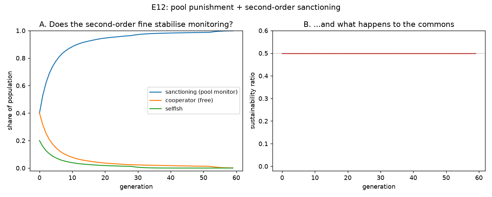

# E12 — Does Pool Punishment With a Second-Order Fine Stabilise Monitoring?

**Date:** 2026-08-06 · **Script:**
[`scripts/experiment_pool_punishment.py`](../../scripts/experiment_pool_punishment.py)
· **Outputs:** `results/E12_pool_punishment/` · **Extends:** E5, E11 ·
**Motivated by:** Sigmund, De Silva, Traulsen & Hauert (2010) ·
**Design decision:** [ADR-0010](../decisions/0010-pool-punishment-symmetric-fine.md)

## Question

[E5](E5-voluntary-monitoring.md) found voluntary monitoring collapses.
[E11](E11-loner-rescue.md) tried Hauert et al. (2007)'s opt-out rescue and found
it only delays the collapse — our continuous replicator dynamics lack the
finite-population fixation step that mechanism needs. Sigmund et al. (2010)
offer a *different* fix built on a different property: **pool punishment** is
pre-committed (paid unconditionally, not scaled down when defectors are rare)
and, because paying in is a declared act, the pool can also fine **second-order
free-riders** — cooperators who benefit from enforcement without paying for it.
Does *this* mechanism stabilise monitoring where E11's did not?

## Method

Same replicator-dynamics harness as E5/E11 (no core-engine change; ADR-0006),
changing exactly one thing relative to plain E5 (per experiment-design.md's
"change one factor at a time"): a **pool fine**. Every round enforcement holds,
every non-sanctioning agent — `cooperative` *and* `selfish` alike — pays
`0.2`/round into the pool, redistributed evenly across `sanctioning` agents.
Monitoring cost itself stays flat, as in E5 (unlike E11, which scaled it down).
No loner strategy here — isolating the fine mechanism on its own.

`N = 40`, 60 rounds/generation, 60 generations, starting composition
`sanctioning=0.40, cooperative=0.40, selfish=0.20` (E5's exact starting point,
for direct comparison).

**A first version of this fine failed and is documented, not hidden — see
[ADR-0010](../decisions/0010-pool-punishment-symmetric-fine.md).** Fining only
`cooperative` agents (the literal "second-order" half of Sigmund's mechanism)
made the collapse *faster* than plain E5, because this engine's enforcement
caps selfish agents' harvest but does not fine them *below* cooperators' — so
taxing only cooperative agents just made them worse off than untaxed selfish
ones. The fix — fining `selfish` too — reproduces both halves of Sigmund's
mechanism (the ordinary defector fine his baseline already assumes, plus the
second-order addition), not just the second half.

## Results

| generation | sanctioning | cooperative | selfish | sustainability |
| ---------: | ----------: | ----------: | ------: | --------------: |
| 0  | 0.400 | 0.400 | 0.200 | 0.50 |
| 3  | 0.688 | 0.208 | 0.104 | 0.50 |
| 10 | 0.883 | 0.078 | 0.039 | 0.50 |
| 20 | 0.946 | 0.036 | 0.018 | 0.50 |
| 40 | 0.982 | 0.017 | 0.0002 | 0.50 |
| 59 | 0.999 | 0.001 | ~0.000 | 0.50 |

*(Compare: E5 collapses to 0% sanctioning / 100% selfish by generation ~13–14.
E11 delays that same outcome to generation ~60–65. E12 never collapses at all.)*

- **Sanctioning grows monotonically from the first generation**, from 40% to
  99.9% by generation 59 — the opposite trajectory to both E5 and E11.
- **Selfish is driven out fastest of the three** (down to ~0.02% by generation
  40) — being fined *and* capped at the quota with no compensating benefit is
  the worst position of all once a pool exists.
- **Sustainability never moves from 0.50.** No erosion phase, no cliff-drop —
  monitoring is never in danger once the fine is in place.

## Interpretation

**Pool punishment with a symmetric fine on all non-monitors genuinely
stabilises monitoring in this model — the first of the three mechanisms tried
(E5's plain voluntary case, E11's loner opt-out, E12's pool fine) to actually
do so, rather than delay or fail to prevent collapse.** This reproduces
Sigmund et al.'s (2010) qualitative result: pool punishment, once its
second-order loophole is closed, out-competes both defection and plain
cooperation.

**Why this succeeds where E11 didn't.** E11's opt-out delay worked by making
monitoring *cheaper*, but sanctioning's cost was still always strictly
*positive* while cooperation's was always exactly zero — an asymmetry that,
under continuous (non-fixating) replicator dynamics, cooperation eventually
wins no matter how small the gap. E12 removes that asymmetry directly: once
the pool exists, *every* non-monitor pays the *same* fine sanctioning agents
effectively don't (they collect it instead of paying it), so sanctioning's
fitness advantage doesn't shrink toward zero as free-riders become rare — it
grows *larger* the fewer sanctioners there are to split the pot among. That
structural difference — a persistent, self-reinforcing advantage rather than a
shrinking cost — is what a continuous replicator model actually needs to lock
in a costly strategy, without requiring Hauert's finite-population fixation
step at all.

## Threats to validity / limitations

- **The fine is asserted, not derived from any cheap-to-collect mechanism.**
  It is applied costlessly and with perfect information about who monitors —
  Ostrom (1990)'s point that real monitoring is only cheap when *engineered*
  to be a low-cost by-product applies here (see the OWG-1992 and Ostrom-1990
  paper notes' critique of this project's monitoring assumptions generally).
- **One fine value (0.2/round), not swept.** Chosen for symmetry with the
  existing monitoring cost, not tuned to find a minimum threshold.
- **No loner strategy.** Deliberately isolated to attribute the effect
  cleanly to the fine; combining with E11's opt-out is an open follow-up.
- **Same single-seed, single-simulation-per-generation setup as E5/E11.**

## Follow-ups

- **Sweep `POOL_FINE_PER_ROUND`** to find the minimum fine that still
  stabilises monitoring, and check whether very small fines still work or
  whether there's a real threshold.
- **Combine with E11's loner option** — does adding an opt-out change how fast
  the population converges to full sanctioning, or is the fine alone already
  enough that the opt-out adds nothing?
- **A more realistic, costly-to-collect fine** (e.g. scaling the fine's
  administrative cost with population size or information quality) would test
  whether the result survives relaxing the "free, perfect enforcement"
  assumption this version relies on.
