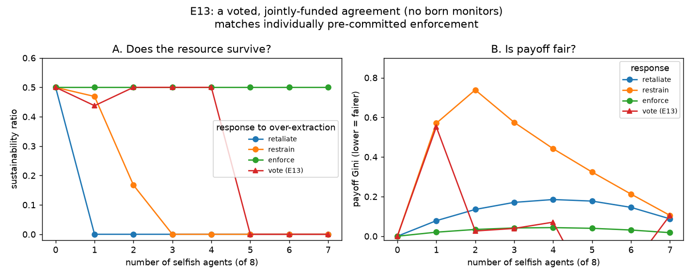

# E13 — Does a Voted, Jointly-Funded Agreement Match Enforcement?

**Date:** 2026-08-06 · **Script:**
[`scripts/experiment_binding_agreement.py`](../../scripts/experiment_binding_agreement.py)
· **Outputs:** `results/E13_binding_agreement/` · **Extends:** E5, E7 ·
**Motivated by:** Ostrom, Walker & Gardner (1992) ·
**Engine change:** [ADR-0011](../decisions/0011-collective-choice-enforcement.md)
(new `CollectiveChoiceConfig` — the first core-engine change since E1–E10)

## Question

[E7](E7-response-rules.md) found that of the responses to detected
over-extraction tried so far — retaliate, restrain, enforce — only enforcement
protects both the resource and fairness. But every "enforcer" there is
individually pre-committed to the `sanctioning` strategy from round 0 — a
trait some agents are simply born with. Ostrom, Walker & Gardner (1992)'s lab
CPR experiment shows something structurally different: real groups
**communicate, then vote** on whether to adopt a jointly-funded sanctioning
mechanism, and *whether the vote passes* — not the mere presence of a monitor
type — is what predicts success (93% yield when adopted, 56% when rejected).
Can a population with **no individually pre-committed monitors at all** reach
enforcement's outcome, purely by voting itself into it once it observes it is
over-using the commons?

## Method

A fourth response, **collective choice** (ADR-0011). Population: 8 agents =
`(8 − n_selfish)` `cooperative` + `n_selfish` `selfish`, swept `n_selfish =
0..7`; no `sanctioning` agent exists. Resource `K=100, g=0.4` (`MSY=g·K/4=10`),
`initial_level=50`, `information_model=global`, `100` rounds. Compared against
E7's three responses (`conditional_cooperator`=retaliate,
`compensating_cooperator`=restrain, `sanctioning`=enforce, all with the same
population structure/sweep). Seed: 1 (deterministic — global info, no noise,
no broadcast needed).

**The vote — `CollectiveChoiceConfig(vote_round=2, overuse_threshold=0.5,
cost_share=0.2)`, worked through exactly:**

- At round index 2 (after rounds 0 and 1 have played), the engine counts how
  many of those **2** prior rounds had total group harvest exceed `MSY=10`.
  Call that count `X`. The vote passes if `X/2 > 0.5` — since `X ∈ {0,1,2}`,
  that arithmetically requires `X=2`: **both** observed rounds had to be
  over-use rounds, not just one on average.
- **If it passes:** from round 2 onward, every agent's harvest is capped at
  `MSY/8 = 1.25`/round (the identical quota mechanism `sanctioning` uses), and
  every agent — none individually carries a `sanctioning` policy here — pays
  `cost_share=0.2`/round out of pocket, funding the quota.
- **If it fails:** nothing changes; agents keep behaving exactly as their
  individual strategy dictates.

**Vote timing was itself a finding, not a free parameter picked to make this
work — see "Interpretation."** Tried first at round 10 (matching OWG-1992's
own "after round 10" convention); that was too slow once free-riders numbered
3+. The reported run votes at **round 2**.

## Results

**Sustainability ratio**, by response × number of selfish free-riders:

| n_selfish | enforce | restrain | retaliate | **vote (E13)** |
| --------: | ------: | -------: | --------: | --------------: |
| 0 | 0.50 | 0.50 | 0.50 | 0.50 |
| 1 | 0.50 | 0.47 | 0.00 | 0.44 |
| 2 | 0.50 | 0.17 | 0.00 | **0.50** |
| 3 | 0.50 | 0.00 | 0.00 | **0.50** |
| 4 | 0.50 | 0.00 | 0.00 | **0.50** |
| 5 | 0.50 | 0.00 | 0.00 | 0.00 |
| 6 | 0.50 | 0.00 | 0.00 | 0.00 |
| 7 | 0.50 | 0.00 | 0.00 | 0.00 |

- **Collective choice matches pre-committed enforcement exactly across 0–4
  free-riders** (0.50 at every count except a small dip to 0.44 at exactly 1),
  despite starting with *zero* individually-sanctioning agents — the vote,
  fired at round 2, closes the gap.
- **It breaks down sharply at 5+ free-riders**, falling to 0.00 — the same
  point where `restrain` had already been failing since 3. Pre-committed
  `enforce` alone holds at 0.50 for every count, because it never allows any
  damage to occur in the first place.
- **Fairness (Gini) tracks `enforce` closely in the range it succeeds** (≤0.07
  vs `enforce`'s ≤0.04 for n_selfish 0–4), and both are far better than
  `restrain`'s (up to 0.74) or `retaliate`'s. At n_selfish 5–6, `vote`'s Gini
  goes *negative* (−0.29, −0.16) — an artefact of some agents' net payoff going
  negative post-collapse (still paying the collective fee while earning ~0
  harvest), which breaks the standard Gini formula's non-negativity
  assumption; not a meaningful fairness signal once the resource is already
  dead.

## Interpretation

**A voted, jointly-funded agreement can substitute fully for individually
pre-committed enforcement — but only if the group acts fast enough relative
to how quickly free-riders can do damage.** This is the central, non-obvious
result, and it only emerged by testing timing explicitly:

- At **round 10** (the first, more "realistic" choice — give the group a
  longer track record before deciding), collective choice tracked `restrain`,
  not `enforce`: it matched enforcement only for 0–2 free-riders, then
  degraded just like the peer response, reaching 0.00 by n_selfish 3. Ten
  rounds was enough time for a large free-rider group to drive the stock into
  a depletion the flat quota — calibrated for the healthy `K/2` steady state
  — cannot out-grow, **the same "a flat quota can't force recovery of an
  already-depleted, under-observing population" mechanism E8 documents for
  blind agents.** Here the population isn't blind (global information), but
  the *vote itself* was blind for those first 10 rounds — the group simply
  hadn't looked yet.
- At **round 2**, the group looks almost immediately, and the range where
  collective choice matches enforcement extends to 4 free-riders instead of 2.
- **The mechanism has a hard ceiling regardless of timing**: at 5+
  free-riders, even a round-2 vote cannot save it, because two rounds of
  eight-agent free-riding is already enough damage. This mirrors E9's finding
  that enforcement "widens the resilient range; it does not make it
  unbounded."

**Reframed as the equifinality question this project has been circling:**
under a fixed setting (global information, a given free-rider count), *how
many different approaches reach the sustainable optimum?* For 0–4
free-riders, the near-optimal set has (at least) **two** members —
pre-committed enforcement *and* collective choice — reaching the identical
0.50 by two structurally different institutional routes (one exogenous, one
endogenously voted). For 5+ free-riders, the set shrinks to **one**
(pre-committed enforcement only). This is exactly the "near-optimal-set size
as a function of complexity/severity" pattern named in
[thesis-direction-equifinality.md](../thesis-direction-equifinality.md) —
here the "complexity dial" is the free-rider count, and the set visibly
shrinks from 2 to 1 as it turns.

## Threats to validity / limitations

- **Vote timing was tuned on this exact scenario, not derived from theory.**
  Round 2 was chosen because it worked better than round 10 in *this*
  population/parameterisation; a systematic sweep over `vote_round` (and
  `overuse_threshold`) is needed to map the real timing-vs-severity frontier
  rather than reporting one favourable point (see Follow-ups).
- **Only tested under global information.** Under private information with a
  broadcast, an early diagnostic run showed collective choice fails
  completely from 1 free-rider onward — even a round-1 vote cannot rescue it,
  because blind agents (unlike observing ones) do not self-correct at all
  during the pre-vote window, so the stock can be driven near 0 within 1–2
  rounds regardless of when the vote fires. Collective choice therefore
  inherits E1/E8's information dependency in addition to its own timing
  dependency — worth stating plainly rather than only reporting the
  favourable global-information case.
- **The vote rule is a mechanical threshold on observed harvest, not a
  reasoned decision.** See ADR-0011's limitations: no agent-level vote, no
  stochasticity, no institutional memory (OWG-1992's own "hysteresis" finding
  — a group's bad prior experience makes it vote against a *better* design
  later — cannot appear here).
- **An individually-sanctioning agent, if present, makes the vote
  structurally unable to pass** (documented in ADR-0011 and covered by a
  dedicated test) — collective and individual enforcement are alternative
  founding mechanisms here, not layers that combine.
- **The negative-Gini artefact** (above) suggests the fairness metric needs a
  guard or a different formulation for post-collapse, negative-payoff cases
  before being reported as a headline number in future work.

## Follow-ups

- **Sweep `vote_round` × `overuse_threshold` × free-rider count** to map the
  full frontier of when collective choice matches enforcement vs. degrades —
  turning the round-2-vs-round-10 comparison above into a proper surface
  rather than two spot checks.
- **Test under private information** as a first-class comparison (not just a
  documented caveat), to quantify exactly how much of collective choice's
  viability is about timing vs. about information.
- **A probabilistic vote** (pass with some probability rather than a hard
  threshold) would let a single configuration reproduce OWG-1992's "some
  groups vote yes, some don't" split across seeds, rather than every seed
  reaching the same deterministic outcome.
- **Feed this into the equifinality near-optimal-set metric directly**: this
  experiment is close to a ready-made worked example — objective = resource
  sustainability, tolerance = "reaches 0.50", approaches = {enforce, vote},
  setting = free-rider count. Computing the set-size curve explicitly (2 →
  1 as free-riders cross 5) would be a clean first data point for that
  broader thesis direction.
