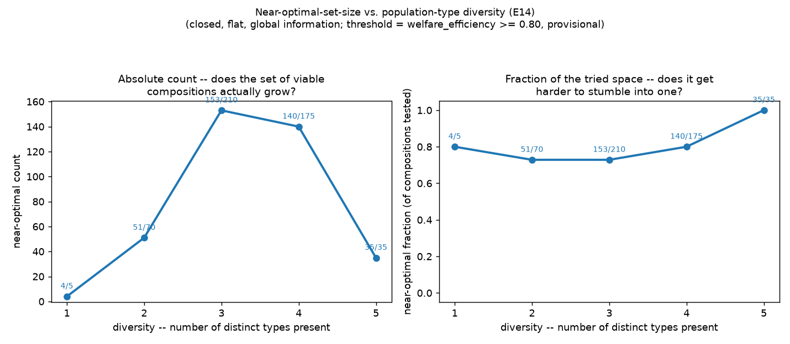

# E14 — Population-Type Diversity: Does the Near-Optimal Set Grow With More Distinct Types?

**Date:** 2026-08-09 · **Script:**
[`scripts/experiment_population_diversity.py`](../../scripts/experiment_population_diversity.py)
· **Outputs:** `results/E14_population_diversity/` · **Mechanism:** none new —
every strategy and the flat-population enforcement rule already existed
(ADR-0005); this experiment only sweeps composition.

## Question

E15 (nested enforcement) and E16 (boundaries) each vary population
composition as part of their own sweep — E15's `k` (how many groups are
sanctioning vs. selfish), E16's outsider type — without ever isolating
"how many *distinct* strategies are simultaneously present" as its own
question. That is a structurally different axis from either: E15's `k`-sweep
is a ratio between two fixed types; this is about how many *different kinds*
of agent coexist at all, before any group or boundary structure exists. Per
the corrected axis sequencing (see
[thesis-direction-equifinality.md](../thesis-direction-equifinality.md)),
this belongs *before* groups/boundaries, not folded into them — so it takes
the E14 slot, with groups/boundaries renumbered to E15/E16 to make room.

## Method

- Population: **fixed at 8 agents, closed, flat (one group), global
  information** — the same baseline E15/E16 build on top of.
- **Every reachable composition** across all five registered non-loner
  strategies (`cooperative`, `conditional_cooperator`,
  `compensating_cooperator`, `selfish`, `sanctioning`) is swept — 495
  compositions total (stars-and-bars: `C(8+5-1, 5-1) = C(12,4)`).
  `sanctioning` is included deliberately: diversity is about how many
  distinct strategies coexist, and sanctioning being one candidate strategy
  is exactly what that means, even though it's also what E15/E16 vary in
  isolation.
- **Diversity** = how many of the five types have a non-zero count in a
  given composition (1..5).
- Resource: logistic, `K = 100`, `g = 0.4` (`MSY = 10`), collapse threshold
  1.0, 100 rounds, `initial_level = 50`.
- Metric: `welfare_efficiency`, same provisional threshold `≥ 0.80` as
  E15/E16, for direct comparability across axes.
- Deterministic strategies, single seed — exact, not a noisy mean (same
  reasoning as E1).

## Results

**Near-optimal-set-size vs. diversity (naive reading):**

| diversity | configs tested | near-optimal count | fraction |
| -: | -: | -: | -: |
| 1 | 5 | 4 | 0.80 |
| 2 | 70 | 51 | 0.73 |
| 3 | 210 | 153 | 0.73 |
| 4 | 175 | 140 | 0.80 |
| 5 | 35 | 35 | 1.00 |

**This naive reading is confounded, and reporting it alone would repeat the
exact mistake this project already corrected twice (see
[complexity-synthesis.md](../complexity-synthesis.md)'s two methodological
lessons).** The count rises sharply from diversity 1→3 then falls at 4→5 —
but the *total number of compositions that exist* at each diversity level
also isn't constant (5, 70, 210, 175, 35): requiring more distinct types
present, with only 8 agents to distribute, mechanically shrinks how many
compositions are even possible at high diversity. The count falling from 153
to 35 is largely just "there are only 35 compositions where all five types
appear at all," not "diversity got harder."

**Decomposing further reveals the real driver, and it isn't diversity at
all:**

| condition | passing | tested | rate |
| --- | -: | -: | -: |
| At least one `sanctioning` agent present | 330 | 330 | **100%** |
| No `sanctioning` agent present | 53 | 165 | 32% |

**Every single composition that includes at least one sanctioning agent
reaches the threshold — all 330 of them, regardless of how the other 7
agents split across the remaining four types.** This is E3's classic finding
(a single monitor, in a flat population, enforces the quota on everyone) —
rediscovered here as a special case of a much larger sweep, not a new
result. Without any sanctioning agent, the population's fate depends on
`selfish` count and, more subtly, on *which* restraining strategy is
present:

| `n_selfish` (no sanctioning) | passing | tested |
| -: | -: | -: |
| 0 | 45 | 45 |
| 1 | 8 | 36 |
| 2+ | 0 | 108 |

With zero selfish agents, any mix of the three restraining types sustains
the resource. With exactly one selfish agent, only 8 of 36 compositions
survive — and **every one of those 8 has zero `conditional_cooperator`
agents.** A conditional cooperator's own defensive rule (grab now if the
stock just declined) turns one free-rider's presence into a retaliation
spiral that collapses the pool — this is E2's finding ("reciprocity
collapses it"), also rediscovered here. `compensating_cooperator` (which
withholds rather than retaliates on a decline) tolerates that same single
free-rider fine. With two or more selfish agents and no enforcer, nothing in
the tested space recovers — matching E2/E3's joint conclusion that
restraint alone, however composed, cannot out-scale multiple free-riders.

## Interpretation

1. **The headline "does diversity grow the near-optimal set" question
   doesn't have a clean answer from the naive count alone, and reporting
   only that count would have been misleading in a now-familiar way** (see
   complexity-synthesis.md's lessons 1 and 2 — this is a third instance of
   the same family of mistake: an aggregate number that looks like it's
   answering the headline question is actually dominated by something else).
2. **What actually predicts success here is almost entirely two already-known
   facts, not a new "diversity effect":** whether an enforcer is present
   (E3), and — absent one — whether the restraining strategy present is
   reciprocal (fails against even one free-rider, E2) or simply withholds
   (tolerates one). A full 495-composition sweep mostly re-derives E1–E3's
   findings rather than discovering new structure. That is itself a useful,
   honest result: it says the *number* of distinct types present is a weak
   proxy for what matters, compared to *which specific* combination of
   institutional and behavioural choices is present.
3. **This reframes what "population diversity" should mean going forward.**
   Raw type-count is not a good complexity dial on its own. A more
   informative version of this axis would track *which* strategies coexist,
   not how many — e.g. "is an enforcer present" and "is the restraining
   response reciprocal or compensating" as two separate, named booleans,
   rather than one scalar diversity count. Worth revisiting before this axis
   gets combined with groups/boundaries.

## Threats to validity / limitations

- **Closed, flat, global information only** — this experiment doesn't yet
  cross diversity with groups (E15) or boundaries (E16); doing so is the
  natural next step now that this baseline is understood, but it multiplies
  the sweep size substantially (495 compositions × every `m` × every
  boundary condition).
- **The near-optimal-set-size threshold (`0.80`) is provisional** — same
  caveat as E15/E16.
- **Single seed, deterministic strategies** — exact for this composition,
  not a noisy mean; a version with `decision_noise > 0` would need seed
  averaging and a much larger compute budget (495 compositions × seeds).
- **`loner` excluded** — it's an evolution-mode-only opt-out strategy, not a
  harvesting decision available in a single run; this axis doesn't cover it.
- **The "which types matter" finding (enforcer presence, reciprocal vs.
  compensating response) is read off this one sweep, not independently
  confirmed by a targeted follow-up experiment** — E2 and E3 already support
  it as a smaller-scale prior, which is why it's reported as a
  rediscovery, not a new claim.

## Follow-ups

- **A revised diversity axis based on this experiment's own finding:** two
  named booleans (enforcer present / restraining response type) instead of
  a raw type count, tested as its own small factorial.
- Cross this axis with groups (E15) and boundaries (E16) once the revised
  axis above is settled — per the 2026-08-09 renumbering note in
  [ADR-0012](../decisions/0012-nested-enterprise-groups.md), E15/E16 will
  likely need reworking anyway to sweep the full population-composition
  matrix instead of a single sanctioning/selfish split.
- Add `decision_noise` and seed-averaging to check whether the "one
  sanctioning agent is always enough" result is robust to noisy execution,
  not just the deterministic case tested here.
