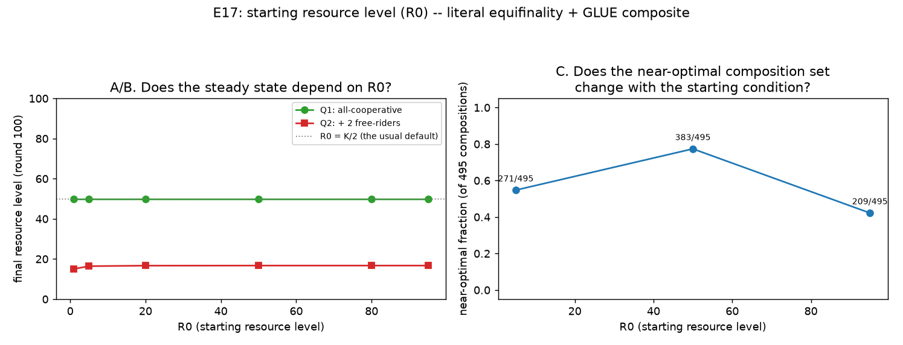

# E17 — Starting Resource Level (R₀): Literal Equifinality and a GLUE Composite

**Date:** 2026-08-16 · **Script:**
[`scripts/experiment_starting_resource.py`](../../scripts/experiment_starting_resource.py)
· **Outputs:** `results/E17_starting_resource/` · **Mechanism:**
[ADR-0017](../decisions/0017-starting-resource-level-glue-sweep.md)

## Question

Every experiment so far has implicitly fixed the starting resource level
`R₀` at `K/2` without ever naming that choice. Von Bertalanffy (1968)'s own
definition of equifinality is exactly this: an open system that reaches a
*steady state* has a final value provably independent of its initial
conditions. Three questions, kept deliberately separate (ADR-0017):

1. **Literal equifinality:** does a fixed, well-behaved population's final
   resource level actually not depend on `R₀`?
2. **The guarantee's limits:** does that still hold once free-riders are
   present and can drain the pool from an already-fragile start?
3. **GLUE composite (Beven & Binley 1992/2014):** crossed with E14's full
   composition space, does the *near-optimal set* itself depend on `R₀`?

## Method

- `K=100`, `g=0.4`, 100 rounds, `information_model=global`, deterministic
  strategies (seed=1).
- **Q1:** 8 `cooperative` agents, no free-riders, `R₀ ∈ {1, 5, 20, 50, 80,
  95}`.
- **Q2:** identical `R₀` sweep, 6 `cooperative` + 2 `selfish` free-riders.
- **Q3:** the identical 495-composition enumeration E14 used (5 registered
  non-loner strategies, `N=8`), at three representative levels
  `R₀ ∈ {5, 50, 95}` (catastrophic / default / near-capacity), reusing the
  same `welfare_efficiency ≥ 0.80` threshold as E14–E16/E20.

## Results

**Q1 — literal equifinality** (`q1_literal_equifinality.csv`):

| R₀ | final level | ever collapsed |
| --: | --: | :-: |
| 1.0 | 50.0 | no |
| 5.0 | 50.0 | no |
| 20.0 | 50.0 | no |
| 50.0 | 50.0 | no |
| 80.0 | 50.0 | no |
| 95.0 | 50.0 | no |

Exactly `50.0` at every single `R₀` tested, to the last decimal.

**Q2 — limits under free-riders** (`q2_limits_with_freeriders.csv`), at 100 rounds:

| R₀ | final level (100 rounds) | final level (500 rounds) |
| --: | --: | --: |
| 1.0 | 15.060 | 16.667 |
| 5.0 | 16.425 | 16.667 |
| 20.0 | 16.683 | 16.667 |
| 50.0 | 16.722 | 16.667 |
| 80.0 | 16.722 | 16.667 |
| 95.0 | 16.722 | 16.667 |

(The 500-round column is a follow-up check, not part of the original sweep
— see Interpretation.)

**Q3 — GLUE composite** (`q3_composite_curve.csv`), against E14's own
`R₀=50` baseline:

| R₀ | near-optimal count | fraction |
| --: | --: | --: |
| 5.0 (catastrophic) | 271/495 | 0.547 |
| 50.0 (default — **= E14's own reported baseline**) | 383/495 | 0.774 |
| 95.0 (near-capacity) | 209/495 | 0.422 |

## Interpretation

1. **Q1 confirms von Bertalanffy's theorem exactly, not approximately.** An
   all-`cooperative` population's final resource level is `50.0` regardless
   of whether it started at `1.0` or `95.0` — a precise, direct empirical
   instance of the founding citation for this project's whole equifinality
   direction, not a metaphorical resemblance. Mechanistically clean:
   `cooperative`'s decision rule (`max(0, level − K/2)/n`) is purely
   reactive to the *current* stock, with no memory of where it started, so
   it has no way to behave differently based on history in the first place.
2. **Q2 shows the guarantee holds, but only asymptotically — the 100-round
   budget this project uses everywhere else isn't always long enough to
   see it.** At round 100, `R₀=1.0`'s final level (`15.06`) looks
   meaningfully lower than `R₀=50`'s (`16.72`) — a real gap, not noise. A
   follow-up check at 500 rounds shows **all six starting levels converge
   to the identical `16.667`** — the same true steady state, reached more
   slowly the further away it started. This is an honest, useful nuance:
   equifinality is a claim about `t → ∞`, and this project's standard
   round budget can understate it for a sufficiently catastrophic start,
   without the underlying claim being false.
3. **Q3's near-optimal fraction genuinely depends on `R₀` — dropping at
   *both* extremes, and further at the high end than the low one** (0.774
   at the default vs. 0.547 catastrophic-low vs. 0.422 near-capacity). This
   directly answers the "multiple configurations" sense of the question:
   *which* compositions succeed is not independent of the starting
   condition, unlike Q1's literal, fixed-population sense.
4. **The near-capacity result has a sharp, fully-explained, and previously
   invisible mechanism — this is the headline finding.** Every registered
   strategy was checked individually; `conditional_cooperator` alone
   accounts for a large share of the R₀=95 drop, via an exact, deterministic
   threshold: **any `R₀ > K/2` causes an all-`conditional_cooperator`
   population to permanently empty the pool within two rounds** (verified
   at `R₀=50.0` → stable; `R₀=50.1` → collapsed by round 1; every level up
   to `95` → same). The mechanism: `conditional_cooperator` detects
   "over-extraction" by comparing the *observed* (regrown) stock to the
   *previous* round's — but starting above `K/2` means the population's own
   first, perfectly legitimate harvest (bringing the stock back down toward
   its target) **looks identical to a decline caused by a free-rider**, to
   a heuristic that has no way to tell the two apart. Every other registered
   strategy was checked the same way at `R₀=95`: `cooperative` and
   `sanctioning` are fine (no decline-detection at all);
   `compensating_cooperator` shares the *exact same* decline trigger as
   `conditional_cooperator` but is immune, because its response to a
   (falsely) detected decline is to **withhold** (harvest nothing) rather
   than retaliate — harmless, where retaliation is catastrophic. Of the 495
   compositions, 330 (67%) include `conditional_cooperator`; their pass
   rate falls from 74.5% (`R₀=50`) to 41.8% (`R₀=95`), while
   `conditional_cooperator`-free compositions *also* fall, from 83.0% to
   43.0% — so this mechanism is a large, precisely-understood contributor,
   not the sole one; the remaining drop among CC-free compositions is more
   diffuse (many individually modest, threshold-crossing shifts across
   mixed populations) and not exhaustively traced here.
5. **This was invisible in every prior experiment (E2 onward used
   `conditional_cooperator` extensively) purely because `R₀ = K/2` was
   always the fixed, silent default** — exactly the kind of unnamed,
   un-tested assumption E17 exists to surface. It does not invalidate any
   earlier finding (all of them ran at exactly the one starting level where
   this doesn't manifest), but it is a genuine, previously-undocumented
   limitation of `conditional_cooperator`'s decline-detection heuristic,
   worth citing wherever that strategy is discussed going forward.

## Threats to validity / limitations

- **Q2's asymptotic convergence check (500 rounds) was a targeted follow-up,
  not part of the original sweep design** — worth folding into the main
  script if this experiment is revisited.
- **Only one free-rider composition tested in Q2** (6 cooperative + 2
  selfish) — the convergence-rate effect's sensitivity to free-rider count
  is untested.
- **The `conditional_cooperator` threshold was traced by hand for
  individual and a few paired compositions, not for all 330 CC-containing
  compositions in Q3** — the 41.8% pass rate confirms the effect is
  widespread, but the exact composition-by-composition breakdown (e.g.
  whether a large enough `sanctioning`/`compensating_cooperator` presence
  can rescue a CC-containing composition from the round-1 cascade) is a
  natural follow-up, not claimed here.
- **Deterministic strategies, single seed** (matching E1/E14's own
  convention); a stochastic decision-noise variant could smooth or sharpen
  the exact `R₀ = K/2` threshold.
- **Not folded into the complexity-staircase count/fraction table as its
  own row** — a deliberate scope decision (ADR-0017): this is a
  settings-robustness check, not a new axis varying decentralization,
  information, or institutions.

## Follow-ups

- Fix `conditional_cooperator`'s decline-detection to distinguish "the
  population's own legitimate adjustment toward `K/2`" from genuine
  over-extraction (e.g. compare against the *target*, not just the
  *previous* observation) — the natural next step, and a real correctness
  question independent of E17 itself.
- A finer `R₀` grid around `K/2` (e.g. every 5 units from 40–60) to check
  whether the sharp threshold is genuinely a knife-edge at every population
  mix, or specific to the pure-`conditional_cooperator` case tested here.
- Trace the remaining, more diffuse `R₀=95` drop among
  `conditional_cooperator`-free compositions to a specific mechanism,
  rather than leaving it as an unexplained residual.
- Extend Q2 to a small free-rider-count sweep (0–4) to characterize how
  convergence rate (not just final state) depends on both `R₀` and
  free-rider pressure jointly.
