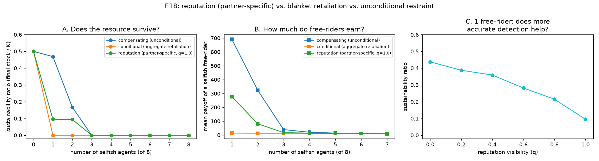

# E18 — Reputation: Indirect Reciprocity vs. Blanket Retaliation

**Date:** 2026-08-14 · **Script:**
[`scripts/experiment_reputation.py`](../../scripts/experiment_reputation.py)
· **Outputs:** `results/E18_reputation/` · **Mechanism:**
[ADR-0014](../decisions/0014-reputation-indirect-reciprocity.md)

## Question

Nowak & Sigmund (1998): cooperation can be sustained via a public reputation
score, without repeated interaction between the same two individuals. Two
questions this project's own engine can actually check, not just cite:

1. Does conditioning retaliation on **one randomly-assigned partner's**
   reputation (rather than the population's aggregate trend, the way
   `conditional_cooperator` already does) avoid E2's own finding that
   retaliation collapses the resource with even a single free-rider?
2. Does **more accurate** reputation information (`visibility`, Nowak &
   Sigmund's `q`) help or hurt — the resource, and fairness?

## Method

- Group of 8 agents; `information_model = global`; logistic resource
  `K=100`, `g=0.4` (`MSY=10`), 100 rounds, 3 seeds (deterministic strategies
  → zero between-seed variance; values are exact, matching E2's own
  convention).
- **Main sweep:** three cooperator types compared against a growing minority
  of selfish free-riders (0–8 of 8) — `compensating_cooperator`
  (unconditional restraint, never retaliates), `conditional_cooperator`
  (retaliates against the population's aggregate stock trend — E2), and
  `reputation_cooperator` (retaliates only against a randomly-assigned
  partner it distrusts this round — ADR-0014), all with
  `ReputationConfig(visibility=1.0)` where applicable.
- **Visibility sweep:** fixed at 1 free-rider (the case E2 already showed
  collapses under blanket retaliation), `visibility` swept `0.0 → 1.0` in
  steps of `0.2`.

## Results

**Main sweep** (`results/E18_reputation/sweep.csv`):

| cooperator type | n_selfish | sustainability | welfare_efficiency | collapsed? |
| --- | --: | --: | --: | :--: |
| compensating (unconditional) | 1 | **0.469** | 0.993 | no |
| conditional (aggregate retaliation) | 1 | **0.000** | 0.070 | **yes** |
| reputation (partner-specific, q=1.0) | 1 | **0.095** | 0.560 | no |
| compensating | 2 | 0.167 | 0.654 | no |
| conditional | 2 | 0.000 | 0.069 | yes |
| reputation | 2 | 0.094 | 0.204 | no |
| all three | 3+ | 0.000 | ≤0.079 | yes |

**Visibility sweep** (1 free-rider, `results/E18_reputation/visibility_sweep.csv`):

| visibility (q) | sustainability | welfare_efficiency | selfish free-rider payoff | payoff Gini |
| --: | --: | --: | --: | --: |
| 0.0 | 0.438 | 0.991 | 670.7 | 0.552 |
| 0.4 | 0.359 | 0.949 | 613.9 | 0.577 |
| 0.8 | 0.215 | 0.761 | 470.5 | 0.487 |
| 1.0 | 0.095 | 0.560 | 332.0 | 0.417 |

*(Free-rider payoff and Gini computed directly for this table — not in the
sweep script's own CSV, which reports sustainability/welfare only.)*

## Interpretation

1. **The partner-specific trigger genuinely avoids the collapse a
   population-wide one causes — this is the load-bearing result.** At 1
   free-rider, `conditional_cooperator` is already fully collapsed
   (sustainability 0.000, `welfare_efficiency` 0.070); `reputation_cooperator`
   survives (0.095, 0.560), worse than pure unconditional restraint (0.469,
   0.993) but a genuine third point on that spectrum, not a repeat of either
   known extreme. Mechanistically: only whoever happens to draw the
   free-rider as their random partner defects on a given round — with 1
   free-rider among 7 others, that's a minority of rounds for any single
   reputation-cooperator, not a population-wide synchronised switch.
2. **More accurate reputation information makes the *resource* outcome
   worse, monotonically — but makes *fairness* better.** As `visibility`
   rises `0.0 → 1.0`, sustainability falls **0.438 → 0.095** (more than 4×),
   while the free-rider's payoff falls **670.7 → 332.0** (more than 2×) and
   Gini falls **0.552 → 0.417**. At `q=0`, no reputation-cooperator ever
   actually learns anyone's score, so every one of them just behaves like an
   unconditional cooperator (matching E2's own compensating/unconditional
   numbers closely) — full trust, full exploitation. At `q=1`, they reliably
   detect and reciprocate against the one real free-rider, which protects
   them individually but costs the shared pool exactly the same way E2's
   blanket retaliation did, just less severely because it's only partial.
   **This is E2's resource-vs-fairness trade-off, rediscovered inside a
   single mechanism's own information parameter, not just across two
   different mechanisms.**
3. **Both known extremes remain visible as limiting cases of this one
   mechanism.** `visibility → 0` converges toward unconditional restraint's
   own numbers; a hypothetical partner-selection rule that always resamples
   the *same* known-bad partner (not implemented) would converge toward
   `conditional_cooperator`'s blanket retaliation. Reputation's own
   `visibility` dial sits between two mechanisms this project already
   understood, not beside them.
4. **All three collapse once free-riders are numerous enough (≥3 of 8).**
   Reputation, like the other two, is not a general-purpose fix — it changes
   *how much* damage a small minority of free-riders does, not whether an
   unenforced population can tolerate a large one.

## Threats to validity / limitations

- **Fair-share reference for scoring is population-wide (`MSY/n_governed`),
  not adapted to how many free-riders are actually present** — an agent's
  reputation reflects a fixed external standard, not relative standing
  within its actual population.
- **`trust_threshold=0` (the strategy default) was not swept** — a stricter
  or laxer threshold would shift where on the visibility curve a given
  population sits, not tested here.
- **Partner selection is uniform over the whole population, every round
  independently** — no memory of past partners, no preferential pairing; a
  real social network (clustering, repeated pairing) is untested and would
  be the natural bridge to a future network-reciprocity axis.
- Deterministic strategies (zero seed variance); single `(K, g, N)`; global
  info only; `reputation` combined with `groups`/`boundaries` (ADR-0012/13)
  is untested (see ADR-0014's own Consequences).

## Follow-ups

- Sweep `trust_threshold` alongside `visibility`.
- Test whether reputation-as-enforcement (ADR-0014's rejected Option 1 —
  capping a bad-reputation agent's harvest directly, no dedicated monitor
  cost) answers E3/E5's second-order free-rider problem better than this
  strategy-level version does.
- Combine with `groups`/`boundaries` (does partner selection stay
  population-wide, or should it scope to an agent's own group?).
- A genuine network-reciprocity axis (structured, non-uniform partner
  selection) as the natural generalisation of this experiment's uniform
  random pairing.
