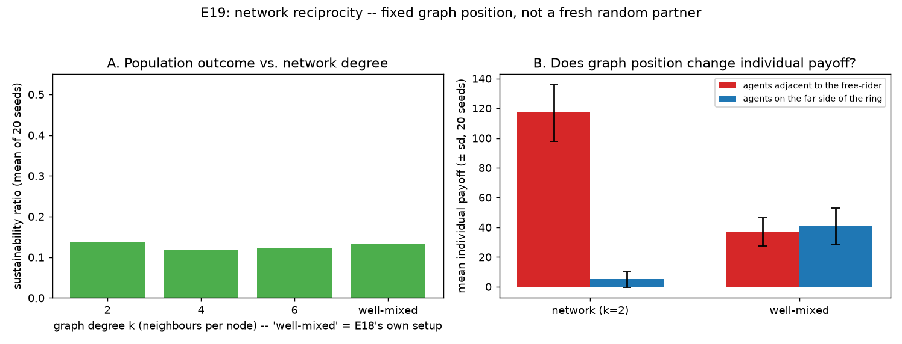

# E19 — Network Reciprocity: Fixed Graph Position, Not Just a Fresh Random Partner

**Date:** 2026-08-15 · **Script:**
[`scripts/experiment_network_reciprocity.py`](../../scripts/experiment_network_reciprocity.py)
· **Outputs:** `results/E19_network_reciprocity/` · **Mechanism:**
[ADR-0015](../decisions/0015-network-reciprocity-fixed-neighbor-graph.md)

## Question

Nowak (2006)'s network reciprocity (rule 4): individuals occupy the vertices
of a graph and interact only with their `k` graph neighbours, not the whole
population; cooperators can then survive by forming clusters that mutually
protect each other. E18 already made reputation *partner-specific*, but its
partner is a fresh, uniformly random draw every round — closer to Nowak's
rule 3 (indirect reciprocity) than rule 4. This experiment adds the one
ingredient E18 doesn't have: a **fixed, persistent** neighbour graph, and
asks two questions:

1. **Position.** With a sparse ring and one free-rider at a fixed position,
   do its fixed neighbours pay a measurable cost that agents on the far side
   of the ring never see — something well-mixed reputation (E18) cannot
   produce, since every agent there has equal expected exposure?
2. **Degree.** Sweeping the graph's degree `k` from sparse to well-mixed,
   does a sparser network change the *population's* sustainability?

**This does not literally test `b/c > k`** — see ADR-0015's Rationale for
why an earlier attempt (graph-structured evolutionary dynamics on top of
E5/E11/E12) was built, run, and rejected: monitoring's benefit in this
project's single shared pool is a population-wide public good, which cannot
produce the local payoff variance Nowak's formula assumes. This experiment
tests the qualitative claim — fixed position changes outcomes — using the
one mechanism in this project (reputation's partner-conditioned harvest
decision) that is genuinely individual rather than a public good.

## Method

- 1 `selfish` agent (fixed at index 0) + 7 `reputation_cooperator` agents
  (indices 1–7); `information_model = global`; logistic resource `K=100`,
  `g=0.4`, 100 rounds, `ReputationConfig(visibility=1.0)` — same population
  as E18's own 1-free-rider case, for direct comparability.
- **Neighbour graph:** a ring lattice built once from agent order
  (`NetworkConfig(degree=k)`); agent `i`'s neighbours are the `k/2` nearest
  agents on each side. At `k=2`, the free-rider's only fixed neighbours are
  agents 1 and 7; agents 2–6 can never be paired with it.
- **Degree sweep:** `k ∈ {2, 4, 6}` plus a `well-mixed` control
  (`network=None`, i.e. E18's own partner-selection rule), 20 seeds each,
  population-level `sustainability_ratio` and `welfare_efficiency`.
- **Position comparison:** at `k=2` vs. well-mixed, 20 seeds each, mean
  individual payoff for the free-rider's fixed neighbours (agents 1, 7)
  vs. agents on the far side of the ring (agents 2–6).

## Results

**Degree sweep** (`results/E19_network_reciprocity/degree_sweep.csv`, mean of 20 seeds):

| degree | sustainability | welfare_efficiency | collapsed? |
| --- | --: | --: | :--: |
| k=2 | 0.136 | 0.496 | no |
| k=4 | 0.119 | 0.568 | no |
| k=6 | 0.121 | 0.523 | no |
| well-mixed (E18) | 0.132 | 0.547 | no |

**Position comparison** (`results/E19_network_reciprocity/position_comparison.csv`, mean ± sd, 20 seeds):

| condition | fixed neighbours of the free-rider | agents on the far side |
| --- | --: | --: |
| network (k=2) | **117.0 ± 19.1** | **5.0 ± 5.6** |
| well-mixed (E18) | 36.9 ± 9.5 | 40.7 ± 12.1 |

## Interpretation

1. **Fixed graph position produces a large, mechanistically clear
   inequality that well-mixed reputation structurally cannot — this is the
   load-bearing result.** At `k=2`, the free-rider's two fixed neighbours
   earn ~117 on average while agents on the far side of the ring earn ~5 —
   over 20× apart. Under well-mixed reputation (E18's own setup), the same
   agent-index labels earn statistically indistinguishable amounts (~37 vs.
   ~41): there is no "position" for a well-mixed mechanism to depend on in
   the first place, only equal expected exposure averaged over many random
   draws. This is a genuinely new capability, not a re-run of E18 with
   extra bookkeeping.
2. **The direction is the opposite of the naive guess.** One might expect
   the free-rider's neighbours to do *worse* (repeatedly exposed to a bad
   partner). They do better. Mechanism: because they are the only agents
   who ever draw the free-rider, they are also the only agents who ever
   *distrust* it — and distrust means switching to a selfish-sized grab
   themselves. Early in the run, while the pool is still healthy, that
   occasional grab is a large one-time windfall; once the pool crashes
   (driven by the free-rider's own constant over-extraction, independent of
   any of this), the far agents' cooperative "surplus above target" formula
   returns ~0 for almost every remaining round, since the target is rarely
   exceeded once the stock stays depleted. The two neighbours captured
   their windfall before the crash; the five distant agents never got the
   chance to defect at all and are left waiting on a surplus that mostly
   never returns.
3. **Population-level sustainability is roughly flat across degree** (0.12–0.14
   across every `k` tested, including well-mixed) — sparsifying the network
   does not rescue the *shared pool* the way it changes who bears the cost.
   The free-rider's own behaviour never depends on the graph at all, so its
   damage to the one global pool is largely unaffected by who else happens
   to be nearby. **The effect this experiment surfaces is distributional
   (who bears the cost), not aggregate (whether the pool survives)** — a
   different kind of claim than E14–E16's near-optimal-*set-size* framing;
   see `complexity-synthesis.md`'s scoping note for this axis.
4. **This is a real example of graph-position-driven luck**, not a designed
   institution: nobody chose to protect agents 1 and 7 more than agents
   2–6 — it falls directly out of *where the free-rider happened to start*.
   That is arguably closer to how real network effects work (an accident of
   who your neighbours are) than any deliberately-designed mechanism this
   project has built so far (sanctioning, voting, groups).

## Threats to validity / limitations

- **The free-rider's fixed position (index 0) is a single, hand-picked
  case** — the position effect at `k=2` was not re-tested with the
  free-rider at a different ring index or with multiple free-riders spread
  across the ring; the qualitative direction should be symmetric by
  construction (the ring lattice is rotation-invariant), but this was not
  separately verified.
- **`b/c > k` is not literally computable here** (see ADR-0015) — the
  reported effect is qualitative evidence that fixed position matters, not
  a test of Nowak's exact threshold.
- **Only a ring lattice was tested** — no random-regular, small-world, or
  scale-free topology; whether the windfall/starvation asymmetry generalises
  to irregular graphs (some agents with more neighbours than others) is
  untested.
- **`visibility=1.0` only** — E18 found visibility trades off resource
  health against fairness; how that interacts with a fixed graph (does low
  visibility flatten the position effect, since fewer distrust events fire
  at all?) is untested.
- Deterministic single-seed *within* a run (only cross-seed variance comes
  from the RNG stream seed, not from repeated sampling of the same
  configuration); single `(K, g, N)`; combined with `groups`/`boundaries`
  (ADR-0012/13) is untested, same caveat as E18's own.

## Follow-ups

- Re-run the position comparison with the free-rider at multiple ring
  positions / multiple free-riders, to confirm the windfall/starvation
  asymmetry isn't an artifact of the one chosen layout.
- Sweep `visibility` at a fixed degree to see whether the position effect
  shrinks as fewer distrust events ever fire.
- Try irregular topologies (small-world, one hub with many neighbours) —
  Nowak's own clustering story is normally illustrated on more structured
  graphs than a plain ring.
- Test combining `network` with `groups`/`boundaries` (ADR-0012/13) — does
  scoping the neighbour graph to an agent's own group change anything, or
  are the two genuinely orthogonal as currently implemented?
