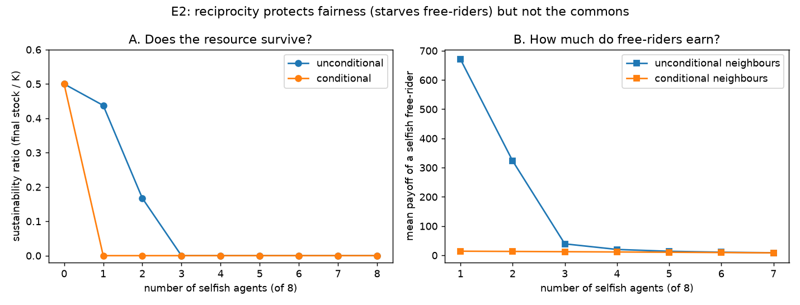

# E2 — Reciprocity in Mixed Populations: Resource vs. Fairness

**Date:** 2026-07-25 · **Script:**
[`scripts/experiment_reciprocity.py`](../../scripts/experiment_reciprocity.py)
· **Outputs:** `results/E2_reciprocity/` · **Tests:** SQ-4, SQ-5

## Question

When a population of cooperators faces a growing minority of selfish free-riders,
does **conditional cooperation** (reciprocity: cooperate until the group
over-extracts, then grab a selfish share) protect the resource better than
**unconditional cooperation** — and how is payoff distributed? (SQ-5, SQ-4.)

## Method

- Group of 8 agents; `information_model = global`; logistic resource `K=100`,
  `g=0.4` (`MSY=10`), 100 rounds.
- Two cooperator types compared: `cooperative` (unconditional, self-correcting) and
  `conditional_cooperator` (reciprocity, `defection_greed=1.0`).
- Swept the number of selfish agents from 0 to 8 (the rest are the cooperator type).
- Reported per (type, n_selfish): sustainability ratio, payoff Gini, and mean payoff
  of a cooperator vs. a selfish free-rider. Seeds: 3 (deterministic strategies →
  zero between-seed variance; values are exact).

## Results

| type | n_selfish | sustainability | Gini | coop payoff | selfish payoff |
| ---- | --------: | -------------: | ---: | ----------: | -------------: |
| unconditional | 0 | 0.50 | 0.00 | 125.0 | — |
| unconditional | 1 | **0.44** | 0.55 | 45.7 | **670.7** |
| unconditional | 2 | 0.17 | 0.74 | 1.2 | 323.3 |
| unconditional | 3 | 0.00 | 0.57 | 1.2 | 39.3 |
| unconditional | 4 | 0.00 | 0.44 | 1.2 | 20.2 |
| conditional | 0 | 0.50 | 0.00 | 125.0 | — |
| conditional | 1 | **0.00** | 0.08 | 7.9 | **14.2** |
| conditional | 2 | 0.00 | 0.14 | 7.1 | 13.4 |
| conditional | 4 | 0.00 | 0.19 | 5.3 | 11.6 |

*(Full table in `results/E2_reciprocity/sweep.csv`.)*

## Interpretation

1. **Reciprocity does NOT protect the resource — it collapses it faster.** A single
   selfish agent among unconditional cooperators still leaves the resource alive
   (sustainability 0.44); the same free-rider among conditional cooperators triggers
   retaliation that collapses it (0.00). This **refutes the naive SQ-5 hypothesis**
   that conditional cooperation protects the commons better.
2. **Reciprocity protects fairness and the individual.** The free-rider earns **670**
   exploiting unconditional cooperators but only **14** among conditional ones — a
   ~48× reduction — and Gini stays low (≤0.19 vs up to 0.74). Conditional cooperators
   refuse to be suckers.
3. **The trade-off is the finding:** with these two mechanisms you can protect *the
   resource* (unconditional restraint absorbs the damage) **or** *fairness*
   (reciprocity starves free-riders), but **not both**. Neither mechanism achieves
   sustainable *and* equitable outcomes when free-riders are present.
4. **The "optimal parasite":** a lone free-rider among unconditional cooperators does
   best of all (670); adding more free-riders destroys the resource they feed on, so
   their individual payoff falls (670 → 39 → 20 …). Exploitation is only lucrative
   while it is rare.

## Why this matters (link to the roadmap)

Protecting *both* the resource and fairness is exactly what **sanctioning /
graduated punishment** (Ostrom's design principles) is for: punish over-extractors
enough to deter them without destroying the resource through retaliation. E2 makes
the case for a `sanctioning` strategy and, more broadly, for the **communication**
phase — can agents coordinate (build trust) to avoid the retaliation spiral? (Janssen
et al. 2022: communication → trust → sustained restraint.)

## Threats to validity / limitations

- **Retaliation severity is a design choice.** Our conditional cooperator retaliates
  *hard* (`defection_greed = 1.0`, a full selfish grab) and does not forgive while
  the stock keeps falling, which drives the fast collapse. A milder or forgiving
  reciprocity (`defection_greed < 1`, or probabilistic forgiveness) would sit between
  the two curves — worth a follow-up sweep over `defection_greed`.
- **Monitoring is indirect** (via the stock trend), so any decline — even a transient
  one — triggers retaliation; a noisier resource could cause false triggers.
- Deterministic strategies (zero seed variance); single `(K, g, N)`; global info only.
- Homogeneous cooperator type per run (no mix of conditional + unconditional).

## Follow-ups

- Sweep `defection_greed` (retaliation severity) and add forgiveness.
- A `sanctioning` strategy: targeted, costly punishment of over-extractors; can it
  protect resource *and* fairness?
- Repeat under `private` information (conditional cooperators cannot monitor when
  blind — do they degrade to unconditional?).
