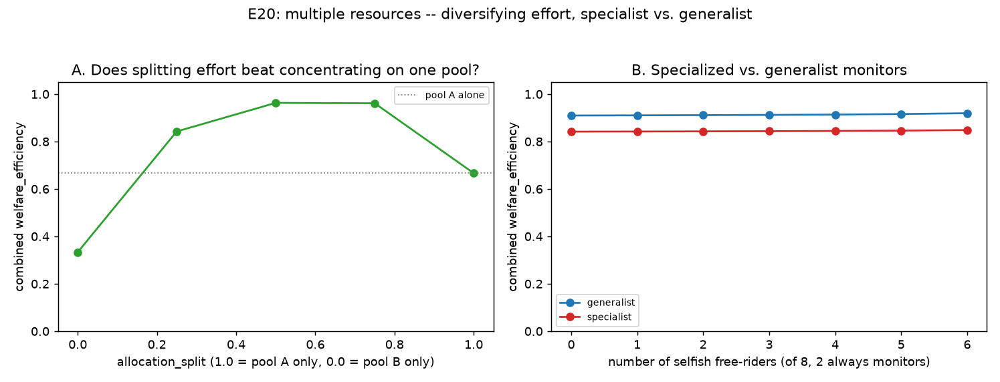

# E20 — Multiple Resources: Diversifying Effort, Specialist vs. Generalist Monitors

**Date:** 2026-08-16 (revised — see the correctness-fix note below) · **Script:**
[`scripts/experiment_multiple_resources.py`](../../scripts/experiment_multiple_resources.py)
· **Outputs:** `results/E20_multiple_resources/` · **Mechanism:**
[ADR-0016](../decisions/0016-multiple-resources-allocation-split.md)

## Question

GovSim (Piatti et al., 2024) names "varying regeneration rates and multiple
resource types" directly as its own future work — the next axis by grounding
once reputation (E18) and network reciprocity (E19) were both built. Every
existing strategy is reused completely unchanged (ADR-0016): the engine
calls `decide()` once per pool against that pool's own observation and
scales the two results by each agent's `AgentSpec.allocation_split`. Three
questions:

1. **Does diversifying effort across two independent, asymmetric resources
   change total welfare, compared to concentrating on one?**
2. **Specialized vs. generalist monitors: does having one monitor per
   resource (cheaper, half the monitoring cost) outperform monitors that
   each watch both resources (more expensive, fully redundant coverage)?**
3. **Does adding a second resource change the near-optimal composition
   count?** The same population-type-diversity question E14 asked at a
   single pool — swept at the exact same 495 compositions, this time with a
   second pool on and every agent splitting its effort evenly.

## Method

- Two deliberately asymmetric pools, both `K=100`: Pool A ("reliable",
  `g=0.4`, `MSY=10`) and Pool B ("fragile", `g=0.2`, `MSY=5`, half the
  growth rate) — asymmetry gives specialization a real stake; symmetric
  pools would make preferring one arbitrary. `information_model=global`,
  100 rounds, deterministic strategies (seed=1; zero between-seed variance
  for deterministic populations, matching this project's own convention for
  non-evolutionary experiments).
- **Split sweep (Q1):** 8 `cooperative` agents, no free-riders, no monitors,
  `allocation_split` swept `1.0 → 0.0` (pool A only → even split → pool B
  only). Welfare measured against the *combined* sustainable yield of both
  pools (`MSY_A + MSY_B = 15`/round) — `compute_metrics` is deliberately
  single-pool-only (ADR-0016), so this experiment computes its own
  combined-pool `welfare_efficiency` directly from `RunResult`.
- **Monitor arrangement sweep (Q2):** 2 of 8 agents are always monitors,
  arranged either as **generalists** (`allocation_split=0.5` each, both
  watch and pay to enforce both pools) or **specialists** (one
  `allocation_split=1.0` enforcing only pool A, one `allocation_split=0.0`
  enforcing only pool B) — a monitor's enforcement reach follows its own
  specialization (ADR-0016). The remaining 6 seats are split between
  `cooperative` (`allocation_split=0.5`, generalist) and a growing count of
  `selfish` free-riders (0–6).
- **Composition sweep (Q3):** the identical 495-composition enumeration
  E14 used (5 registered non-loner strategies, `N=8`, stars-and-bars) — the
  only change is `second_resource=Pool B` and every agent's
  `allocation_split` fixed at `0.5` (the same representative value the web
  demo's "+ Resources" complexity-panel toggle uses). Threshold
  `welfare_efficiency ≥ 0.80` (provisional), same as E14–E16, so the two
  curves are directly comparable diversity-level by diversity-level.

## Correctness fix, 2026-08-16 — the original Q2/Q3 numbers below were wrong

While explaining this axis's mechanism in detail, a real bug turned up in the
sanctioning quota, and the numbers in this report have been regenerated after
fixing it. Documenting it here in full, not quietly replacing the numbers,
because the *wrong* version told a specific, plausible-sounding, and false
story (see the retired Interpretation points below).

**The bug:** a sanctioning agent's enforced quota comes from
`SanctioningStrategy.sanction_policy()`, which computes
`quota_total = regeneration_rate * capacity / 4` from whatever params that
strategy instance was built with. Two things were wrong at once: (1)
`Simulation._build_strategies()` built pool B's own strategy instances
(`self._strategy_b`) from the *same* `AgentSpec.params` as pool A, so a
sanctioning agent's pool-B copy still thought it was protecting a `g=0.4`
pool even though it was actually enforcing `g=0.2` pool B; and (2)
`_enforce()` never even consulted that pool-B copy — it always asked
`agent.strategy` (the pool-A instance) for its policy, regardless of which
pool it was enforcing. Net effect: every quota enforced on pool B was
`MSY_A/n_governed = 1.25`, double pool B's true sustainable
`MSY_B/n_governed = 0.625` — a monitor that looked like it was protecting
pool B was letting free-riders take twice what that slower pool could
actually bear. Confirmed directly: before the fix, a 4-sanctioning +
4-selfish population (split 0.5) let pool B sink to a final level of 16.0;
after the fix, the same population settles at 54.9 (healthy, matching the
all-cooperative equilibrium). Both `Simulation._build_strategies()` and
`Simulation._enforce()` are fixed (see their docstrings); a regression test
(`test_sanctioning_quota_uses_each_pools_own_growth_rate`) pins the correct
per-pool quota. The web demo's own JS engine never had this bug — its
enforcement always took the correct pool-specific MSY as an explicit
argument — but a parallel, lower-impact version (the *blind*/private-info
harvest estimate reusing pool A's MSY constant) was fixed there too for full
parity.

**What actually changed:** Q1 (the split sweep) is untouched — no sanctioning
agents are involved. Q2 and Q3 both change materially — see Results and
Interpretation below, both now reflecting the corrected engine.

## Results

**Split sweep** (`results/E20_multiple_resources/split_sweep.csv`):

| allocation_split | welfare_efficiency | final level A | final level B |
| --: | --: | --: | --: |
| 1.0 (pool A only) | **0.667** | 50.0 | 100.0 |
| 0.75 | 0.961 | 53.3 | 63.8 |
| **0.5 (even split)** | **0.963** | 59.6 | 55.0 |
| 0.25 | 0.842 | 73.4 | 51.7 |
| 0.0 (pool B only) | **0.333** | 100.0 | 50.0 |

**Monitor arrangement sweep** (`results/E20_multiple_resources/monitor_arrangement_sweep.csv`):

| n_selfish | generalist welfare | generalist cost | specialist welfare | specialist cost |
| --: | --: | --: | --: | --: |
| 0 | 0.910 | 80.0 | 0.842 | 40.0 |
| 2 | 0.911 | 80.0 | 0.843 | 40.0 |
| 4 | 0.914 | 80.0 | 0.845 | 40.0 |
| 5 | 0.916 | 80.0 | 0.846 | 40.0 |
| 6 (max free-riders, 2 monitors) | 0.919 | 80.0 | 0.848 | 40.0 |

Neither pool ever collapses, at any free-rider count tested (0–6), in either
arrangement — a real change from the pre-fix numbers (see below).

**Composition sweep** (`results/E20_multiple_resources/composition_sweep_curve.csv`), against
E14's own single-pool baseline (`results/E14_population_diversity/diversity_curve.csv`):

| diversity | E14 baseline (pool A only) | E20, second resource on (split=0.5) |
| --: | --: | --: |
| 1 | 4/5 (80.0%) | 3/5 (60.0%) |
| 2 | 51/70 (72.9%) | 49/70 (70.0%) |
| 3 | 153/210 (72.9%) | **160/210 (76.2%)** |
| 4 | 140/175 (80.0%) | **145/175 (82.9%)** |
| 5 | 35/35 (100.0%) | 35/35 (100.0%) |

Bold cells *exceed* the single-pool baseline — the corrected composition sweep
now beats E14 at two of the five diversity levels and matches it at a third.

## Interpretation

1. **Diversifying effort across two resources unlocks welfare a single
   resource cannot reach — this is the load-bearing result.** Concentrating
   entirely on pool A yields exactly `MSY_A × rounds = 1000`
   (`welfare_efficiency = 0.667` against the *combined* denominator) —
   correct, but pool B sits completely untouched, growing to full capacity
   with its own sustainable yield never harvested at all. Splitting evenly
   reaches `welfare_efficiency = 0.963` — **44% more total welfare than the
   best single-pool strategy achieves**, simply by not leaving a second
   sustainable resource on the table. This isn't about risk-spreading; it's
   about a resource sitting idle being real, uncaptured value.
2. **The peak isn't at the symmetric midpoint — it tracks the resources'
   own asymmetry.** `0.75` (favouring the faster-growing pool A) reaches
   `0.961`, nearly matching the `0.5` peak (`0.963`), while `0.25`
   (favouring the slower pool B) drops to `0.842`. A cooperative agent's
   "surplus above `K/2`" rule is more forgiving of over-allocation toward
   the resource that regenerates faster — the optimal split isn't naive
   50/50, it's shaped by each pool's own growth rate.
3. **Specialized monitoring is cheaper but not welfare-better — a genuine,
   non-obvious tradeoff, not the naive "division of labour wins" story.**
   Specialist monitors cost exactly half as much in raw monitoring fees
   (40 vs. 80 across 100 rounds) — confirmed mechanically
   (`test_specialist_monitor_only_enforces_and_pays_for_its_own_pool`) — but
   *net* welfare_efficiency is consistently several points *lower* for
   specialists (e.g. 0.842 vs. 0.910 at 0 free-riders) at every free-rider
   count tested. The reason is mechanical, not a quirk: a pool-A-only
   specialist doesn't just stop *enforcing* pool B, it stops *harvesting*
   from pool B too (`allocation_split=1.0` routes its entire request to
   pool A) — with correct per-pool quotas now enforced on both sides, both
   pools settle *higher* (less harvested) in the specialist arrangement
   (final level 67.7/67.7, A/B, vs. 59.6/54.9 for generalists at 0
   free-riders) because one fewer agent's harvesting effort ever reaches
   either pool at full weight. The cost saving from specializing is offset
   by the harvesting capacity a specialist withdraws by definition — the
   same story as finding 1: a resource under-harvested relative to its
   sustainable yield is left-on-the-table welfare, not safety.
4. **With correctly-calibrated per-pool enforcement, the fragile resource
   holds up fine, at every free-rider count tested — the opposite of what
   the pre-fix numbers showed.** Neither pool collapses, in either monitor
   arrangement, across the full range tested (0–6 free-riders, the maximum
   possible with 2 of 8 agents as monitors). This directly contradicts the
   pre-fix reading ("pool B collapses at exactly 5 free-riders regardless
   of arrangement") — that result was the miscalibrated quota silently
   permitting double pool B's true sustainable extraction, not a property
   of asymmetric resources. Once a monitor's quota actually reflects the
   pool it's protecting, "asymmetric" does not have to mean "fragile in
   practice" — it means the *correct* quota is smaller, and enforcing the
   correct quota does what enforcement is supposed to do.
5. **The composition-sweep's near-optimal set does not shrink relative to
   E14's single-pool baseline — it *exceeds* it at two of five diversity
   levels and matches it at a third, with the remaining shortfall fully
   explained by an already-documented, unrelated cost (finding 3, not this
   axis generically).** Corrected: diversity 3 (76.2% vs. 72.9%) and
   diversity 4 (82.9% vs. 80.0%) both beat the single-pool figure; diversity
   5 matches exactly (100% = 100%). Only diversity 1–2 still lag (60.0% vs.
   80.0%; 70.0% vs. 72.9%), and diversity 1's gap is fully accounted for:
   of the five single-type populations, only all-`selfish` (unsustainable
   regardless of pools, `welfare=0.104`) and all-`sanctioning`
   (`welfare=0.750`, just under threshold — pure doubled-monitoring-cost
   overhead from watching two pools, finding 3's own mechanism, not a
   collapse) fail; the same three cooperative-family types that pass at
   diversity 1 in the single-pool case still pass here. **This replaces the
   pre-fix "unlike groups, this axis shrinks the near-optimal set" claim
   entirely** — that framing was the miscalibrated quota's own signature
   (a too-loose pool-B protection letting free-rider-heavy compositions
   scrape by on paper while genuinely undermining the pool), not a real
   property of multiple resources as an axis. Once fixed, this axis looks
   considerably more like groups (E15) than it first appeared: real
   structural richness, tested rigorously, that *helps* equifinality at
   several diversity levels rather than uniformly hurting it.

## Threats to validity / limitations

- **Only one asymmetry (`g`) was tested** — pools with different `K`, or a
  non-logistic pool, are untested.
- **`allocation_split` is fixed per agent, not dynamically adaptive** — a
  deliberate scope decision (see ADR-0016's Rationale), not a finding about
  whether adaptive reallocation would do better; it almost certainly would,
  and is the natural follow-up.
- **Collective choice, disturbances, and the broadcast signal all stay
  scoped to pool A only** (ADR-0016) — combining them with a second pool is
  untested.
- **Only two monitors, one arrangement of specialization tested** (exactly
  one monitor per pool) — an intermediate arrangement (e.g. one generalist
  + one specialist) or more than two monitors is untested.
- Deterministic strategies (zero seed variance); single `(K, g)` pair per
  pool; `network`/`reputation` combined with `second_resource` is
  mechanically tested for correctness
  (`test_reputation_fair_share_sums_both_pools_when_combined`) but not
  explored as its own experiment.

## Follow-ups

- Sweep pool-B's own `g` (or `K`) to find where the "diversify vs.
  concentrate" welfare gap narrows or reverses.
- A dynamically-adaptive `allocation_split` (shift effort toward whichever
  pool currently has more surplus) — the natural generalization ADR-0016
  explicitly deferred.
- Intermediate monitor arrangements (partial specialization, more than two
  monitors, unequal pool coverage).
- Combine with `network`/`reputation` as a genuine three-way experiment,
  not just a mechanical-correctness check.
- The diversity-1/2 shortfall against E14 is now understood (finding 5) —
  it's the doubled-monitoring-cost tax (finding 3) showing up in the
  homogeneous-sanctioning composition specifically, not a mystery. A
  natural follow-up: does a *cheaper* generalist-monitoring cost model (or
  a specialist arrangement, which is cheaper by construction) recover
  diversity-1 parity with E14 too?
