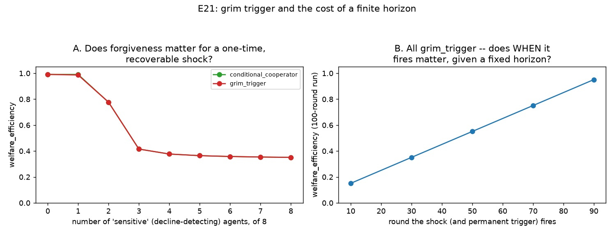

# E21 — Grim Trigger and the Cost of a Finite Horizon

**Date:** 2026-08-16 · **Script:**
[`scripts/experiment_grim_trigger.py`](../../scripts/experiment_grim_trigger.py)
· **Outputs:** `results/E21_grim_trigger/` · **Mechanism:**
[ADR-0018](../decisions/0018-grim-trigger-finite-horizon.md)

## Question

Friedman (1971): a non-cooperative equilibrium can sustain a Pareto-improving
outcome purely from the threat of *permanent* reversion to the one-shot
(selfish) equilibrium after any deviation — "grim trigger," a genuine
strategy-space gap this project's engine had (every existing reciprocal
strategy forgives, at least implicitly). Fudenberg & Maskin (1986): finite
horizons compound the problem of sustaining cooperation, since a permanent
punishment only has as much of the game left to act on as remains. Two
questions:

1. **Does grim trigger's refusal to forgive cost welfare, compared to
   `conditional_cooperator`'s forgiveness, when a decline turns out to be a
   one-time, recoverable event rather than genuine ongoing free-riding?**
2. **Does the finite horizon matter — does an earlier permanent trigger cost
   more cumulative welfare than a later one?**

## Method

- `K=100`, `g=0.4`, 100 rounds, `information_model=global`, deterministic
  strategies (seed=1). A new registered strategy, `grim_trigger`
  (ADR-0018): identical harvest rule to `conditional_cooperator`, but its
  decline-triggered defection latches permanently (`_triggered`, never
  reset) instead of being re-evaluated fresh each round.
- **Q1:** 8 agents total — `n_sensitive` (0–8) of either `conditional_cooperator`
  or `grim_trigger`, the rest plain `cooperative`. A single, modest resource
  shock (15% of stock removed) at round 30 — large enough to trigger
  decline-detection, far short of catastrophic on its own.
- **Q2:** all 8 agents `grim_trigger`, the identical shock, swept across
  which round it fires (10, 30, 50, 70, 90).

## Results

**Q1 — forgiveness vs. permanence** (`q1_forgiveness_sweep.csv`):

| n_sensitive | conditional_cooperator welfare | grim_trigger welfare | conditional_cooperator final level | grim_trigger final level |
| --: | --: | --: | --: | --: |
| 0 | 0.991 | 0.991 | 50.00 | 50.00 |
| 1 | **0.991** | **0.986** | **50.00** | **43.75** |
| 2 | 0.777 | 0.777 | 16.93 | 16.93 |
| 3 | 0.415 | 0.415 | 0.00 | 0.00 |
| 4–8 | 0.35–0.38 | 0.35–0.38 | 0.00 | 0.00 |

**Q2 — trigger timing, all `grim_trigger`** (`q2_trigger_timing_sweep.csv`):

| shock round | rounds remaining | welfare_efficiency |
| --: | --: | --: |
| 10 | 90 | 0.151 |
| 30 | 70 | 0.351 |
| 50 | 50 | 0.551 |
| 70 | 30 | 0.751 |
| 90 | 10 | 0.951 |

## Interpretation

1. **The two strategies diverge only in a narrow window — exactly `n_sensitive=1`
   — and this is the headline result, not a limitation of the design.** At
   `n_sensitive=0` there is nothing to trigger. At `n_sensitive≥2`, the shock
   provokes a self-reinforcing decline that never actually stops (each
   round's harvest still exceeds regrowth), so `conditional_cooperator`'s
   "declined" check keeps firing fresh every round anyway — it never gets a
   chance to *notice* recovery, because there isn't one within the tested
   horizon. Only at `n_sensitive=1` does the rest of the population (7
   plain `cooperative` agents) have enough collective self-correcting
   capacity to actually pull the stock back to a genuine steady state after
   the shock passes — which is exactly the condition under which
   forgiveness or its absence can make any difference at all.
2. **Where it matters, forgiveness wins, cleanly.** At `n_sensitive=1`,
   `conditional_cooperator` returns to the full healthy target (`50.0`)
   within one round of the shock and stays there (`welfare_efficiency =
   0.991`); `grim_trigger` never returns, settling into a new, permanently
   depressed equilibrium (`43.75`, `welfare_efficiency = 0.986`) — the rest
   of the population's own surplus-based harvesting compensates for one
   agent's permanent, needless over-extraction, but at a real, measurable
   cost. Grim trigger's theoretical deterrence value (Friedman's own
   framing: the *threat* of permanent punishment sustains cooperation) buys
   nothing extra here — no one was deterred by anything, since the "decline"
   was an exogenous shock, not a free-rider choosing to defect — and its
   lack of a return path is pure cost once the threat has already fired.
3. **The finite horizon matters exactly as Fudenberg & Maskin's own logic
   predicts, and the relationship is close to perfectly linear.** Welfare
   lost to a permanent trigger scales with how much of the fixed 100-round
   game remains when it fires: `0.151` at round 10 (90 rounds of near-zero
   welfare ahead) up to `0.951` at round 90 (only 10 rounds left to lose).
   The slope is close to constant (`≈0.01` welfare per round), meaning each
   round *before* the shock is "banked" at close to the sustainable rate,
   and each round *after* it contributes close to nothing — a clean,
   quantitative, empirical demonstration of "a permanent punishment only has
   as much of the game left to act on as remains," without porting any of
   Fudenberg & Maskin's own discounting/incomplete-information machinery.
4. **The underlying collapse mechanism is the same self-inflicted dynamic
   E17 found for `conditional_cooperator` at `R₀ > K/2`** — once triggered
   agents' combined selfish-sized requests meet or exceed the current
   stock, the pool empties to (or toward) zero in a single round, an
   absorbing state under logistic regrowth. Grim trigger doesn't introduce
   a new failure mode; it removes the one thing (forgiveness) that could
   have ended it once conditions genuinely improved.

## Threats to validity / limitations

- **Only one shock magnitude (15%) and one shock round (30, for Q1) tested**
  — the exact `n_sensitive=1` divergence window's sensitivity to shock size
  is untested.
- **Deterministic strategies, single seed** (matching this project's own
  convention for non-evolutionary experiments).
- **Not folded into the complexity-panel composition sweep** — a deliberate
  scope decision (ADR-0018): E21's own contribution is the timing question
  (Q2), orthogonal to population composition, not a fourth composable type.
- **No discounting, no rationality, no common-knowledge assumptions** —
  `grim_trigger` is a mechanical rule, like every other strategy in this
  project, not a calculated best-response; the connection to Friedman/
  Fudenberg-Maskin is at the level of the question, not shared machinery
  (see ADR-0018's Consequences).
- **Only tested against `conditional_cooperator`**, not `sanctioning` or
  `compensating_cooperator` — a real quota-enforcing or restraint-based
  response to the same shock is untested.

## Follow-ups

- Fold `grim_trigger` into the complexity-panel composition sweep as an
  8th composable type (mirroring reputation's own precedent, E18/ADR-0014) —
  flagged as out of scope for E21 itself in ADR-0018.
- Sweep shock magnitude at `n_sensitive=1` to map the full boundary of the
  "just enough capacity to recover" window.
- Compare against `sanctioning`'s own response to the identical shock — does
  a quota, rather than a harvest-rule change, avoid the self-inflicted
  empty-the-pool dynamic entirely?
- A "partial forgiveness" variant (return to cooperation after `T` clean
  rounds, rather than never) as a middle point between `conditional_cooperator`
  and `grim_trigger` — the natural next step on this same axis.
