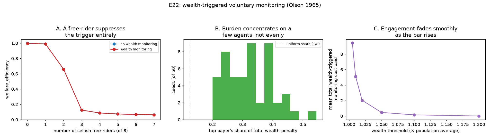

# E22 — Wealth-Triggered Voluntary Monitoring (Olson 1965)

**Date:** 2026-08-16 · **Script:**
[`scripts/experiment_wealth_monitoring.py`](../../scripts/experiment_wealth_monitoring.py)
· **Outputs:** `results/E22_wealth_monitoring/` · **Mechanism:**
[ADR-0020](../decisions/0020-wealth-triggered-voluntary-monitoring.md) ·
**Grounding:**
[paper-notes/1965-olson-logic-of-collective-action.md](../paper-notes/1965-olson-logic-of-collective-action.md)

## Question

Olson (1965): a group member has an individual incentive to unilaterally
provide a collective good exactly when its own share of the group's benefit
clears the good's cost relative to its total value (`F_i > C/V_g`, p. 33) —
and where members are unequal in size, the largest bears a disproportionate
share of the burden ("exploitation of the great by the small," p. 29). Two
questions, both checked directly against the running engine before this
script was written (ADR-0020):

1. **Does wealth-triggered volunteering emerge and protect the commons with
   zero designated monitors?** Sweeping the free-rider count.
2. **Exploitation of the great by the small, without a free-rider present:**
   in an all-cooperative population, does volunteering concentrate on a
   small subset rather than rotating evenly, and does it mildly reduce
   payoff inequality by taxing whoever is currently ahead?

## Method

- `K=100`, `g=0.4`, 100 rounds, `information_model=global`. A new config
  field, `SimulationConfig.wealth_monitoring` (ADR-0020): each round, the
  single active agent with no intrinsic sanction policy, not `selfish`,
  whose own `total_payoff` exceeds `threshold × (population's current
  average total_payoff)` volunteers as monitor for that round — enforcing
  the sustainable quota and paying `monitoring_cost`, re-evaluated fresh
  every round. `threshold=1.02`, `monitoring_cost=0.2` unless swept.
- **Deterministic strategies never organically diverge in wealth** (same
  strategy ⇒ identical requests ⇒ identical payoffs) — `decision_noise=0.15`
  is switched on throughout as the *only* source of wealth divergence among
  same-strategy agents, not a robustness add-on.
- **Q1:** `(8 − n_selfish)` `cooperative` agents + `n_selfish` `selfish`
  free-riders (0–7), `wealth_monitoring ∈ {none, on}`, seed 1.
- **Q2:** 8 `cooperative` agents, no free-rider, 50 seeds. Per seed: total
  wealth-triggered monitoring cost paid, the top payer's share of it, whether
  the top payer matches the single wealthiest agent in an otherwise-identical
  *ungated* run of the same seed, and payoff Gini with the mechanism on vs.
  off.
- **Q2b (threshold sensitivity):** the same all-cooperative setup, 20 seeds
  per threshold, sweeping `threshold ∈ {1.005, 1.01, 1.02, 1.05, 1.1, 1.2}`.

## Results

**Q1 — free-rider sweep** (`q1_freerider_sweep.csv`):

| n_selfish | welfare (off) | welfare (on) | total wealth-penalty paid |
| --: | --: | --: | --: |
| 0 | 1.000 | 0.997 | **2.6** |
| 1 | 0.990 | 0.990 | **0.0** |
| 2 | 0.661 | 0.661 | 0.0 |
| 3–7 | 0.06–0.13 | identical | 0.0 |

**Q2 — exploitation dynamics** (`q2_exploitation_dynamics.csv`, 50 seeds, all
engaged):

- Mean top-payer concentration: **0.328** (a uniform rotation across 8
  agents would be `0.125`) — 2.6× the uniform share.
- The top payer matches the single wealthiest agent in the matched ungated
  baseline in **16/50** seeds (32%, vs. `1/8=12.5%` chance).
- Payoff Gini is lower with the mechanism on than off in **36/50** seeds.

**Q2b — threshold sensitivity** (`q2b_threshold_sensitivity.csv`):

| threshold | mean total penalty | engaged fraction (of 20 seeds) |
| --: | --: | --: |
| 1.005 | 9.43 | 100% |
| 1.01 | 5.12 | 100% |
| 1.02 | 2.04 | 100% |
| 1.05 | 0.47 | 100% |
| 1.10 | 0.16 | 75% |
| 1.20 | 0.01 | 5% |

## Interpretation

1. **The mechanism is structurally inert in exactly the population it would
   need to protect.** The instant a single free-rider is present
   (`n_selfish≥1`), total wealth-penalty paid drops to exactly `0.0` and
   welfare is byte-identical with the mechanism on or off, for every
   free-rider count tested. The reason is precise: a free-rider consistently
   out-earns cooperators here (E2's standing finding), which inflates the
   *population average* so far above any single cooperator's own wealth that
   no cooperator ever clears even a barely-above-average threshold (`1.02×`).
   Olson's `F_i` presumes a large stake *relative to the group's benefit*;
   in this well-mixed pool, the group's own average is dragged upward by the
   one agent least interested in providing the good, not by the agents who
   would actually volunteer.
2. **Without a free-rider, the mechanism does engage — purely from
   noise-induced wealth divergence among agents who all want the same
   thing.** At `n_selfish=0`, `2.6` total monitoring cost is paid across the
   run even though every agent runs the identical `cooperative` strategy;
   the only source of divergence is `decision_noise` giving some agents
   slightly luckier draws than others, exactly the kind of "unequal size"
   Olson's own small-group argument doesn't derive from — it simply assumes
   it. Welfare dips only slightly (`1.000→0.997`), the cost of protection no
   one asked for in an already-healthy population.
3. **Where it engages, the burden is disproportionately concentrated — but
   on a shifting cast, not one fixed individual.** The top payer's average
   share of the total penalty (`0.328`) is 2.6× what a uniform rotation
   across 8 agents would produce (`0.125`) — a real, measurable
   disproportion, Olson's prediction holding directionally. But the top
   payer matches the *single* wealthiest agent from an independent, ungated
   run of the same seed only `32%` of the time — because the trigger is
   re-evaluated fresh every round, "who is currently ahead" shifts as the
   run progresses, so several agents typically take turns being the
   momentary volunteer rather than one agent locking in the role for the
   whole run. Exploitation-of-the-great-by-the-small is real here, but
   partial and rotating, not exclusive and permanent.
4. **The effect on inequality is real but small, and directionally
   consistent with taxing whoever is ahead.** Payoff Gini decreases (the
   mechanism switched on vs. off) in `36/50` seeds (`72%`) — more often than
   not, but far from universally; the absolute Gini values here are tiny
   (`~0.002–0.006`, an all-cooperative population is already very close to
   equal), so this is a directional signal, not a dramatic redistribution.
5. **Engagement fades smoothly, not sharply, as the threshold rises.** Mean
   total monitoring cost paid falls roughly monotonically from `9.43`
   (`threshold=1.005`) to `0.01` (`threshold=1.2`), and the *fraction* of
   seeds that ever engage at all only starts dropping below 100% past
   `threshold≈1.1` — there is no sharp cliff, just a gradually rising bar
   that noise-driven divergence clears less and less often.

## Threats to validity / limitations

- **Wealth divergence is entirely `decision_noise`-driven** — the engine has
  no other source of organic inequality among same-strategy agents.
  Real-world "unequal size" (Olson's own property-tax example) is a
  pre-existing structural difference, not accumulated luck; this project's
  engine has no config surface for the former (no per-agent starting-wealth
  or capacity-dependence parameter), so the noise-driven operationalization
  is the closest available proxy, not a literal reproduction.
- **`selfish` is excluded from eligibility by construction** (ADR-0020) —
  a deliberate, documented scope decision (enforcement would cap a
  free-rider's own over-extraction too, a pure loss), not an oversight, but
  it does mean the free-rider-suppression finding (point 1 above) is partly
  a consequence of that exclusion, not solely of the average-inflation
  mechanism — both operate together and were not tested apart.
- **Single seed for Q1**, matching this project's convention for
  deterministic-outcome sweeps; Q2/Q2b use 50/20 seeds specifically because
  `decision_noise` makes per-seed outcomes genuinely variable.
- **Scoped to the first pool only** (multiple resources, ADR-0016, untested
  in combination).
- **No plutocratic-capture / vote-weighting variant built** — the originally
  sketched item-11 framing (a payoff-weighted vote on ADR-0011's
  collective-choice mechanism) is a different, still-ungrounded research
  question, explicitly logged as open in `thesis-direction-equifinality.md`
  rather than folded into this result (see ADR-0020's Context).

## Follow-ups

- A genuine per-agent "size" parameter (e.g., a fixed resource-dependence or
  starting-capacity difference, not noise-derived), to test Olson's
  unequal-`S_i` claim directly rather than through accumulated luck.
- Test whether combining the wealth trigger with a *milder* free-rider
  presence (e.g. `greed < 1.0`, so the free-rider doesn't dominate the
  population average as completely) recovers engagement — the suppression
  finding may be specific to `greed=1.0`'s degree of dominance, not free-
  riding per se.
- A fixed-identity variant (once triggered, a volunteer stays "on duty" for
  several rounds rather than re-evaluating every round) to test whether that
  produces a cleaner, more exclusive exploitation-of-the-great-by-the-small
  signature than the fully re-evaluated version built here.
