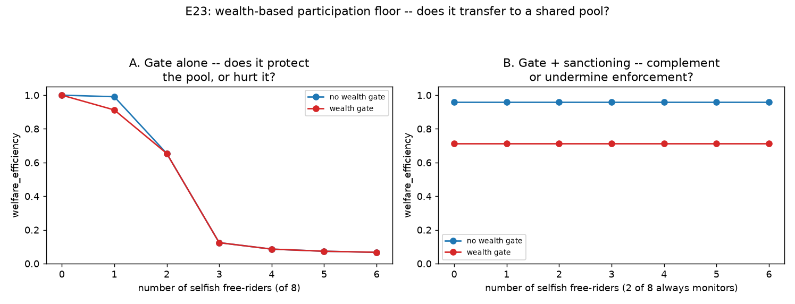

# E23 — Wealth-Based Participation: Does It Transfer to a Shared Pool?

**Date:** 2026-08-16 · **Script:**
[`scripts/experiment_wealth_participation.py`](../../scripts/experiment_wealth_participation.py)
· **Outputs:** `results/E23_wealth_participation/` · **Mechanism:**
[ADR-0019](../decisions/0019-wealth-based-participation.md)

## Question

Chen & Szolnoki (2016): on a spatial lattice, gating participation in a
public-goods round on accumulated wealth self-corrects — sustained
defection erodes a defector's *own* local resource base, so the gate
disproportionately excludes defectors, not cooperators. This project's
engine has a single, globally shared pool, not a spatial lattice. Two
questions, checked directly against the running engine before this script
was written (ADR-0019):

1. **Wealth gate alone:** does a relative-wealth participation floor
   protect the pool against free-riders, or does it end up excluding
   someone else?
2. **Wealth gate + sanctioning:** once a monitor's enforcement already
   equalizes harvest, does the gate complement it — or find a new,
   different group to exclude?

## Method

- `K=100`, `g=0.4`, 100 rounds, `information_model=global`, deterministic
  strategies (seed=1). A new config field,
  `SimulationConfig.wealth_floor_fraction` (ADR-0019): an agent whose own
  `total_payoff` falls below this fraction of the population's *own current
  average* is excluded from requesting that round — re-evaluated fresh
  every round.
- **Q1:** `(8 − n_selfish)` `cooperative` agents + `n_selfish` `selfish`
  free-riders (0–6), no monitor. `wealth_floor_fraction ∈ {none, 0.9}`.
- **Q2:** identical sweep, with 2 of the 8 seats always `sanctioning`
  monitors (the remaining 6 split between `cooperative` and `selfish`).

## Results

**Q1 — wealth gate alone** (`q1_gate_alone.csv`):

| n_selfish | welfare (no gate) | welfare (gate) | free-rider still active (gate) |
| --: | --: | --: | :-: |
| 0 | 1.000 | 1.000 | — |
| 1 | 0.991 | **0.912** | **yes** |
| 2 | 0.654 | 0.654 | yes |
| 3–6 | 0.06–0.12 | identical | pool already collapsed either way |

**Q2 — wealth gate + sanctioning** (`q2_gate_with_sanctioning.csv`), every
`n_selfish` from 0–6 identically:

| | welfare | final level | monitors still active |
| --- | --: | --: | :-: |
| no gate | 0.960 | 50.0 | yes |
| gate on | **0.713** | 75.0 | **no** |

## Interpretation

1. **The gate never excludes the free-rider, at any free-rider count
   tested.** In every Q1 row where the gate is even relevant (`n_selfish=1,2`),
   the free-rider's own final-round request stays positive — it is never
   the one gated out.
2. **Where it has an effect, it actively hurts welfare — by excluding the
   exploited cooperative majority, not the exploiter.** At `n_selfish=1`,
   welfare drops from `0.991` to `0.912` purely because the gate is on; per-
   agent payoffs confirm why: the free-rider ends the run with `903.58`
   accumulated payoff against `1.25` for each of the 7 cooperative agents —
   the cooperative majority sits far below the population average precisely
   *because* they are being exploited, and the gate excludes them for
   exactly that reason, shutting off real, positive harvesting they were
   still contributing.
3. **At `n_selfish≥2`, the gate makes no difference at all — not because it
   stopped mattering, but because the cooperative agents it would exclude
   were already requesting zero anyway.** Once the shared pool sits at or
   below the healthy target (`K/2`), `cooperative`'s own formula
   (`max(0, level − K/2)/n`) already returns zero; gating an agent that was
   already contributing nothing changes nothing measurable.
4. **With sanctioning present, the gate finds a different target: the
   monitors themselves.** Sanctioning's quota already caps every
   non-monitor agent's harvest identically, regardless of type — the only
   wealth gap left is between the two monitors (who pay `monitoring_cost`
   every round, ending the run at a *negative* net payoff, `-18.75` each)
   and everyone else (`125.0` flat). The gate excludes the monitors, not
   because they misbehaved, but because enforcing was the one costly thing
   anyone did. Removing them drops welfare from `0.960` to `0.713` — a
   result completely independent of `n_selfish`, since it is driven entirely
   by the monitoring cost, not by free-rider pressure.
5. **The mechanism doesn't transfer, and the reason is precise, not a
   shrug.** Chen & Szolnoki's self-correction depends on a defector's own
   *local* resource base shrinking because of its own defection — a channel
   that requires the spatial structure their lattice model has. This
   project's single, globally shared pool has no such channel: a
   free-rider's request scales with the *global* level, the same one every
   other agent draws from, so defection doesn't erode the defector's own
   position relative to anyone else's — if anything, it strengthens it,
   exactly the standard tragedy-of-the-commons pattern this project has
   shown since E2. A wealth floor built on "below the population's own
   average" therefore tracks *who sacrifices for the collective good*
   (restraint, or enforcement cost) rather than *who exploits it* — the
   precise opposite of the paper's own finding, for a precise, identifiable
   structural reason.

## Threats to validity / limitations

- **Only one threshold value tested (`0.9`)** — a milder floor might avoid
  excluding contributing cooperative agents while still doing nothing
  useful; the boundary is untested.
- **Deterministic strategies, single seed**, matching this project's own
  convention.
- **Enforcement itself is not gated** — a wealth-excluded monitor stops
  requesting but keeps enforcing that round (a deliberate scope decision,
  ADR-0019), so Q2's welfare drop is driven entirely by lost harvesting
  capacity and the cascading effect of one fewer harvester, not by any
  change in enforcement reach.
- **No spatial/network structure tested** — the original plan (combine with
  `NetworkConfig`, E19) was dropped after checking the engine: `network`
  only restricts reputation pairing, never the shared pool itself, so it
  would not have tested Chen & Szolnoki's own local-exhaustion channel
  regardless (see ADR-0019).

## Follow-ups

- A genuinely local/spatial resource structure (each agent or small cluster
  draws from its own sub-pool, not one shared stock) would be the actual,
  faithful test of whether wealth-gating works once the local-exhaustion
  channel exists — a substantially larger engine change than this project's
  existing multiple-resources axis (E20), which still shares each pool
  population-wide.
- A milder wealth floor (e.g. `0.3`–`0.5`) swept finely, to check whether
  there is any threshold range where the gate helps rather than hurts.
- Test the gate against `conditional_cooperator`/`grim_trigger` (E21)
  populations, where wealth differences might track something closer to
  "who retaliates" than "who free-rides" or "who enforces."
