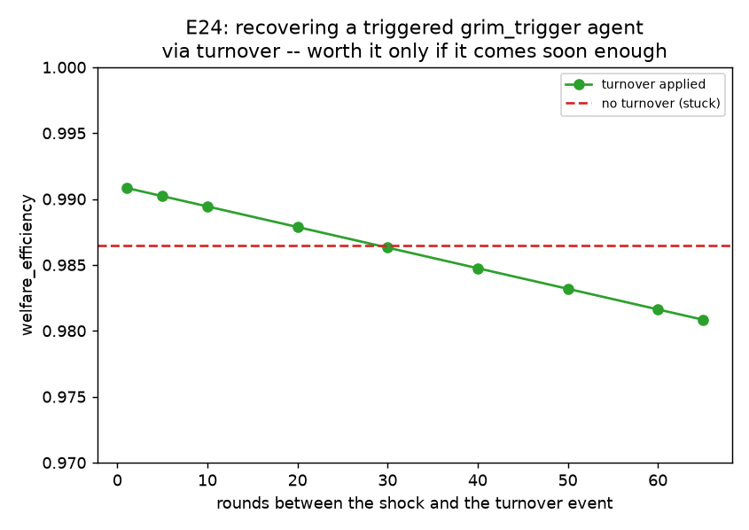

# E24 — Agent Turnover: Can a Fresh Start Undo a Permanent Trigger?

**Date:** 2026-08-17 · **Script:**
[`scripts/experiment_agent_turnover.py`](../../scripts/experiment_agent_turnover.py)
· **Outputs:** `results/E24_agent_turnover/` · **Mechanism:**
[ADR-0021](../decisions/0021-agent-turnover-disturbance.md) · **Grounding:**
[paper-notes/2015-duffy-lafky-birth-death-public-good.md](../paper-notes/2015-duffy-lafky-birth-death-public-good.md)

## Question

Duffy & Lafky (2015): replacing a fixed cohort with staggered overlapping-
generations turnover significantly flattens the usual decay of public-goods
contributions over time. This project's agents don't decay from experience
the way human subjects do — except `grim_trigger` (E21), whose permanent
`_triggered` flag never resets on its own ("no return path," ADR-0018). Two
questions, checked directly against the engine before this script was
written (ADR-0021):

1. **Can a turnover event — resetting an agent's memory as if a fresh
   individual took over — recover a triggered `grim_trigger` population,
   and does *when* it happens matter?**
2. **Is turnover a genuine no-op everywhere there's nothing to reset**
   (`cooperative`, `selfish`, `sanctioning` — none tracks per-round decline
   memory)?

## Method

- `K=100`, `g=0.4`, 100 rounds, `information_model=global`. A new
  disturbance kind, `agent_turnover` (ADR-0021): at a scheduled round, a
  fraction of active agents have their strategy's `reset_state()` called
  (clearing `_last_level`/`_triggered` for `conditional_cooperator`/
  `compensating_cooperator`/`grim_trigger`) and their reputation cleared —
  same strategy, same parameters, no memory of any prior decline or
  trigger. Reuses `DisturbanceConfig`'s existing schedule/magnitude fields
  exactly like `agent_failure`.
- **Q1:** 1 `grim_trigger` agent + 7 `cooperative`, the exact population
  E21's own "narrow window" scenario used, hit with the identical one-time
  recoverable shock (`magnitude=0.15` at round 30). A single full-population
  turnover event (`magnitude=1.0`) is then swept across rounds 31–95,
  compared against never applying one.
- **Q2:** `cooperative` and `sanctioning` populations, swept over 0–3
  selfish free-riders, each run twice — with a repeating turnover schedule
  (every 7 rounds, resetting half the population each time) switched on vs.
  off — checking for byte-identical results.

## Results

**Q1 — recovery timing** (`q1_recovery_timing.csv`):

| rounds after shock | welfare_efficiency | final level |
| --: | --: | --: |
| — (no turnover) | 0.9865 | 43.75 |
| 1 | **0.9908** | **50.00** |
| 10 | 0.9894 | 50.00 |
| 20 | 0.9879 | 50.00 |
| 29 | 0.9865 (ties baseline) | 50.00 |
| 40 | 0.9848 | 50.00 |
| 65 | 0.9808 | 50.00 |

**Q2 — no-op verification** (`q2_noop_verification.csv`): all 8 rows
(`cooperative`/`sanctioning` × 0–3 free-riders) report
`welfare_off == welfare_on` and `byte_identical = True`.

## Interpretation

1. **Turnover recovers the triggered agent completely, every single time it
   was applied.** Regardless of how late the reset comes (even 65 rounds
   after the shock, with only 35 rounds left in the run), the pool climbs
   back to the full healthy target, `50.0` — the resource itself was never
   destroyed (the shock was mild enough to leave a recoverable stock, unlike
   a full collapse to `0`, which is an absorbing state under logistic
   regrowth that no amount of agent-memory resetting can undo). Once the
   triggered agent's memory clears, its behavior reverts to ordinary
   cooperative harvesting immediately, and the population converges exactly
   like an unwounded one.
2. **But timing decides whether the intervention was *worth it*.** Welfare
   is highest when turnover comes almost immediately after the shock
   (`0.9908` at 1 round later) and falls off steadily the longer the
   population is left stuck — each round of triggered, exploitative
   over-harvesting compounds a welfare cost that a later recovery cannot buy
   back. **The two curves cross at exactly 29 rounds after the shock**: any
   turnover *before* that point leaves the population strictly better off
   than never intervening at all; any turnover *after* it leaves the
   population worse off than doing nothing, purely because of how much
   welfare was already lost while waiting. A rescue that arrives too late is
   a real cost, not a free correction.
3. **This is the direct dual of E21's own finding.** E21 showed that welfare
   lost to a *permanent* trigger scales almost linearly with how much of the
   fixed round budget remains when it fires (a later trigger costs less,
   because it has less time left to act). E24 shows the same linear-in-time
   logic applies to *undoing* a trigger: welfare recovered scales with how
   much of the *triggered* period is cut short. Both findings are the same
   underlying fact — a fixed round budget means every round spent in the
   wrong state has an opportunity cost — read from opposite ends.
4. **Turnover is a verified, byte-for-byte no-op wherever there is nothing
   to reset.** Every Q2 configuration — `cooperative` or `sanctioning`,
   0–3 free-riders — produces identical payoffs whether a repeating
   turnover schedule is switched on or off. This confirms the mechanism
   does exactly what its design predicts: it only ever matters for
   strategies with genuine per-round memory (`conditional_cooperator`,
   `compensating_cooperator`, `grim_trigger`), and is inert everywhere else
   — not a general-purpose "helps the pool" dial, but a targeted fix for a
   specific class of failure.
5. **A concrete answer to a question E21 left open.** E21's own report noted
   grim trigger "removes the one thing (forgiveness) that could have ended
   [the collapse mechanism] once conditions genuinely improved" — implying
   no path back inside the engine as it then existed. E24 shows an
   *external* intervention (replacement, not forgiveness) can restore it,
   as Duffy & Lafky's own human-subject finding would predict, translated
   from "new group member" to "new agent instance in the same role."

## Threats to validity / limitations

- **Single seed, single shock magnitude, single population composition for
  Q1** — matching this project's convention for deterministic-outcome
  sweeps (no `decision_noise`), but the exact 29-round crossover point is
  specific to this scenario (`magnitude=0.15` shock, 1 sensitive agent among
  7, 100-round budget) and would shift if any of those parameters changed.
- **Only a full-population reset (`magnitude=1.0`) tested for timing** — a
  partial reset targeting only the triggered agent (confirmed to also fully
  recover the population in `tests/test_agent_turnover.py`) was not swept
  across timing, since with only 1 sensitive agent in this population the
  two are equivalent in outcome, only differing in whether unaffected
  `cooperative` agents' (harmless) memory also gets cleared.
- **No sweep over how many agents are `grim_trigger`** — E21 itself found
  the "narrow window" (exactly 1 sensitive agent) is where forgiveness vs.
  permanence matters at all; an all-`grim_trigger` population's shock in
  this project's engine drives the stock to literal `0`, an absorbing state
  turnover cannot rescue (confirmed directly before choosing this
  scenario — see ADR-0021's Decision).
- **`agent_failure` and `agent_turnover` were not tested together** — a
  population losing an enforcer while simultaneously undergoing turnover
  elsewhere is a plausible compound scenario, untested here.

## Follow-ups

- Sweep shock magnitude and population composition to characterize how the
  crossover point (turnover no longer worth it) moves — is it always
  linear, as E21's dual finding would suggest?
- Test turnover against `conditional_cooperator`/`compensating_cooperator`
  populations under sustained (not one-off) free-rider pressure, where
  their own fresh-every-round recompute already self-corrects — does
  turnover add anything once the strategy itself doesn't need permanent
  forgiveness?
- A genuinely periodic, low-magnitude turnover schedule (mirroring Duffy &
  Lafky's own "one member every 3 periods," not a single full-population
  event) tested as a standing policy rather than a one-time rescue, to see
  whether continuous low-level turnover prevents a trigger from
  accumulating harm in the first place, not just recovers from one after
  the fact.
