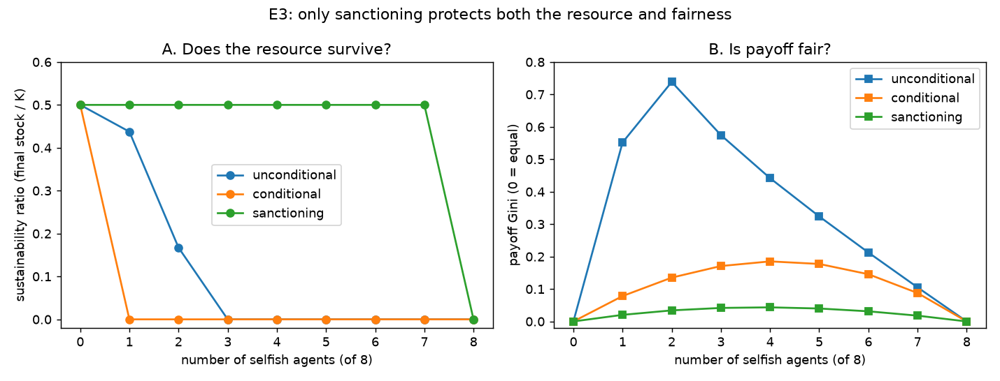

# E3 — Sanctioning: Protecting Both the Resource and Fairness

**Date:** 2026-07-26 · **Script:**
[`scripts/experiment_sanctioning.py`](../../scripts/experiment_sanctioning.py)
· **Outputs:** `results/E3_sanctioning/` · **Tests:** SQ-5 follow-up; Ostrom design principles

## Question

E2 showed that neither unconditional restraint nor reciprocity protects *both* the
resource and fairness against free-riders. Can **sanctioning** — cooperate *and*
enforce a sustainable harvest quota (monitoring + graduated sanctions, per Ostrom) —
protect both? And what does enforcement cost?

## Method

- Group of 8; `information_model = global`; logistic `K=100`, `g=0.4` (`MSY=10`),
  100 rounds. Three cooperator types compared against a growing selfish minority
  (0–8 selfish, rest the cooperator type): `cooperative` (unconditional),
  `conditional_cooperator` (reciprocity), `sanctioning`.
- **Enforcement (ADR-0005):** if any sanctioner is present, every agent's harvest is
  capped at the per-capita quota `MSY/N = 1.25`; confiscated excess stays in the
  pool; each sanctioner forfeits a `monitoring_cost = 0.2`/round.
- Metrics: sustainability ratio, payoff Gini, per-strategy net payoff. Seeds: 3
  (deterministic → exact).
- Second-order analysis: a mix of 3 sanctioners + 4 plain cooperators + 1 selfish.

## Results

**Sustainability ratio (final stock / K):**

| n_selfish | unconditional | conditional | sanctioning |
| --------: | ------------: | ----------: | ----------: |
| 1 | 0.44 | 0.00 | **0.50** |
| 2 | 0.17 | 0.00 | **0.50** |
| 3 | 0.00 | 0.00 | **0.50** |
| 4–7 | 0.00 | 0.00 | **0.50** |
| 8 (no cooperator) | 0.00 | 0.00 | 0.00 |

**Payoff Gini (0 = equal):**

| n_selfish | unconditional | conditional | sanctioning |
| --------: | ------------: | ----------: | ----------: |
| 1 | 0.55 | 0.08 | **0.02** |
| 2 | 0.74 | 0.14 | **0.03** |
| 4 | 0.44 | 0.19 | **0.04** |

**Second-order free-rider** (3 sanctioning + 4 cooperative + 1 selfish): mean payoffs
— **sanctioning 105.0, cooperative 125.0, selfish 125.0** (resource sustained).

## Interpretation

1. **Sanctioning protects both** — and is the *only* mechanism that does. Across
   every free-rider count (1–7), sanctioning holds sustainability at 0.50 (top of
   panel A) **and** Gini at ≤0.04 (bottom of panel B). Enforcement caps the selfish
   agents' extraction at the sustainable quota, so they can neither deplete the
   resource nor out-earn the cooperators. This is the result E2 lacked.
2. **Enforcement works against non-adaptive defectors** precisely because it reduces
   their *extraction* (confiscation), not just their payoff — the design choice of
   ADR-0005.
3. **But monitoring is costly — the second-order free-rider problem.** In the mixed
   run the sanctioners earn **105** while the plain cooperators they protect earn
   **125**, as does the selfish agent. Everyone benefits from enforcement, but only
   the sanctioners pay for it. So *who will choose to monitor?* is the next dilemma —
   a nested commons problem one level up.

## The three-experiment arc

| mechanism | resource | fairness |
| --------- | :------: | :------: |
| selfish only | ✗ collapse | — |
| unconditional cooperation | ✓ (few free-riders) | ✗ exploited |
| reciprocity (E2) | ✗ collapses faster | ✓ starves free-riders |
| **sanctioning (E3)** | **✓** | **✓** (but monitors pay) |

Sanctioning resolves the E2 trade-off — at the price of a new, higher-order
collective-action problem. This mirrors Ostrom's finding that enduring commons need
*monitoring and graduated sanctions*, and Fehr & Gächter-style results on costly
punishment sustaining cooperation.

## Threats to validity / limitations

- **"Any one sanctioner enforces fully"** is a strong simplification (monitoring as a
  step public good). Enforcement strength scaling with the number of monitors, and
  imperfect/partial monitoring, are follow-ups.
- **Frictionless enforcement:** no evasion, no false positives, confiscation is
  perfect. Real sanctioning is noisier and can misfire.
- **The monitoring cost (0.2) is a free parameter.** It sets the size of the
  second-order gap (here 125 → 105); the *sign* of the effect is robust, the
  magnitude is not.
- Deterministic strategies (zero seed variance); single `(K, g, N)`; global info.

## Follow-ups

- Make monitoring *voluntary and adaptive* (agents decide whether to pay to monitor)
  — does sanctioning survive the second-order free-rider problem?
- Graduated/proportional sanctions; enforcement strength ∝ number of monitors.
- **Communication (Phase 2):** can agents build the trust/agreement to share
  monitoring costs (Janssen et al. 2022)?
