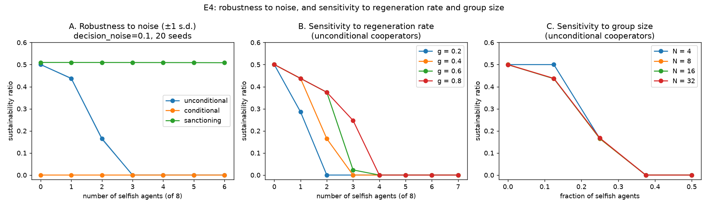

# E4 — Robustness (to noise) and Sensitivity (to N and g)

**Date:** 2026-07-26 · **Script:**
[`scripts/experiment_robustness.py`](../../scripts/experiment_robustness.py)
· **Outputs:** `results/E4_robustness/` · **Tests:** SQ-11, SQ-12

## Question

The E1–E3 strategies are deterministic, so the earlier results are exact but carry no
between-seed variance. Two methodological questions follow:

- **Robustness (SQ-11):** with a stochastic knob added (agents act with
  `decision_noise`), are the mechanism-comparison conclusions robust across seeds, or
  were they artefacts of the deterministic setup?
- **Sensitivity (SQ-12):** how do outcomes depend on the regeneration rate `g` and the
  group size `N`?

## Method

- **Stochastic knob:** `decision_noise = d` perturbs each agent's request by a factor
  drawn uniformly from `[1−d, 1+d]` using the agent's own RNG (so a run is still a
  pure function of `(config, seed)`; only now the seed *matters*). `d = 0` reproduces
  the deterministic behaviour of E1–E3.
- **Panel A (robustness):** the E3 comparison (`cooperative` / `conditional` /
  `sanctioning` vs. selfish, 8 agents, global, `g=0.4`) at `decision_noise = 0.1`,
  over **20 seeds**; mean sustainability ± 1 s.d.
- **Panel B (sensitivity to g):** unconditional cooperators + selfish, `g ∈
  {0.2,0.4,0.6,0.8}`, sustainability vs. number of selfish.
- **Panel C (sensitivity to N):** unconditional cooperators + selfish, `g=0.4`,
  `N ∈ {4,8,16,32}`, sustainability vs. selfish *fraction*.

## Results

**A. Robustness.** The mechanism ordering is unchanged and the between-seed spread is
tiny — the maximum s.d. of the sustainability ratio across all selfish counts is:

| mechanism | max between-seed s.d. (noise 0.1) |
| --------- | --------------------------------: |
| unconditional | 0.0075 |
| conditional | 0.0000 |
| sanctioning | 0.0003 |

**B. Sensitivity to g.** Higher regeneration rate lets an unconditional-cooperator
population tolerate **more** free-riders before collapse: the collapse threshold moves
from ~2 selfish at `g=0.2` to ~4 selfish at `g=0.8`.

**C. Sensitivity to N.** The curves for `N = 8, 16, 32` almost coincide: outcomes
depend on the selfish **fraction**, not the absolute group size — the system is
approximately **scale-invariant** in `N`. (`N=4` deviates only because rounding a
fraction to a whole number of agents is coarse at small `N`.)

## Interpretation

1. **The E1–E3 conclusions are robust.** Adding decision noise barely moves the
   outcomes (s.d. ≤ 0.008), so the deterministic results were not lucky-seed
   artefacts — the mechanisms' behaviour is dominated by structure (self-correction,
   the reciprocity ratchet, enforcement), not by chance. This is the reassuring
   answer to SQ-11, and it justifies reporting exact values elsewhere.
2. **Regeneration rate sets the free-rider tolerance.** A more productive resource
   absorbs more over-extraction before collapsing — an intuitive, quantified result
   (SQ-12).
3. **Cooperation is a fraction game, not a headcount game.** What matters is the
   *proportion* of free-riders, not how many agents share the resource — a useful
   scale-invariance for generalising the findings beyond `N=8`.

## Threats to validity / limitations

- **Noise model is deliberately simple** (symmetric multiplicative, one global
  level). Larger noise, asymmetric noise, or noise in *observation* rather than
  *action* could produce more variance; the small spread here is partly because the
  cooperative/sanctioning rules are self-stabilising.
- **The self-correcting mechanisms suppress variance by design;** a genuinely
  stochastic *strategy* (not just noisy execution) would stress the seed machinery
  harder — a natural follow-up.
- **`N=4` fraction granularity** is coarse (rounding artefact), so treat its curve
  cautiously.
- Single information model (`global`) and one noise level for the sensitivity panels.

## Follow-ups

- A stochastic *strategy* (e.g. probabilistic cooperate/defect) to make between-seed
  variance substantial and the robustness question sharper.
- Sensitivity of the *sanctioning* mechanism to the monitoring cost and quota.
- Repeat B/C under `private` information and with the conditional cooperator.
