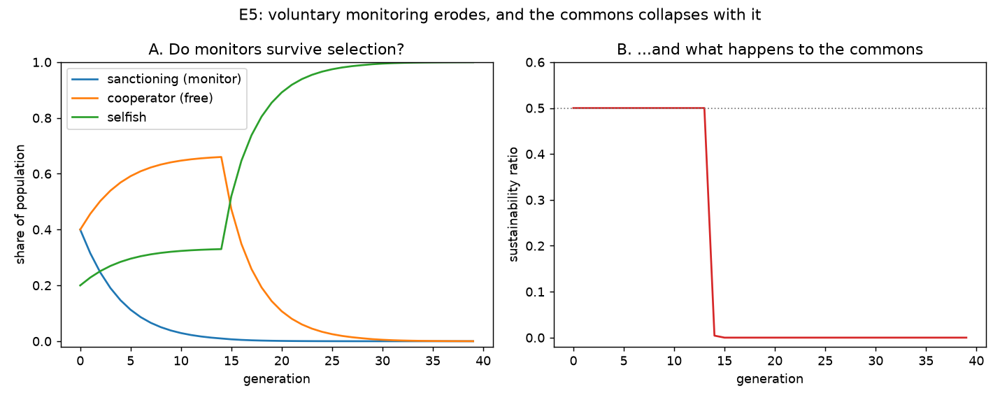

# E5 — Is Voluntary Monitoring Evolutionarily Stable?

**Date:** 2026-07-26 · **Script:**
[`scripts/experiment_voluntary_monitoring.py`](../../scripts/experiment_voluntary_monitoring.py)
· **Outputs:** `results/E5_voluntary_monitoring/` · **Motivated by:** Hauert et al. (2007)

## Question

E3 showed sanctioning protects the commons but that monitors earn less than the
cooperators they protect (the **second-order free-rider problem**). If agents are free
to *choose* whether to monitor, does monitoring — and with it the commons — survive?

## Method

Replicator dynamics *on top of* the simulator (ADR-0006), no core-engine change.
Three strategies compete: `sanctioning` (cooperate **and** pay to monitor),
`cooperative` (cooperate, free-ride on others' monitoring), `selfish` (defect). Over
`GENERATIONS` steps: instantiate `N=40` agents at the current strategy shares, run one
simulation (global info, 60 rounds), measure each strategy's mean net payoff, and
update the shares by a softened replicator step (above-average strategies grow). The
whole trajectory is deterministic. Start from a healthy monitored commons:
40% sanctioning, 40% cooperative, 20% selfish.

## Results

A clean **two-stage collapse** (from `dynamics.csv`):

| generation | sanctioning | cooperative | selfish | sustainability |
| ---------: | ----------: | ----------: | ------: | -------------: |
| 0 | 0.40 | 0.40 | 0.20 | 0.50 |
| ~13 | ≈0.00 | ~0.66 | ~0.33 | 0.50 |
| 39 | 0.00 | 0.00 | **1.00** | **0.00** |

- **Phase 1 (erosion).** Monitors decline steadily toward zero: free-riding
  cooperators enjoy the enforced protection *without* paying the monitoring cost, so
  they out-reproduce sanctioners (second-order free-riding). The resource stays
  healthy (0.50) because a few monitors still enforce.
- **Phase transition (~gen 14).** Once monitors are effectively gone, enforcement
  vanishes. Selfish agents — previously capped — can now exploit the cooperators,
  invade rapidly, and the sustainability ratio **cliff-drops from 0.50 to 0.00**.
- **Phase 2 (collapse).** Selfish fixate at 100%; the commons is dead.

## Interpretation

**Voluntary monitoring is not evolutionarily stable in this model.** Sanctioning
solves the *first-order* problem (defection) but creates a *second-order* one
(monitoring is a costly public good), and selection resolves the second-order problem
against the monitors — after which the first-order problem returns and destroys the
resource. This reproduces, in a minimal reproducible CPR model, the puzzle that
motivates Hauert et al. (2007): costly punishment/monitoring erodes unless something
protects it.

The two-stage shape is itself the insight: a monitored commons can look perfectly
healthy (flat 0.50 sustainability) right up until the monitoring that sustains it has
quietly eroded away — then it fails suddenly, not gradually.

## Threats to validity / limitations

- **No mutation / re-invasion.** Extinct strategies do not return, so we see collapse,
  not the *cyclic* rescue Hauert et al. obtain with an opt-out ("loner") strategy.
  Adding mutation and/or a loner strategy is the direct follow-up.
- **"Any one monitor enforces fully"** (ADR-0005) is why sustainability stays flat at
  0.50 until monitors hit ~0 and then cliff-drops. With *proportional* enforcement
  (strength ∝ monitor share) the resource would degrade more gradually as monitors
  erode — a more realistic variant worth testing.
- **One simulation per generation, single seed, discretised integer counts** (finite
  population). The qualitative result is robust to these; exact generation numbers are
  not.
- **Softened replicator with fixed selection strength**; the *speed* of erosion
  depends on it, the *direction* does not.

## Follow-ups

- Add the **loner / optional-participation** rescue (Hauert et al.) and/or mutation —
  does monitoring persist via cycles?
- **Second-order sanctioning:** let sanctioners also penalise non-monitoring
  cooperators — can that stabilise monitoring?
- **Proportional enforcement** (ADR-0005 follow-up) for a gradual rather than
  cliff-edge collapse.
- **Communication (Phase 2):** can agents coordinate to share monitoring costs and
  avert the erosion? (Janssen et al. 2022.)
