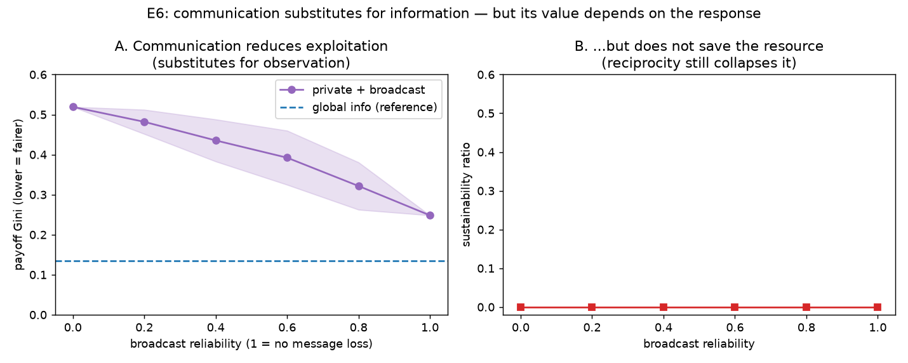

# E6 — Can Communication Substitute for Missing Information?

**Date:** 2026-07-26 · **Script:**
[`scripts/experiment_communication.py`](../../scripts/experiment_communication.py)
· **Outputs:** `results/E6_communication/` · **Tests:** SQ-6, SQ-7, SQ-8 · **ADR-0007**

## Question

E1 established that cooperation needs *information* (or knowledge). Communication is a
way to *acquire* information. Under **private** information — agents cannot see the
stock — can a broadcast channel supply what they're missing, and does it help?

## Method

A first communication model (ADR-0007): each round an agent hears the group's **total
harvest last round** with probability `broadcast_reliability` (drawn from its own RNG;
dropped messages = silence). A conditional cooperator uses that `signal`, when it
can't see the stock, to detect over-extraction (`signal > MSY`) and reciprocate.

Population: 6 conditional cooperators + 2 selfish, private info, 100 rounds. Sweep
`broadcast_reliability ∈ {0, 0.2, …, 1.0}` over 20 seeds; compare against the
global-information reference. Metrics: payoff Gini (fairness) and sustainability.

## Results

| broadcast reliability | payoff Gini (mean ± s.d.) | sustainability |
| --------------------: | ------------------------: | -------------: |
| 0.0 (silent) | 0.519 ± 0.000 | 0.00 |
| 0.2 | 0.482 ± 0.030 | 0.00 |
| 0.4 | 0.435 ± 0.053 | 0.00 |
| 0.6 | 0.392 ± 0.068 | 0.00 |
| 0.8 | 0.322 ± 0.059 | 0.00 |
| 1.0 (perfect) | 0.248 ± 0.000 | 0.00 |

Reference points: **global** info Gini = 0.135; **private, silent** Gini = 0.519.

## Interpretation

1. **Communication substitutes for observation (SQ-6, SQ-7).** Blind conditional
   cooperators cannot detect free-riders and are heavily exploited (Gini 0.52). As the
   broadcast becomes more reliable, they increasingly detect over-extraction and stop
   subsidising the free-riders — Gini falls monotonically from 0.52 toward the
   global-information value (0.14). More message loss ⇒ less of this benefit: the
   effect is graded, not all-or-nothing.
2. **But communication does not save the commons (SQ-8).** Sustainability stays at
   0.00 at every reliability. The reason is instructive: the conditional cooperator's
   *response* to detected over-extraction is **retaliation**, which — as in E2 —
   collapses the resource. Communication faithfully delivered the information; what
   agents *did* with it (reciprocate) protects fairness, not the resource.
3. **The value of communication depends on the response rule, not communication
   itself.** This is the sharp version of "when does communication help vs. not":
   here it helps *fairness* and is neutral-to-harmful for the *resource*. A
   restraint-based or sanctioning response to the same signal would use it differently.
4. **The channel also makes seeds matter:** at intermediate reliability the random
   pattern of received/dropped messages produces genuine between-seed variance
   (Gini s.d. up to ~0.07), unlike the deterministic endpoints.

## Threats to validity / limitations

- **Single aggregate signal, no deception.** Agents broadcast the *true* total harvest;
  there is no lying, no per-agent messages, no delay, no topology (ADR-0007
  simplifications). Intentions/pledges with deception is the natural next model.
- **One response strategy.** Only the conditional cooperator uses the signal (via
  retaliation). The "communication helps the resource" case needs a restraint- or
  agreement-based responder — a direct follow-up.
- **One population and free-rider count** (6 conditional + 2 selfish), one information
  model (private). The qualitative substitution effect is robust; exact numbers are not.

## Follow-ups

- A **pledge/agreement** response: on hearing over-extraction, *restrain more* (or
  form a group quota) instead of retaliating — does communication then save the
  resource? (Janssen et al. 2022: communication → trust → restraint.)
- **Deception:** let selfish agents broadcast low pledges while over-harvesting; does
  cheap talk still help?
- Communication to **fund monitoring** (tie to E5): can agents coordinate to share the
  monitoring cost and avert the second-order free-rider collapse?
- Message **delay** and **budget**; per-agent messaging and topology (the full
  `CommunicationModel`).
