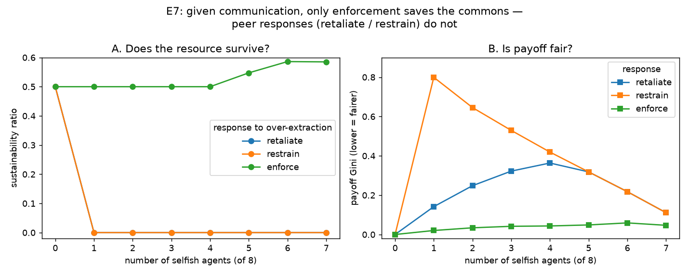

# E7 — Given Communication, Does the Response Rule Save the Commons?

**Date:** 2026-07-26 · **Script:**
[`scripts/experiment_response_rules.py`](../../scripts/experiment_response_rules.py)
· **Outputs:** `results/E7_response_rules/` · **Closes:** the E6 open question

## Question

E6 showed communication lets agents *detect* free-riders, but that a **retaliation**
response protects fairness, not the resource. Two questions remain: does a
**restraint** response do better, and can *any* peer response match **enforcement**?

## Method

Private information + a **perfect broadcast** (`broadcast_reliability = 1.0`, so every
cooperator can detect over-extraction — this isolates the *response* from the
*information*). Three responses to detected over-extraction, each mixed with a growing
number of selfish free-riders (8 agents total):

- **retaliate** (`conditional_cooperator`) — grab a selfish share;
- **restrain** (`compensating_cooperator`) — withhold to let the pool recover;
- **enforce** (`sanctioning`) — cap everyone's harvest (ignores the signal).

Perfect broadcast is deterministic, so a single seed suffices.

## Results

**Sustainability ratio** (private info, perfect broadcast):

| n_selfish | retaliate | restrain | enforce |
| --------: | --------: | -------: | ------: |
| 0 | 0.50 | 0.50 | 0.50 |
| 1 | **0.00** | **0.00** | 0.50 |
| 2–4 | 0.00 | 0.00 | 0.50 |
| 5–7 | 0.00 | 0.00 | 0.55–0.59 |

**Fairness** (payoff Gini): enforce ≈ 0.02–0.06 (fairest) at all counts; retaliate
peaks ≈ 0.36; **restrain is the *least* fair** (Gini up to 0.80 with one free-rider —
the withholding cooperators are maximally exploited).

## Interpretation

1. **Only enforcement saves the commons.** With even a single free-rider, both peer
   responses collapse the resource; enforcement holds it at ≥ 0.50 across every
   free-rider count. Enforcement is the *only* mechanism in the "good corner" — high
   sustainability **and** low inequality.
2. **Restraint is worse than retaliation, not better.** Withholding cooperators (a)
   still fail to save the resource — the free-riders' extraction scales with the stock
   and, with a one-round-lagged signal, the reactive withholding *oscillates* rather
   than stabilising — and (b) are maximally exploited (highest Gini), since they earn
   nothing while free-riders take everything.
3. **The decisive difference is binding vs. reactive.** Retaliation and restraint are
   *reactive* peer responses to information; enforcement *removes the choice* by
   capping extraction. Communication supplies information, but information alone does
   not coordinate — a **binding rule** does. This is exactly Ostrom's point:
   monitoring and graduated *sanctions*, not talk alone, sustain a commons.

**The unifying conclusion (E2, E3, E6, E7):** *communication informs but does not
coordinate; among the responses tried, only enforcement — which converts information
into a binding constraint — protects both the resource and fairness.*

## Threats to validity / limitations

- **Naive, reactive restraint.** The compensating cooperator withholds entirely on a
  one-round-lagged signal, which oscillates. A *coordinated quota agreement* (agree a
  per-capita cap and hold to it) could succeed — but that is essentially enforcement
  by consent, which is the point. This is a limitation of the *simple reactive rule*,
  not proof that restraint can never work.
- **Perfect broadcast, single free-rider type, one seed** (deterministic at
  reliability 1.0); `greed = 1.0` selfish whose extraction scales with the stock.
- **"Any one monitor enforces fully"** still flatters enforcement (ADR-0005); a
  costlier or partial enforcement would narrow the gap.

## Follow-ups

- A **binding agreement / quota** reached by communication (collective choice) rather
  than a reactive rule — does *consented* enforcement match imposed enforcement?
- Combine with E5: can communication **fund/coordinate monitoring** so enforcement is
  self-sustaining despite the second-order free-rider problem?
- Deception in the signal; imperfect/partial enforcement.
