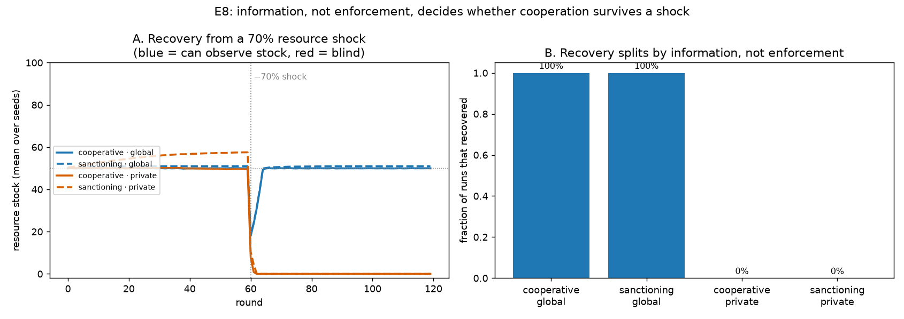

# E8 — Does Cooperation Survive a Shock? Information vs. Enforcement

**Date:** 2026-07-27 · **Script:**
[`scripts/experiment_resilience.py`](../../scripts/experiment_resilience.py)
· **Outputs:** `results/E8_resilience/` · **Opens:** Phase 3 (resilience)

## Question

Every earlier experiment studied the **calm** commons. The resilience question is
different: once a cooperative population has settled, what happens when the
environment is **disrupted**? Specifically — does a mechanism that looks healthy in
steady state also *recover* from a sudden resource loss, and what decides whether it
does: the agents' **information**, or the presence of **enforcement**?

## Method

A homogeneous 8-agent cooperative population runs for 120 rounds. It reaches its
steady state (stock held at the reference level `K/2 = 50`); then a **resource shock**
removes **70% of the stock at round 60** (ADR-0008), and we measure recovery.

Two factors are crossed (2 × 2):

- **Information** — `global` (agents observe the stock) vs. `private` (blind).
- **Enforcement** — plain `cooperative` vs. `sanctioning` (a policed per-capita quota).

`decision_noise = 0.1`, 20 seeds per condition. A **no-shock control** runs every
condition without the disturbance. Recovery is "stock back to ≥ 90% of its pre-shock
level"; `recovery_time` is right-censored (`None`) if it never recovers within the run.

## Results

**Recovered rate and final stock after the 70% shock** (20 seeds):

| strategy | information | recovered | final stock |
| -------- | ----------- | --------: | ----------: |
| cooperative | global | **100%** | 0.50·K |
| sanctioning | global | **100%** | 0.51·K |
| cooperative | private | **0%** | 0.00·K |
| sanctioning | private | **0%** | 0.00·K |

- **Observing** populations recover in a handful of rounds (≈ 4 for the single-seed
  trace) and return to `K/2`.
- **Blind** populations **collapse to 0 and never recover**, regardless of enforcement.
- **No-shock control:** every condition is stable (final stock ≥ 0.43·K). Without the
  shock, the four conditions are indistinguishable — the fragility is invisible in
  calm conditions.

## Interpretation

1. **Information, not enforcement, decides resilience.** The recovery outcome splits
   perfectly along the information axis and is flat along the enforcement axis. Agents
   that can *see* the depleted stock harvest nothing while it is below the reference
   level and let it regrow (the cooperative rule is self-correcting). Blind agents keep
   requesting the *steady-state* quota (`≈ MSY/N`) out of a shrunken pool whose
   regrowth is now far below that quota, so extraction exceeds regrowth every round and
   drives the resource to collapse — positive feedback into the absorbing state.

2. **Enforcement does not rescue a blind harvest rule.** The sanctioning quota is a
   **ceiling** on over-extraction, not a **floor** that forces restraint. When the
   binding problem is "everyone is blindly over-drawing a depleted pool", capping the
   *maximum* changes nothing — every agent is already at or below the cap. So
   `sanctioning · private` collapses exactly like `cooperative · private`.

3. **A fragility that calm conditions hide.** In steady state, information looks
   almost irrelevant (E1: private cooperation with accurate knowledge sustains the
   resource just fine). The shock reveals that the same information which was optional
   for *running* the commons is decisive for *surviving a disturbance* to it. This is
   the "efficient under normal conditions, fragile under disruption" pattern the
   resilience phase was meant to surface.

**Conclusion:** *resilience of the commons is an information property, not (only) an
institutional one. Observation lets a self-correcting rule ride out a shock;
enforcement, which governs the calm commons so well (E3/E7), does nothing for
recovery when agents cannot see what they are recovering from.*

## Threats to validity / limitations

- **One disturbance kind.** A single deterministic *pulse* shock; a *press*
  disturbance (sustained lower `g`) or agent failure may rank the mechanisms
  differently — those are the next kinds to add (ADR-0008).
- **Homogeneous populations, one shock size/timing.** The clean 100%/0% split is
  partly because populations are pure; mixed populations (cooperators + free-riders +
  enforcers under a shock) are the obvious follow-up and would test whether
  enforcement helps recovery *once free-riders are present*.
- **Blind rule is the accurate-knowledge fallback.** `private` cooperators harvest
  `MSY/N` (knowledge_bias = 1.0). A blind agent that scaled its request to its *own*
  recent catch might self-correct without observing the stock — i.e. resilience might
  be recoverable from *local* information, not just global. Worth testing.
- **Recovery threshold (90%) and censoring window (120 rounds)** are conventions; the
  qualitative split (recovers vs. collapses to 0) is insensitive to both here.

## Follow-ups

- **Agent failure** and **communication failure** disturbances against the same
  interface.
- Mixed populations under a shock: does enforcement protect recovery when free-riders
  are present, even though it doesn't help a pure blind population?
- A **local-information** model (observe own catch / neighbours) — is blind resilience
  recoverable without global observation?
- Sweep shock magnitude and timing to map the recovery/collapse boundary.
