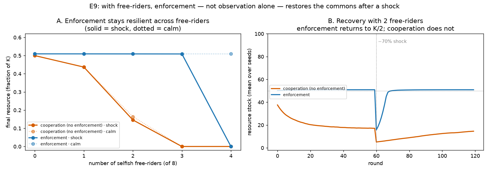

# E9 — Resilience With Free-Riders: Does Enforcement Matter Under a Shock?

**Date:** 2026-07-27 · **Script:**
[`scripts/experiment_resilience_freeriders.py`](../../scripts/experiment_resilience_freeriders.py)
· **Outputs:** `results/E9_resilience_freeriders/` · **Extends:** E8

## Question

[E8](E8-resilience.md) shocked *homogeneous* cooperative populations and found that
**information** decides recovery — observing agents self-correct and recover, blind
ones collapse — and that enforcement was irrelevant there. This raises the
complementary question: once **free-riders** are present, does enforcement provide
shock-resilience that plain cooperation lacks?

## Method

Global information throughout (so this isolates the *free-rider* effect from the
*information* effect of E8). A group of 8 = `(8 − s)` cooperators plus `s` selfish
free-riders, with the cooperators being either plain `cooperative` (no enforcement) or
`sanctioning` (enforced quota). A **70% resource shock** hits at round 60; a **no-shock
control** runs alongside. `s` is swept 0–4, `decision_noise = 0.1`, 20 seeds.

## Results

**Final resource (fraction of K) after the shock**, by free-rider count `s`:

| regime | s=0 | s=1 | s=2 | s=3 | s=4 |
| ------ | --: | --: | --: | --: | --: |
| cooperation (no enforcement) | 0.50 | 0.44 | 0.15 | 0.00 | 0.00 |
| **enforcement** | 0.51 | 0.51 | 0.51 | **0.51** | 0.00 |

- **Enforcement recovers to full health at every free-rider count up to `s=3`**, then
  breaks at `s=4` (half the group free-riding overwhelms the quota).
- **Plain cooperation degrades from `s=2`** and is dead by `s=3`.
- **The shock ≈ the calm control** (solid vs. dotted lines in panel A nearly overlap):
  for the observing population the shock is *not* the killer — the free-riders are.

## Interpretation

1. **Observation buys shock-recovery; enforcement buys free-rider tolerance.** Panel B
   (`s=2`) shows the mechanism: after the shock both populations are knocked down, but
   the *enforced* one snaps back to `K/2` while the unenforced one limps along near the
   floor. Plain cooperators *do* recover from the raw shock (as E8 predicts — greedy
   extraction scales *down* with the depleted stock, so the pool can regrow) — but only
   back to the level free-riders have already dragged it to, and past one free-rider
   that level is collapse.

2. **The E8 headline sharpens, it doesn't reverse.** E8: *information*, not
   enforcement, lets a **pure** population recover. E9: with free-riders, *enforcement*
   is additionally required to recover to health. The two protective factors are
   **complementary, not substitutes** — observation lets a commons climb back from a
   shock; enforcement decides how many free-riders it can carry while doing so.
   Neither alone is sufficient in the general (disturbed, mixed) case.

3. **Enforcement has a ceiling too.** At `s=4` (half the group) even enforcement
   collapses after the shock: the summed quota of four capped free-riders exceeds what
   a depleted pool can regrow. Enforcement widens the resilient range; it does not make
   it unbounded — consistent with E3's "enforcement protects, but is not free".

**Conclusion:** *resilience of a mixed commons needs both axes — information to
self-correct after the shock (E8) and enforcement to contain free-riders during the
fragile recovery (E9). This unifies the calm-state mechanism ladder (E2–E3, E7) with
the resilience story: the same enforcement that governs the calm commons is what
carries it through a disturbance when free-riders are present.*

## Threats to validity / limitations

- **Global information only.** By design, to isolate the free-rider effect. The blind
  (`private`) case is E8's domain: enforcement does *not* rescue a blind population
  (the quota caps over-use but cannot force restraint on agents who cannot see the
  stock), so the full statement is "needs *both* information and enforcement".
- **Proportional (self-limiting) free-riders.** Selfish agents take `greed · stock/N`,
  which shrinks with the stock — this is *why* observing cooperators can regrow through
  moderate free-riding. A free-rider taking a *fixed* amount (or `greed > 1`) would
  bite harder during recovery and lower the tolerance thresholds.
- **One shock size/timing, homogeneous cooperator type, `greed = 1.0`.** The `s`
  thresholds (cooperation fails at 2, enforcement at 4) are specific to `(K, g, N)` and
  the shock; the *ordering* (enforcement tolerates strictly more) is the robust claim.

## Follow-ups

- Sweep shock magnitude/timing and `greed` to map the resilient region in
  (free-riders × shock) space for each mechanism.
- The blind + free-rider + enforcement cell as a single "needs both" figure.
- Voluntary monitoring (E5) under a shock: does the second-order free-rider problem
  make enforcement erode exactly when a disturbance needs it most?
