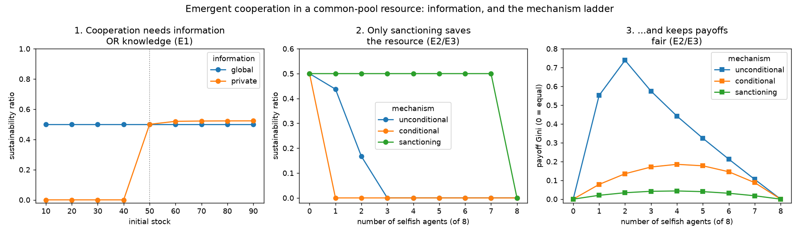
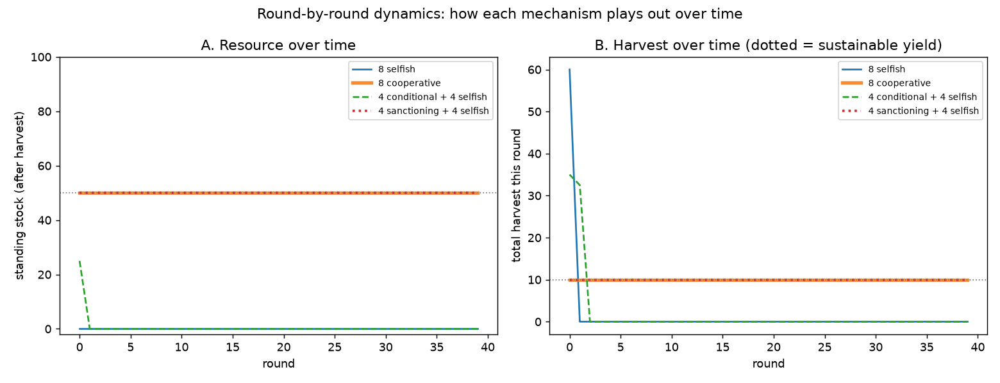

# Findings Summary — Emergent Cooperation in a Common-Pool Resource

*A consolidated synthesis of experiments E1–E10. E1–E7 study the calm commons; E8–E10
are the resilience phase (disturbances). This is the narrative spine for the writeup;
each claim links to its full experiment report and the code that produced it.*

**Status:** 2026-07-27 · 5 strategies · 10 experiments (E1–E10) · 80 tests · results
reproducible from `scripts/` and the committed `results/` data.

---

## In one paragraph

We built a reproducible, deterministic simulation of a renewable common-pool
resource shared by agents with simple, interchangeable decision rules. Using it we
show two things. **(1) Cooperative *intent* is not enough for a sustainable outcome:**
agents that mean to restrain still collapse the resource if they lack either
*information* about its state or accurate *ecological knowledge* of the sustainable
yield (E1). **(2) When free-riders are present, the *mechanism* of cooperation
decides the outcome:** unconditional restraint is exploited, reciprocity protects
fairness but not the resource, and only enforced sanctioning protects both — at the
price of a second-order free-rider problem (E2–E3). The results reproduce, in a
minimal abstract model, classic findings from the commons literature (Hardin,
Ostrom, Schill et al.).



The same story as *dynamics over time* — the resource stock and harvest round by
round (`scripts/plot_trajectory.py`): selfish crash the pool in one round, reciprocity
ratchets to collapse in a few, cooperation and sanctioning hold a steady sawtooth.



---

## Research question

> Under what conditions does *cooperative intent* produce *sustainable and fair*
> outcomes in a decentralized common-pool-resource system — and how does that depend
> on the information agents have and the mechanism they use to cooperate?

Two organizing axes emerged: an **information/knowledge** axis (E1) and a
**cooperation-mechanism** axis (E2–E3).

## The model (in brief)

- **Resource:** one scalar stock with logistic regeneration `dR = g·R·(1 − R/K)`
  (`K = 100`, `g = 0.4`, so the maximum sustainable yield is `MSY = g·K/4 = 10`).
  A stock driven to 0 cannot recover.
- **Round:** `regenerate → observe → decide → ration → (enforce) → harvest`. All
  randomness derives from one seed; a run is a pure function of `(config, seed)`.
- **Agents & strategies (five):** `selfish` (grab a share of what's visible),
  `cooperative` (take only the surplus above `K/2`; self-correcting),
  `conditional_cooperator` (reciprocity: retaliate on over-extraction),
  `compensating_cooperator` (restraint: withhold on over-extraction), `sanctioning`
  (cooperate and enforce a per-capita quota at a monitoring cost). Definitions:
  [terminology.md](terminology.md#cooperation-mechanisms-the-strategies).
- **Metrics:** total harvest, sustainability ratio (final stock / K), collapse and
  survival time, efficiency vs. MSY, over-usage rate, and payoff Gini (fairness).

Full detail: [architecture.md](architecture.md), [metrics.md](metrics.md). Design
decisions: [decisions/](decisions/).

---

## Finding 1 — Cooperation needs information *or* knowledge (E1)

*(Panel 1. Full report: [E1](experiments/E1-information-and-knowledge.md).)*

An all-cooperative population sustains the resource **only** when it can *observe*
the stock (global information) **or** holds an *accurate* estimate of the sustainable
yield. Blind cooperators (private information) collapse the resource when it starts
below the healthy level `K/2`, and overconfident cooperators collapse it even from a
healthy start. With observation, agents self-correct and are robust to both.

- **Global information:** sustainability = 0.50 across every initial stock and every
  knowledge bias — observation substitutes for ecological knowledge.
- **Private + starting depleted (≤ K/2):** collapse (sustainability 0.0).
- **Private + overconfident (knowledge_bias ≥ 1.2):** collapse.

This reproduces Schill et al. (2016), *"Cooperation Is Not Enough"*: sustainability
needs cooperation **plus** ecological knowledge. Here, *information can supply the
knowledge*.

## Finding 2 — Against free-riders, the mechanism decides the resource (E2/E3)

*(Panel 2. Reports: [E2](experiments/E2-reciprocity.md), [E3](experiments/E3-sanctioning.md).)*

Introducing selfish free-riders into a cooperator population:

- **Unconditional cooperation** survives only 1–2 free-riders, then collapses; the
  cooperators keep subsidizing until the resource is gone.
- **Reciprocity** (conditional cooperation) collapses the resource with even a single
  free-rider — retaliation is a ratchet to collapse.
- **Sanctioning** holds sustainability at 0.50 for *every* free-rider count (1–7),
  because enforcement caps the free-riders' extraction at the sustainable quota.

## Finding 3 — ...and only sanctioning also keeps it fair (E2/E3)

*(Panel 3.)*

- **Unconditional cooperation** produces extreme inequality (Gini up to 0.74): a lone
  free-rider earns ~670 vs cooperators' ~46 — it is heavily exploited.
- **Reciprocity** starves free-riders (a lone free-rider earns ~14) and keeps Gini
  moderate (≤ 0.19) — it protects *fairness* but not the resource.
- **Sanctioning** keeps Gini ≤ 0.04 *and* the resource alive — the only mechanism
  that protects both.

## Finding 4 — Enforcement has a price: the second-order free-rider

*(Report: [E3](experiments/E3-sanctioning.md).)*

Monitoring is costly. In a mix of sanctioners, plain cooperators, and a free-rider,
the sanctioners earn **105** while the cooperators they protect — and the free-rider
— earn **125**. Everyone benefits from enforcement, but only the monitors pay for it.
So *who will choose to monitor?* becomes a nested collective-action problem, echoing
Ostrom's emphasis on monitoring and graduated sanctions and Fehr & Gächter on costly
punishment.

---

## The mechanism ladder (headline result)

| mechanism | protects resource? | protects fairness? | cost |
| --------- | :----------------: | :----------------: | ---- |
| selfish only | ✗ collapse | — | — |
| unconditional cooperation | ✓ only vs 1–2 free-riders | ✗ exploited | — |
| reciprocity (conditional) | ✗ collapses faster | ✓ starves free-riders | retaliation spiral |
| **sanctioning (enforcement)** | **✓** | **✓** | monitors pay (2nd-order free-rider) |

Reading the ladder: each mechanism fixes the previous one's failure but reveals a new
problem, ending at the classic result that *enforced, monitored rules* sustain a
commons — while raising the question of how monitoring itself is sustained.

## Extensions (E4–E7)

Beyond the core mechanism story, three further experiments probe robustness and the
two remaining axes:

- **[E4 — robustness & sensitivity](experiments/E4-robustness-and-sensitivity.md):**
  with a `decision_noise` knob added, the E1–E3 conclusions are **robust** (between-seed
  s.d. ≤ 0.008); higher regeneration rate `g` lets the resource tolerate more
  free-riders; outcomes depend on the selfish *fraction*, not group size `N`
  (scale-invariant). *(Answers SQ-11, SQ-12.)*
- **[E5 — voluntary monitoring](experiments/E5-voluntary-monitoring.md):** if
  monitoring is a *choice* (replicator dynamics, ADR-0006), it is **not evolutionarily
  stable** — monitors erode via the second-order free-rider problem, and once they
  vanish the commons collapses (a two-stage collapse). Reproduces the Hauert et al.
  (2007) puzzle.
- **[E6 — communication](experiments/E6-communication.md):** a broadcast channel
  (ADR-0007) lets blind (private-info) conditional cooperators detect free-riders —
  **communication substitutes for observation**, cutting inequality toward the global
  value — but it does **not** save the resource, because the *response* (retaliation)
  is destructive. Communication's value depends on what agents do with it.
  *(Answers SQ-6, SQ-7, SQ-8.)*

- **[E7 — response rules](experiments/E7-response-rules.md):** given perfect
  communication, *only enforcement* saves the commons. Both peer responses to detected
  over-extraction fail — retaliation (E6) protects fairness not the resource, and
  *restraint* (withholding) protects neither and is the most exploited. Enforcement is
  the only mechanism in the "good corner" (sustainable **and** fair), because it
  converts information into a **binding constraint** rather than a reactive choice.

## Resilience: what survives a shock? (E8 — Phase 3)

*(First disturbance experiment. Full report: [E8](experiments/E8-resilience.md).)*

E1–E7 study the *calm* commons. E8 disrupts it: a settled cooperative population is
hit with a **70% resource shock** at round 60 (ADR-0008), and we ask what recovers.
Crossing information (`global`/`private`) with enforcement (`cooperative`/`sanctioning`):

| condition | recovered after shock? |
| --------- | :--------------------: |
| observing (`global`), either strategy | ✓ 100% — back to `K/2` in a few rounds |
| blind (`private`), either strategy | ✗ 0% — collapses to 0 |

**Information, not enforcement, decides resilience.** Agents that can *see* the
depleted stock stop harvesting and let it regrow (self-correction); blind agents keep
taking the steady-state quota from a shrunken pool and drive it to collapse.
Enforcement doesn't help — the sanctioning quota caps over-use but cannot *force*
restraint on a blind population. Crucially, a **no-shock control is stable in every
condition**: the fragility is invisible in calm conditions and only the disturbance
reveals it. This is the first genuinely *non-obvious* result — the same information
that is nearly optional for *running* the commons (E1) is decisive for *surviving a
shock* to it.

**...but with free-riders, you also need enforcement (E8 → E9).**
[E9](experiments/E9-resilience-with-free-riders.md) adds selfish free-riders (global
information throughout) and shocks the mix. Enforcement recovers the commons to `K/2`
at every free-rider count up to 3 of 8; plain cooperation recovers only up to ~1
free-rider, then collapses — and the shock ≈ the calm control, so the free-riders, not
the shock, are the killer there. So the two protective factors are **complementary,
not substitutes**: *observation* lets a commons climb back from a shock (E8);
*enforcement* decides how many free-riders it can carry while doing so (E9). Resilience
of a mixed, disturbed commons needs **both** — which is what unifies the calm-state
mechanism ladder (E2–E3, E7) with the resilience phase.

**Agent failure — enforcement is a single point of failure (E10).**
[E10](experiments/E10-agent-failure.md) disturbs the *population* instead of the
resource: a quarter of the agents drop out mid-run. **Who fails decides the outcome** —
losing the 2 enforcers collapses a commons that enforcement was holding (0.51 → 0.00),
losing 2 cooperators is harmless (self-correction is distributed), and losing 2
free-riders *helps* (0.17 → 0.53). So the enforcement that makes the commons robust to
free-riders (E3/E9) concentrates its protection in the monitors and inherits their
fragility — an exogenous echo of E5's endogenous monitor erosion. Robustness to agent
loss is about *how protection is organized* (distributed vs. concentrated), not how
much cooperation there is.

The throughline: cooperation needs *information* (E1, E6); its outcome is decided by
the *mechanism/response* (E2, E3, E7); **communication informs but does not
coordinate — only a binding rule (enforcement) does** (E7); enforcement fixes the
commons but is itself fragile when voluntary (E5); and the qualitative results are
robust (E4). This mirrors Ostrom: enduring commons need monitoring **and** graduated
sanctions, not talk alone. **Under disturbance the picture turns:** when a shock hits,
*information* — not enforcement — decides whether a **pure** population recovers (E8);
but once **free-riders** are present, *enforcement* is additionally required to recover
to health (E9). Resilience of a mixed, disturbed commons needs **both** information and
enforcement — a synthesis that ties the resilience phase back to the calm-state ladder.
And that enforcement is itself a **single point of failure**: lose the monitors and the
commons collapses (E10), where distributed self-correction would have degraded
gracefully.

## Relation to the literature

- **Hardin (1968):** the all-selfish collapse is the tragedy of the commons.
- **Ostrom (1990):** monitoring + graduated sanctions sustain commons — our E3.
- **Schill et al. (2016):** cooperation ≠ sustainability without knowledge — our E1.
- **Janssen et al. (2022):** conditional cooperators dominate; Gini is standard;
  communication works via trust — motivates the next phase.
- **Piatti et al. (2024, GovSim):** survival/efficiency/over-usage metrics; default to
  collapse (best LLM survival rate only 53.3%); removing communication raises
  over-usage 22% — adopted here.

(Verified citations and analysed notes: [literature-review.md](literature-review.md),
[paper-notes/](paper-notes/).)

## Threats to validity (consolidated)

- **Deterministic strategies by default** → zero between-seed variance; reported E1–E3
  values are exact. A `decision_noise` knob adds stochasticity, and **E4 shows the
  conclusions are robust** to it (between-seed s.d. ≤ 0.008). A genuinely stochastic
  *strategy* would stress the seed machinery harder (open follow-up).
- **Single parameterization** `(K=100, g=0.4, N=8)`; no sensitivity sweep over group
  size or regeneration rate yet.
- **Idealised mechanisms:** reciprocity retaliates at full strength (`defection_greed
  = 1.0`); enforcement is frictionless and "any one monitor enforces fully"; the
  monitoring cost is a free parameter (its *sign* is robust, its magnitude is not).
- **Homogeneous ecology and no space** — still simplifications. Disturbances now cover
  a *pulse* resource shock (homogeneous E8, free-rider-mixed E9) and *agent failure*
  (E10); communication failure, monitor-redundancy sweeps, the blind + free-rider cell,
  and *press* (sustained) disturbances are the next steps.

## What this is (and isn't) as a contribution

It is a *reproducible experimental environment* plus a *systematic, literature-grounded
comparison* of cooperation mechanisms and information conditions — not a new
algorithm. That is an appropriate and defensible bachelor-level contribution
(cf. [contribution-opportunities.md](contribution-opportunities.md), types C1/C2/C5).

## Future work

The full roadmap is in [research-direction.md](research-direction.md). The standout
open threads:

1. **Binding agreement / collective choice** — can communication produce a *consented*
   quota (and fund the monitoring to uphold it), unifying E5 + E7? This is the sharp
   version of "communication that coordinates, not just informs".
2. **Disturbances (Phase 3, in progress):** the resource shock (E8/E9) and agent
   failure (E10) are in. Next — **communication failure** against the same interface;
   **monitor-redundancy** sweeps (how much redundancy buys back the single point of
   failure); the blind + free-rider "needs both" cell; a *press* (sustained)
   disturbance.
3. **A genuinely stochastic strategy** (not just noisy execution), so between-seed
   variance becomes substantial and the robustness question sharper.

## Reproduce everything

```bash
pip install -e ".[dev,analysis]"
python scripts/experiment_information_knowledge.py   # E1
python scripts/experiment_reciprocity.py             # E2
python scripts/experiment_sanctioning.py             # E3
python scripts/make_synthesis_figure.py              # the overview figure
python scripts/experiment_robustness.py              # E4
python scripts/experiment_voluntary_monitoring.py    # E5
python scripts/experiment_communication.py           # E6
python scripts/experiment_response_rules.py          # E7
python scripts/experiment_resilience.py              # E8
python scripts/experiment_resilience_freeriders.py   # E9
python scripts/experiment_agent_failure.py           # E10
pytest                                               # 80 tests
```
