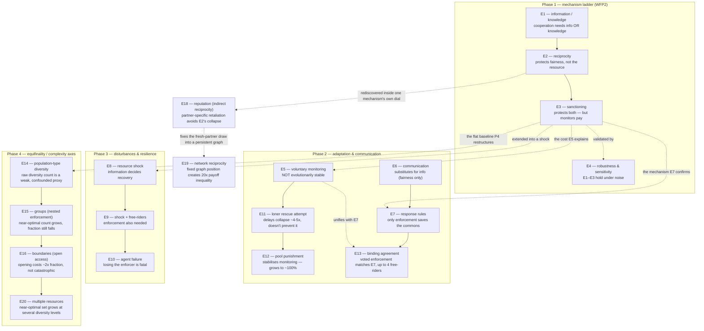

# Findings Summary — Emergent Cooperation in a Common-Pool Resource

*A consolidated synthesis of experiments E1–E20 (E17 reserved). E1–E7 study the calm
commons; E8–E10 are the resilience phase (disturbances); E11–E13 are thesis-track
follow-ups probing whether monitoring can be made evolutionarily stable and whether a
voted agreement can substitute for pre-committed enforcement; E14–E16 and E20 shift to
the equifinality/complexity-axis question — as the population, its governance
structure, its boundary, and now its resources get structurally richer, does the set
of near-optimal approaches grow? E18 and E19 are standalone mechanism comparisons
(built, not folded into the complexity-axis sweep — see `complexity-synthesis.md`'s
"Related but distinct" section for why): does conditioning retaliation on one
partner's reputation, rather than the population's aggregate trend, avoid the
collapse blanket retaliation causes (E18)? And does fixing that partner to a
persistent graph neighbour, instead of a fresh random draw, make an agent's outcome
depend on its graph position (E19)? E20, by contrast, *is* folded into the
complexity-axis sweep — a second, asymmetric resource pool grows the near-optimal
set at several diversity levels, once a sanctioning-quota calibration bug (caught
and fixed, see ADR-0016) was corrected. This is the narrative spine for the
writeup; each claim links to its full experiment report and the code that produced
it.*

**Status:** 2026-08-16 · 7 strategies · 19 experiments built (E1–E20, E17
reserved) · 131 tests · results reproducible from `scripts/` and the committed
`results/` data.

---

## In one paragraph

We built a reproducible, deterministic simulation of a renewable common-pool
resource shared by agents with simple, interchangeable decision rules. Using it we
show two things. **(1) Cooperative *intent* is not enough for a sustainable outcome:**
agents that mean to restrain still collapse the resource if they lack either
*information* about its state or accurate *ecological knowledge* of the sustainable
yield (E1). **(2) When free-riders are present, the *mechanism* of cooperation
decides the outcome:** unconditional restraint is exploited, reciprocity protects
fairness but not the resource, and only enforced sanctioning protects both — at the
price of a second-order free-rider problem (E2–E3). The results reproduce, in a
minimal abstract model, classic findings from the commons literature (Hardin,
Ostrom, Schill et al.).


The same story as *dynamics over time* — the resource stock and harvest round by
round (`scripts/plot_trajectory.py`): selfish crash the pool in one round, reciprocity
ratchets to collapse in a few, cooperation and sanctioning hold a steady sawtooth.


---

## Research question

> Under what conditions does *cooperative intent* produce *sustainable and fair*
> outcomes in a decentralized common-pool-resource system — and how does that depend
> on the information agents have and the mechanism they use to cooperate?

Two organizing axes emerged: an **information/knowledge** axis (E1) and a
**cooperation-mechanism** axis (E2–E3).

## The model (in brief)

- **Resource:** one scalar stock with logistic regeneration `dR = g·R·(1 − R/K)`
  (`K = 100`, `g = 0.4`, so the maximum sustainable yield is `MSY = g·K/4 = 10`).
  A stock driven to 0 cannot recover.
- **Round:** `regenerate → observe → decide → ration → (enforce) → harvest`. All
  randomness derives from one seed; a run is a pure function of `(config, seed)`.
- **Agents & strategies (five):** `selfish` (grab a share of what's visible),
  `cooperative` (take only the surplus above `K/2`; self-correcting),
  `conditional_cooperator` (reciprocity: retaliate on over-extraction),
  `compensating_cooperator` (restraint: withhold on over-extraction), `sanctioning`
  (cooperate and enforce a per-capita quota at a monitoring cost). Definitions:
  [terminology.md](terminology.md#cooperation-mechanisms-the-strategies).
- **Metrics:** total harvest, sustainability ratio (final stock / K), collapse and
  survival time, efficiency vs. MSY, over-usage rate, and payoff Gini (fairness).

Full detail: [architecture.md](architecture.md), [metrics.md](metrics.md). Design
decisions: [decisions/](decisions/).

---

## How the experiments fit together

Each experiment either closes a question the previous one opened, or fixes a
failure mode the previous one exposed. This is the map; the sections below walk
through it one piece at a time.



Reading it: **E1–E3 is the spine** — each experiment fixes the previous one's
failure (blind cooperation fails → add reciprocity → reciprocity still fails the
*resource* → add enforcement). **E4** is a robustness check on that spine, not a new
mechanism. **E5** asks whether E3's enforcement survives if agents can choose it
freely (no); **E11** is one attempt — only partly successful — at fixing that, and
**E12** is a second attempt that actually succeeds. **E6/E7** add a new axis (communication) on top of the same mechanisms, and **E13** unifies E5's "chosen vs. imposed enforcement" question with E7's communication axis — a voted, jointly-funded agreement tested against E7's imposed enforcement. **E8–E10**
take the whole mechanism set and ask what survives a disturbance, building up from a
single shock (E8) to a shock plus free-riders (E9) to losing agents outright (E10).
**E14–E16** ask a different kind of question about the same E3 mechanism (sanctioning)
— not "does it work" but "in how many different population/governance
configurations does it (or something else) still work near-optimally," building a
per-group, then per-boundary, sweep on top of the flat population E1–E13 assumed
throughout. **E20** extends that same composition sweep with a second, asymmetric
resource pool — once a sanctioning-quota calibration bug was caught and fixed
(ADR-0016), it grows the near-optimal set at several diversity levels, the same
direction as groups (E15).

---

## Finding 1 — Cooperation needs information *or* knowledge (E1)

*(Panel 1. Full report: [E1](experiments/E1-information-and-knowledge.md).)*

An all-cooperative population sustains the resource **only** when it can *observe*
the stock (global information) **or** holds an *accurate* estimate of the sustainable
yield. Blind cooperators (private information) collapse the resource when it starts
below the healthy level `K/2`, and overconfident cooperators collapse it even from a
healthy start. With observation, agents self-correct and are robust to both.

- **Global information:** sustainability = 0.50 across every initial stock and every
  knowledge bias — observation substitutes for ecological knowledge.
- **Private + starting depleted (≤ K/2):** collapse (sustainability 0.0).
- **Private + overconfident (knowledge_bias ≥ 1.2):** collapse.

This reproduces Schill et al. (2016), *"Cooperation Is Not Enough"*: sustainability
needs cooperation **plus** ecological knowledge. Here, *information can supply the
knowledge*.

## Finding 2 — Against free-riders, the mechanism decides the resource (E2/E3)

*(Panel 2. Reports: [E2](experiments/E2-reciprocity.md), [E3](experiments/E3-sanctioning.md).)*

Introducing selfish free-riders into a cooperator population:

- **Unconditional cooperation** survives only 1–2 free-riders, then collapses; the
  cooperators keep subsidizing until the resource is gone.
- **Reciprocity** (conditional cooperation) collapses the resource with even a single
  free-rider — retaliation is a ratchet to collapse.
- **Sanctioning** holds sustainability at 0.50 for *every* free-rider count (1–7),
  because enforcement caps the free-riders' extraction at the sustainable quota.

## Finding 3 — ...and only sanctioning also keeps it fair (E2/E3)

*(Panel 3.)*

- **Unconditional cooperation** produces extreme inequality (Gini up to 0.74): a lone
  free-rider earns ~670 vs cooperators' ~46 — it is heavily exploited.
- **Reciprocity** starves free-riders (a lone free-rider earns ~14) and keeps Gini
  moderate (≤ 0.19) — it protects *fairness* but not the resource.
- **Sanctioning** keeps Gini ≤ 0.04 *and* the resource alive — the only mechanism
  that protects both.

## Finding 4 — Enforcement has a price: the second-order free-rider

*(Report: [E3](experiments/E3-sanctioning.md).)*

Monitoring is costly. In a mix of sanctioners, plain cooperators, and a free-rider,
the sanctioners earn **105** while the cooperators they protect — and the free-rider
— earn **125**. Everyone benefits from enforcement, but only the monitors pay for it.
So *who will choose to monitor?* becomes a nested collective-action problem, echoing
Ostrom's emphasis on monitoring and graduated sanctions and Fehr & Gächter on costly
punishment.

---

## The mechanism ladder (headline result)

| mechanism | protects resource? | protects fairness? | cost |
| --------- | :----------------: | :----------------: | ---- |
| selfish only | ✗ collapse | — | — |
| unconditional cooperation | ✓ only vs 1–2 free-riders | ✗ exploited | — |
| reciprocity (conditional) | ✗ collapses faster | ✓ starves free-riders | retaliation spiral |
| **sanctioning (enforcement)** | **✓** | **✓** | monitors pay (2nd-order free-rider) |

Reading the ladder: each mechanism fixes the previous one's failure but reveals a new
problem, ending at the classic result that *enforced, monitored rules* sustain a
commons — while raising the question of how monitoring itself is sustained.

## Extensions (E4–E7)

Beyond the core mechanism story, three further experiments probe robustness and the
two remaining axes:

- **[E4 — robustness & sensitivity](experiments/E4-robustness-and-sensitivity.md):**
  with a `decision_noise` knob added, the E1–E3 conclusions are **robust** (between-seed
  s.d. ≤ 0.008); higher regeneration rate `g` lets the resource tolerate more
  free-riders; outcomes depend on the selfish *fraction*, not group size `N`
  (scale-invariant). *(Answers SQ-11, SQ-12.)*
- **[E5 — voluntary monitoring](experiments/E5-voluntary-monitoring.md):** if
  monitoring is a *choice* (replicator dynamics, ADR-0006), it is **not evolutionarily
  stable** — monitors erode via the second-order free-rider problem, and once they
  vanish the commons collapses (a two-stage collapse). Reproduces the Hauert et al.
  (2007) puzzle.
- **[E6 — communication](experiments/E6-communication.md):** a broadcast channel
  (ADR-0007) lets blind (private-info) conditional cooperators detect free-riders —
  **communication substitutes for observation**, cutting inequality toward the global
  value — but it does **not** save the resource, because the *response* (retaliation)
  is destructive. Communication's value depends on what agents do with it.
  *(Answers SQ-6, SQ-7, SQ-8.)*

- **[E7 — response rules](experiments/E7-response-rules.md):** given perfect
  communication, *only enforcement* saves the commons. Both peer responses to detected
  over-extraction fail — retaliation (E6) protects fairness not the resource, and
  *restraint* (withholding) protects neither and is the most exploited. Enforcement is
  the only mechanism in the "good corner" (sustainable **and** fair), because it
  converts information into a **binding constraint** rather than a reactive choice.

## Resilience: what survives a shock? (E8 — Phase 3)

*(First disturbance experiment. Full report: [E8](experiments/E8-resilience.md).)*

E1–E7 study the *calm* commons. E8 disrupts it: a settled cooperative population is
hit with a **70% resource shock** at round 60 (ADR-0008), and we ask what recovers.
Crossing information (`global`/`private`) with enforcement (`cooperative`/`sanctioning`):

| condition | recovered after shock? |
| --------- | :--------------------: |
| observing (`global`), either strategy | ✓ 100% — back to `K/2` in a few rounds |
| blind (`private`), either strategy | ✗ 0% — collapses to 0 |

**Information, not enforcement, decides resilience.** Agents that can *see* the
depleted stock stop harvesting and let it regrow (self-correction); blind agents keep
taking the steady-state quota from a shrunken pool and drive it to collapse.
Enforcement doesn't help — the sanctioning quota caps over-use but cannot *force*
restraint on a blind population. Crucially, a **no-shock control is stable in every
condition**: the fragility is invisible in calm conditions and only the disturbance
reveals it. This is the first genuinely *non-obvious* result — the same information
that is nearly optional for *running* the commons (E1) is decisive for *surviving a
shock* to it.

**...but with free-riders, you also need enforcement (E8 → E9).**
[E9](experiments/E9-resilience-with-free-riders.md) adds selfish free-riders (global
information throughout) and shocks the mix. Enforcement recovers the commons to `K/2`
at every free-rider count up to 3 of 8; plain cooperation recovers only up to ~1
free-rider, then collapses — and the shock ≈ the calm control, so the free-riders, not
the shock, are the killer there. So the two protective factors are **complementary,
not substitutes**: *observation* lets a commons climb back from a shock (E8);
*enforcement* decides how many free-riders it can carry while doing so (E9). Resilience
of a mixed, disturbed commons needs **both** — which is what unifies the calm-state
mechanism ladder (E2–E3, E7) with the resilience phase.

**Agent failure — enforcement is a single point of failure (E10).**
[E10](experiments/E10-agent-failure.md) disturbs the *population* instead of the
resource: a quarter of the agents drop out mid-run. **Who fails decides the outcome** —
losing the 2 enforcers collapses a commons that enforcement was holding (0.51 → 0.00),
losing 2 cooperators is harmless (self-correction is distributed), and losing 2
free-riders *helps* (0.17 → 0.53). So the enforcement that makes the commons robust to
free-riders (E3/E9) concentrates its protection in the monitors and inherits their
fragility — an exogenous echo of E5's endogenous monitor erosion. Robustness to agent
loss is about *how protection is organized* (distributed vs. concentrated), not how
much cooperation there is.

The throughline: cooperation needs *information* (E1, E6); its outcome is decided by
the *mechanism/response* (E2, E3, E7); **communication informs but does not
coordinate — only a binding rule (enforcement) does** (E7); enforcement fixes the
commons but is itself fragile when voluntary (E5); and the qualitative results are
robust (E4). This mirrors Ostrom: enduring commons need monitoring **and** graduated
sanctions, not talk alone. **Under disturbance the picture turns:** when a shock hits,
*information* — not enforcement — decides whether a **pure** population recovers (E8);
but once **free-riders** are present, *enforcement* is additionally required to recover
to health (E9). Resilience of a mixed, disturbed commons needs **both** information and
enforcement — a synthesis that ties the resilience phase back to the calm-state ladder.
And that enforcement is itself a **single point of failure**: lose the monitors and the
commons collapses (E10), where distributed self-correction would have degraded
gracefully.

## Complexity & equifinality: does the near-optimal set grow? (E14–E16, E20 — Phase 4)

*(Full synthesis: [complexity-synthesis.md](complexity-synthesis.md). Reports:
[E14](experiments/E14-population-diversity.md), [E15](experiments/E15-groups.md),
[E16](experiments/E16-boundaries.md), [E20](experiments/E20-multiple-resources.md).)*

E1–E13 ask *which mechanism works*. Phase 4 asks a different question: as the
*setting* gets structurally richer — not harsher, richer — does the **count** of
distinct population/governance configurations that reach a near-optimal outcome
(`welfare_efficiency ≥ 0.80`) grow?

- **E14 — population-type diversity:** sweeping all 495 compositions of 8 agents
  across the 5 strategies, raw diversity (how many distinct types coexist) turns out
  to be a weak, confounded proxy — the real driver is whether **any** `sanctioning`
  agent is present (330/330 pass) and, absent one, how many `selfish` agents there
  are and whether the cooperator type retaliates or restrains (E2/E3's findings,
  rediscovered, not a new diversity effect).
- **E15 — groups (nested enforcement):** splitting the same population into `m`
  independently-enforced groups (Ostrom principle 8) genuinely **grows the
  near-optimal count** — 383 → 2,820 → 18,737 as `m` goes 1→2→4 — the first
  unconfounded count growth in this project. But the *fraction* of the tried space
  that succeeds still nearly halves at each step: more groups means more ways to
  succeed, and proportionally more ways to fail, at once.
- **E16 — boundaries (open access):** adding a fixed batch of unmonitored outsiders
  (Ostrom principle 1) costs a real, consistent **~2× fraction** at every `m` tested
  — substantial, but far short of the near-total wipeout a single-adversarial-
  outsider reading first suggested; most outsiders, drawn from the full composition
  space, aren't actually threatening.
- **E20 — multiple resources:** the identical 495-composition sweep, this
  time with a second, slower-growing pool switched on and every agent
  splitting effort evenly — **exceeds the single-pool near-optimal count and
  fraction at two of five diversity levels and matches it at a third** (e.g.
  diversity=3: 153/210 → 160/210; diversity=4: 140/175 → 145/175; diversity=5:
  35/35 → 35/35). Only diversity 1–2 lag, and diversity 1's shortfall is fully
  explained by a separate, already-understood cost (doubled monitoring fees
  for full-coverage enforcement), not a general mismatch. A first version of
  this result reported the opposite (shrinkage at every level) — traced to a
  sanctioning-quota calibration bug (the quota enforced on the second pool was
  silently reused from the first), fixed and documented in ADR-0016.

**So: richness tends to help, once correctly measured — and getting the
measurement right matters as much as picking the axis.** Groups (E15) grow
the near-optimal count unconfoundedly. Multiple resources (E20), once its
enforcement bug was fixed, also grows it at several diversity levels. Both
are genuine, mechanistically-grounded composition-space axes, tested with
the same rigor; see `complexity-synthesis.md`'s methodological lessons —
including a new one this axis added, that a plausible-looking negative
result still needs a mechanism check before it's trusted. Unlike E1–E13,
which compare a handful of hand-picked configurations per experiment,
E14–E16 and E20 exhaustively (or, once the space gets too large, Monte
Carlo-) sweep the full composition space — a different kind of evidence (a
measured set-size trend, not a point comparison).

## Multiple resources: diversifying effort, specialist vs. generalist monitors (E20)

*(Full report: [E20](experiments/E20-multiple-resources.md). Mechanism:
[ADR-0016](decisions/0016-multiple-resources-allocation-split.md).)*

GovSim (Piatti et al., 2024) names "varying regeneration rates and multiple
resource types" as its own future work. E20 adds a second, deliberately
asymmetric pool (Pool A: `g=0.4`, "reliable"; Pool B: `g=0.2`, "fragile",
same `K=100`) and a per-agent `allocation_split` — every existing strategy
is reused completely unchanged, called once per pool against that pool's
own observation.

- **Diversifying across both pools unlocks welfare a single pool cannot
  reach.** Concentrating entirely on pool A caps `welfare_efficiency` at
  `0.667` against the combined denominator — pool B sits untouched, its own
  sustainable yield never captured. Splitting evenly reaches `0.963` — 44%
  more total welfare than the best single-pool strategy, simply by not
  leaving a second sustainable resource idle.
- **The welfare peak tracks the asymmetry, not the naive 50/50 midpoint.**
  `allocation_split=0.75` (favouring the faster-growing pool) nearly matches
  the `0.5` peak (`0.961` vs. `0.963`); `0.25` (favouring the slower pool)
  drops to `0.842` — the optimal split is shaped by each pool's own growth
  rate, not a symmetric compromise.
- **Specialist monitors are cheaper but not welfare-better.** One monitor
  per pool costs exactly half the raw monitoring fee of two generalists
  that each watch both pools (40 vs. 80 over 100 rounds) — but net
  `welfare_efficiency` is consistently several points *lower* for
  specialists (e.g. 0.842 vs. 0.910 at 0 free-riders) at every free-rider
  count tested, because a specialist doesn't just stop *enforcing* the pool
  it ignores, it stops *harvesting* from it too.
- **With a correctly-calibrated per-pool quota, neither pool collapses, at
  any free-rider count tested (0–6), in either monitor arrangement.** A
  first version of this finding reported the opposite — the fragile pool
  collapsing at 5 free-riders regardless of arrangement — traced to a
  sanctioning-quota bug (see below) that let a monitor enforce pool B at
  pool A's sustainable yield, double what pool B could actually bear.
- **Folded into Phase 4's composition sweep — unlike E18/E19 — this axis
  exceeds the single-pool near-optimal set at two of five diversity levels
  and matches it at a third** (see the Complexity & equifinality section
  above and `complexity-synthesis.md`'s dedicated chart), once the same
  quota bug was fixed. **A real bug, caught late, is worth naming plainly:**
  a sanctioning agent's quota on the second pool was computed from the
  *first* pool's sustainable yield, not its own — both the strategy
  instance building it and the enforcement call using it were wrong (see
  [ADR-0016](decisions/0016-multiple-resources-allocation-split.md)'s
  second bug note). The pre-fix numbers looked like a coherent, if
  disappointing, finding about richness not paying off; they were a
  miscalibration, caught only by hand-checking the exact enforced numbers.

## Reputation: indirect reciprocity vs. blanket retaliation (E18)

*(Full report: [E18](experiments/E18-reputation.md). Mechanism:
[ADR-0014](decisions/0014-reputation-indirect-reciprocity.md).)*

A standalone mechanism comparison, in the E1–E13 style (deliberately not
folded into Phase 4's compositional sweep — see `complexity-synthesis.md`'s
"Related but distinct" section for why it tests a different question):
Nowak & Sigmund (1998)'s indirect reciprocity
says cooperation can be sustained via a public reputation score, without
repeated personal interaction. `conditional_cooperator` (E2) already
retaliates, but against the *population's aggregate* trend — E2's own
finding is that this collapses the resource with even one free-rider.
`reputation_cooperator` retaliates only against one randomly-assigned
*partner* it happens to distrust this round.

- **The partner-specific trigger avoids E2's collapse.** At 1 free-rider,
  `conditional_cooperator` is fully collapsed (sustainability 0.000); the
  reputation-based strategy survives (0.095) — worse than pure unconditional
  restraint (0.469) but a genuine third point on that spectrum, since only a
  minority of rounds pair any one reputation-cooperator with the actual
  free-rider.
- **More accurate reputation information costs the resource, but protects
  fairness — E2's own trade-off, rediscovered inside one mechanism's own
  information parameter.** Sweeping `visibility` (Nowak & Sigmund's `q`)
  from 0 to 1: sustainability falls monotonically (0.438 → 0.095), while the
  free-rider's payoff falls (670.7 → 332.0) and inequality falls (Gini 0.552
  → 0.417). At `q=0` a reputation-cooperator never learns anyone's score and
  behaves like an unconditional cooperator; at `q=1` it reliably detects and
  reciprocates against the real free-rider, protecting itself individually
  at the shared pool's expense — the same tension E2 found between two
  *different* mechanisms, found again inside one mechanism's own dial.

## Network reciprocity: fixed graph position vs. a fresh partner every round (E19)

*(Full report: [E19](experiments/E19-network-reciprocity.md). Mechanism:
[ADR-0015](decisions/0015-network-reciprocity-fixed-neighbor-graph.md).)*

E18's reputation partner is redrawn uniformly at random every round — closer
to Nowak's rule 3 (indirect reciprocity) than his rule 4 (network
reciprocity: individuals occupy a graph and interact only with fixed
neighbours, so cooperators can cluster and mutually protect each other).
E19 adds the one ingredient E18 doesn't have: a fixed, persistent ring
lattice restricting who can ever be drawn as a partner. An earlier
evolutionary-dynamics operationalization of this axis was built and
rejected first — see ADR-0015's Considered Options — because this project's
single shared pool makes any protective action a population-wide public
good, which cannot produce the *local* payoff variance Nowak's mechanism
actually depends on. Reputation's individually-targeted harvest decision,
by contrast, genuinely can.

- **Fixed graph position produces inequality well-mixed reputation cannot
  produce, even in principle.** At a sparse ring (k=2) with one free-rider,
  its two fixed neighbours earn ~117 on average (20 seeds) while agents on
  the far side of the ring earn ~5 — over 20× apart. Under E18's own
  well-mixed setup, the same agent-index labels earn statistically
  indistinguishable amounts (~37 vs. ~41): there is no "position" for a
  well-mixed mechanism to depend on.
- **The direction is the opposite of the naive guess.** The free-rider's
  neighbours do *better*, not worse: they're the only agents who ever draw
  it as a partner, so they're also the only agents who ever distrust it and
  grab a selfish-sized share themselves — a one-time windfall captured
  before the shared pool crashes. The five distant agents never get that
  chance, and once the pool stays depleted their own cooperative "surplus"
  formula returns ~0 for almost every remaining round.
- **Population-level sustainability barely moves across degree** (0.12–0.14
  across every `k` tested, including well-mixed) — the free-rider's own
  behaviour doesn't depend on the graph at all, so the *shared pool's*
  fate is largely unaffected by who else happens to be nearby. The effect
  this experiment surfaces is distributional (who bears the cost), not
  aggregate (whether the resource survives) — a different kind of claim
  than E14–E16's near-optimal-set-size framing.

## Relation to the literature

- **Hardin (1968):** the all-selfish collapse is the tragedy of the commons.
- **Ostrom (1990):** monitoring + graduated sanctions sustain commons — our E3.
- **Schill et al. (2016):** cooperation ≠ sustainability without knowledge — our E1.
- **Janssen et al. (2022):** conditional cooperators dominate; Gini is standard;
  communication works via trust — motivates the next phase.
- **Piatti et al. (2024, GovSim):** survival/efficiency/over-usage metrics; default to
  collapse (best LLM survival rate only 53.3%); removing communication raises
  over-usage 22% — adopted here.

(Verified citations and analysed notes: [literature-review.md](literature-review.md),
[paper-notes/](paper-notes/).)

## Threats to validity (consolidated)

- **Deterministic strategies by default** → zero between-seed variance; reported E1–E3
  values are exact. A `decision_noise` knob adds stochasticity, and **E4 shows the
  conclusions are robust** to it (between-seed s.d. ≤ 0.008). A genuinely stochastic
  *strategy* would stress the seed machinery harder (open follow-up).
- **Single parameterization** `(K=100, g=0.4, N=8)`; no sensitivity sweep over group
  size or regeneration rate yet.
- **Idealised mechanisms:** reciprocity retaliates at full strength (`defection_greed
  = 1.0`); enforcement is frictionless and "any one monitor enforces fully"; the
  monitoring cost is a free parameter (its *sign* is robust, its magnitude is not).
- **Homogeneous ecology and no space** — still simplifications. Disturbances now cover
  a *pulse* resource shock (homogeneous E8, free-rider-mixed E9) and *agent failure*
  (E10); communication failure, monitor-redundancy sweeps, the blind + free-rider cell,
  and *press* (sustained) disturbances are the next steps.

## What this is (and isn't) as a contribution

It is a *reproducible experimental environment* plus a *systematic, literature-grounded
comparison* of cooperation mechanisms and information conditions — not a new
algorithm. That is an appropriate and defensible bachelor-level contribution
(cf. [contribution-opportunities.md](contribution-opportunities.md), types C1/C2/C5).

## Future work

The full roadmap is in [research-direction.md](research-direction.md); the ranked
complexity-axis candidates are in
[thesis-direction-equifinality.md](thesis-direction-equifinality.md#ranking-the-axes-by-fit-not-by-build-cost).
The standout open threads:

1. **Remaining complexity axes (Phase 4, in progress):** population diversity
   (E14), groups (E15), boundaries (E16), and multiple resources /
   specialization (E20) are done — plus `R₀` (starting resource level,
   reserved as **E17**) as a smaller side-sweep, still open. E20's own
   follow-up (whether a cheaper monitoring-cost model recovers diversity-1/2
   parity with E14, since that gap is now understood to be the doubled
   monitoring-cost tax, not a structural mismatch) is the standout next step
   within Phase 4 itself. Reputation/indirect reciprocity (**E18**, ADR-0014) and
   network reciprocity (**E19**, ADR-0015, Nowak 2006 rule 4) are both
   *built*, but as standalone mechanism comparisons in the E1–E13 style, not
   folded into Phase 4's compositional sweep — deliberately: they test a
   different question (does a specific mechanism avoid a known collapse /
   does graph position create inequality), not "does the near-optimal set
   grow" (see `complexity-synthesis.md`'s "Related but distinct" section).
2. **Disturbances (Phase 3):** the resource shock (E8/E9) and agent failure (E10)
   are in. Next — **communication failure** against the same interface;
   **monitor-redundancy** sweeps (how much redundancy buys back the single point of
   failure); the blind + free-rider "needs both" cell; a *press* (sustained)
   disturbance; and (Phase 4's own optional follow-up) whether the E14–E16 optima
   stay optimal *under* a disturbance, across the full space rather than a
   spot-check.
3. **A genuinely stochastic strategy** (not just noisy execution), so between-seed
   variance becomes substantial and the robustness question sharper.

## Reproduce everything

```bash
pip install -e ".[dev,analysis]"
python scripts/experiment_information_knowledge.py   # E1
python scripts/experiment_reciprocity.py             # E2
python scripts/experiment_sanctioning.py             # E3
python scripts/make_synthesis_figure.py              # the overview figure
python scripts/experiment_robustness.py              # E4
python scripts/experiment_voluntary_monitoring.py    # E5
python scripts/experiment_communication.py           # E6
python scripts/experiment_response_rules.py          # E7
python scripts/experiment_resilience.py              # E8
python scripts/experiment_resilience_freeriders.py   # E9
python scripts/experiment_agent_failure.py           # E10
python scripts/experiment_voluntary_monitoring_loner.py  # E11
python scripts/experiment_pool_punishment.py         # E12
python scripts/experiment_binding_agreement.py       # E13
python scripts/experiment_population_diversity.py    # E14
python scripts/experiment_groups_full_sweep.py       # E15
python scripts/experiment_boundaries_full_sweep.py   # E16
python scripts/experiment_reputation.py              # E18
python scripts/experiment_network_reciprocity.py     # E19
python scripts/experiment_multiple_resources.py      # E20
pytest                                               # 131 tests
```
